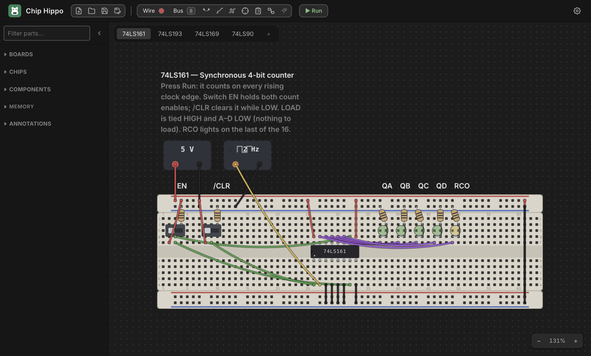

# Chip Hippo — A free, offline, open-source breadboard designer & simulator

[](https://github.com/jfigge/chiphippo/actions/workflows/ci.yml)
[](LICENSE)

[](https://github.com/jfigge/chiphippo/stargazers)

Design and simulate **74LS TTL and CD4000 CMOS logic circuits on virtual
solderless breadboards**, laid out on an infinitely pannable, zoomable desk.
Place breadboards, seat DIP chips across the trench, run jumper wires hole to
hole, then press **Run** and watch electricity trace out from the power supply,
resolve every net, and ripple through the circuit until it settles — LEDs light,
switches drive the logic live, and a 12 V rail lets the smoke out of a 74LS chip
exactly as it would on a real bench. Switch on **Spice Lite** and every wire
carries a voltage: capacitors charge, supplies droop, and an LED with no
resistor burns out.

Built with **Electron** and **Vanilla JavaScript** — no UI framework — with the
breadboards, the netlist, both simulation engines, the 3D renderer and the
Verilog interpreter all first-party code. It shares its engineering foundation
with its siblings [Rest Hippo](https://github.com/jfigge/resthippo) and Port Hippo.

> **Why Chip Hippo?** Free forever · Open source (GPL-3.0) · 100% offline · No
> sign-in · No tracking · Your designs stay in local files.

<p align="center"></p>

📦 **[Download for macOS, Windows &amp; Linux](https://chiphippo.com/#downloads)** &nbsp;·&nbsp;
🌐 **[chiphippo.com](https://chiphippo.com)** &nbsp;·&nbsp;
📖 **[User guide](https://chiphippo.com/docs/)** ([PDF](docs/chip-hippo-user-guide.pdf))

## Features

- **The desk** — an infinite pannable/zoomable workspace. Breadboards come as
  kits (Full 830 / Half 400 / Tiny 170 tie points) or as loose pin-boards and
  power rails (full, half, or **split** for two supplies) that **dovetail
  together** into snap groups and drag as one unit; a rail stood on end becomes
  a signal bus. Strips are drawn to their real millimetre measurements, and a
  600-mil DIP seats at its true width. Every tie point, rail hole, and component
  terminal is individually addressable (`bb1.f12`, `psu1.+`), so chip pins and
  wire ends bind to real holes.
- **110 chips in two logic families** — **52 74LS** parts (gates, open-collector
  and Schmitt parts, buffers and transceivers, flip-flops, latches, counters,
  shift registers, decoders, an encoder, multiplexers, a comparator, adders and
  the '181 ALU); **46 CD4000B** parts (gates, Schmitt triggers, level shifters,
  the bare-MOSFET CD4007UB, flip-flops, decade/ripple/up-down counters, a
  shift-and-store register, a BCD-to-7-segment driver, analog switches and
  multiplexers, and the RC timers and one-shots); the **NE555**; seven
  **memories** (SRAM, ROM, EPROM, EEPROM up to 128 KB); the 65xx peripherals
  (W65C21 PIA, W65C22 VIA); and two real **CPUs** — the **W65C02** and the
  **Z80A**, the latter running a genuine M-cycle / T-state machine so `/M1`,
  `/RFSH` and `/WAIT` mean something. The tray shows one family or both; each
  family keeps its own rules (supply range, a floating CMOS input reading
  unknown, fan-out between families).
- **30 components** — slide switches, momentary and toggle push buttons,
  1/2/4/8-position DIP switch banks, resistors (any value, drawn with real colour
  bands), bussed resistor arrays and a trimmer potentiometer, ceramic and
  electrolytic capacitors, inductors, diodes and Zeners, NPN/PNP transistors and
  N/P-channel MOSFETs, LEDs in five colours, 8-segment digits and bar graphs,
  HD44780 character LCDs (16×2, 20×4), oscillator cans, power supplies (3 / 5 /
  9 / 12 / 15 V) and clock sources (1 Hz – 1 kHz, or manual).
- **Wiring** — click-click jumper wires in eight colours, laid **direct** (a
  sagging hole-to-hole curve) or **routed** through waypoints, or **auto-routed**
  around the parts in one click. Buses lay a whole `D[7:0]` run in one click and
  draw as a ribbon. Nets can be named and the desk annotated. **Option-drag** a
  seated part and its wiring rides along — the wire ends, and the legs of the
  resistors and LEDs plugged into it — so a re-seat can never silently rewire
  the circuit; marquee or ⌘-click a group and the whole cluster drags as one
  rigid unit, in one undo step.
- **Simulation** — a pure, DOM-free engine: a union-find **netlist** partitions
  every point into nets, each net's level is resolved by driver strength, and an
  **incremental settle loop** with warm start runs to a fixpoint (which is why
  cross-coupled NAND latches hold their state). Chips are power-gated off their
  real supply nets against their family's range — a 74LS part is inert at 3 V and
  dead at 12 V, a CD4000 part runs anywhere from 3 to 18 V. Driver conflicts,
  shorts, floating CMOS inputs and oscillation are detected and surfaced. The
  555 and the CMOS timers read their real R and C off the board. Sequential parts
  advance on a two-phase clock tick, driven by the **Run / Pause / Step / speed**
  transport with clocks up to 1 kHz, or stepped by hand.
- **Spice Lite** _(optional second engine)_ — **every net a voltage**: real
  output and input stages, inputs read against their thresholds, gate delays,
  capacitors charging along exact exponentials, timers modelled as their
  datasheet internals, fan-out and output current limits (with brown smoke),
  power supplies that droop past their current limit, jumper-wire resistance,
  switching spikes and decoupling, LEDs that brighten with current and burn out
  by junction temperature, transistors as real part grades (2N3904 … IRF540N),
  and inductors with flyback kick. Graded against **ngspice** — within 2 % in
  every area it models.
- **Instrumentation** — a connectivity **probe** that lights up an entire net
  across boards (with volts and amps under Spice Lite), a **logic analyzer**
  recording waveforms, hex bus lanes and voltage traces with cursors and a Δ
  readout, per-part **pin-assignment windows** carrying hand-cut datasheet crops
  (and a button through to the manufacturer PDF), and a **build guide** with a
  bill of materials, a numbered wire cutting list, and ordered assembly steps
  you can follow at a real bench.
- **Schematic view** — `Tab` flips the desk over to a derived logical diagram:
  chip symbols, discrete symbols with values, routed named nets, and bus lines
  laid out automatically from the same document, sharing the desk's probe and
  live simulation tint.
- **3D view** — turn the whole desk round in a real-time WebGL scene: boards,
  chips on their legs, every part modelled, arching wires and ribbon buses, with
  LEDs, clocks and LCDs live and burnt parts smoking.
- **Memory** — ROM/EPROM/EEPROM chips backed by real bytes, with a virtualized
  hex/ASCII **inspector** (editable when stopped, a live viewer while running),
  Intel HEX and `.bin` import/export, and an in-app programmer. Programmed images
  travel **inside the project file**, content-addressed so identical bytes are
  stored once however many chips hold them.
- **Custom chips** — design your own DIP (pinout, family, width) and write its
  behaviour in a **Verilog subset**, then step through it with a debugger —
  breakpoints, step, watch panel — while the circuit runs around it.
- **Arduino serial integration** — Output and Input tags put a real board in the
  loop over USB serial: the simulation stalls while the board answers, so a
  request and its response land in one step. Chip Hippo generates the board-side
  code — a C++ header for any Arduino, or one Python module for MicroPython and
  CircuitPython — and a built-in mock device runs it all without hardware.
- **AI assistant** _(optional — your own API key, encrypted at rest by the OS
  keystore; Anthropic or any OpenAI-compatible endpoint, Ollama included)_ — two
  modes, and in both the app does the electrical reasoning.
  **Build**: describe a circuit in words and get a wired design; the model only
  ever emits a **coordinate-free netlist**, and a pure compiler places, routes,
  and interposes the resistors, then **proves the result through the real
  simulation engine** before offering it as a ghost for you to place. **Review**:
  Chip Hippo runs its own engine-backed checks over the desk you already have —
  floating inputs, a tri-state part switched off, two outputs on one net, shorts,
  an unlimited LED — and the model explains what they mean. It finds the faults;
  the model explains them, never the other way round.
- **Projects** — one `.chiphippo` file holds every desktop **tab**, every
  programmed ROM image and every custom chip it uses: one dirty marker, one Save,
  one File menu. Nothing is written to your file until you save it, and a
  30-second recovery stash in the app's own working folder means a crash costs
  at most half a minute.
- **Export** — a desktop exports as a **KiCad 8 project** (schematic, symbol
  library and verified footprints, passing KiCad's ERC) or a **Digital** `.dig`
  circuit, each with a report of anything that did not carry across.
- **Examples** — every benchable part ships a working demonstration bench inside
  the app, one click away from its pinout window, each one engine-validated
  against its datasheet truth table at build time — plus whole 6502 computers.
- **Extras** — undo/redo throughout, light/dark/system theming, a scalable UI
  font, auto-update (opt-in — a check is an outbound call), and a UI localized
  into **seven languages** (English, German, Spanish, French, Italian, Japanese,
  Simplified Chinese).

Chip Hippo makes **no network call at all** unless you ask it to: the AI builder,
the datasheet downloader, and the update check are the only three, and every one
is opt-in. (The Arduino link is a USB serial port, not the network.)

## Architecture

```
Electron main process (src/app/main.js)     ← owns all filesystem I/O + native dialogs
  ├── store/        settings.json + ONE project file (atomic writes, schema migrations)
  ├── ai/           the AI provider client     ┐ the only outbound HTTP —
  ├── datasheets/   the datasheet downloader   │ all opt-in (the renderer's
  ├── updater.js    auto-update                ┘ CSP forbids any)
  ├── serial/       the Arduino serial link (USB, not network)
  └── IPC bridge (src/app/preload.js)  →  window.chiphippo.*
        └── Renderer / UI (src/web/scripts/app.js)   ← sandboxed; talks to main via IPC only
              ├── DeskView            ← desk/desk-geometry.js  (pure camera transform)
              ├── ProjectWorkspace    ← the open project; which desktop is on the desk
              ├── DeskController      ← DeskDoc (model/, pure) + the surface layers
              │     boards → parts → wires → overlay
              └── SimController       ← transport + clocks; runs sim/ or sim/spice/
```

Two rules shape the whole codebase:

- **Process split.** The main process owns every filesystem and native call. The
  renderer is fully sandboxed (`contextIsolation`, no `nodeIntegration`) and
  reaches main only over the `window.chiphippo.*` bridge — kept in lockstep with
  `main.js`'s handlers by an IPC-parity test.
- **Pure-logic / DOM split.** All geometry, addressing, occupancy, netlist, and
  simulation logic lives in **DOM-free ES modules** with sibling tests; view
  components stay thin. Both simulation engines are pure computation, not I/O —
  they run under plain `node --test` with no display and no Electron.

## Prerequisites

- [Node.js](https://nodejs.org/) (includes `npm`) — Electron 42 bundles Node 22;
  matching that locally keeps CI parity.

There are two runtime dependencies (`electron-updater` and `serialport`).
Everything else — the breadboards, the netlist, the chip models, both engines,
the compiler, the 3D renderer, the Verilog interpreter — is first-party.

## Project Structure

```
Chip Hippo/
├── Makefile               # Build orchestration (authoritative command list)
├── features/              # Numbered implementation plans; finished ones in done/
├── demos/                 # Generated + engine-validated demo projects
├── website/               # The chiphippo.com static site (GitHub Pages)
├── docs/                  # Generated user-guide PDF
├── scripts/               # Build tooling (docs, PDF, icons, demos, license guard)
└── src/
    ├── package.json       # Node / Electron dependencies + electron-builder config
    ├── packaging/         # Mac App Store entitlements + provisioning profiles
    ├── app/               # Electron main process (Node.js, CommonJS)
    │   ├── main.js        #   window lifecycle + IPC registration + app menu
    │   ├── preload.js     #   IPC bridge exposed as window.chiphippo
    │   ├── store/         #   projects, settings, memory images, credentials (+ tests)
    │   ├── ipc/           #   IPC handlers by area
    │   ├── ai/            #   provider adapters + streaming client
    │   ├── serial/        #   the Arduino serial link, protocol + mock device
    │   └── datasheets/    #   the datasheet source table + downloader
    └── web/               # Renderer (Vanilla JS ES modules + CSS)
        ├── index.html     #   plus pinout / memory / chip-designer / docs /
        │                  #   serial-log auxiliary windows
        ├── scripts/
        │   ├── model/     #     breadboards, documents, occupancy, move rules (pure)
        │   ├── sim/       #     netlist, levels, chip eval, resolve, engine (pure)
        │   │   └── spice/ #       Spice Lite — the second, voltage-level engine
        │   ├── catalog/   #     the parts catalog — data, never per-part code paths
        │   ├── desk/      #     camera + wire-path geometry (pure)
        │   ├── hdl/       #     the custom chips' Verilog subset (pure)
        │   ├── scene3d/   #     the 3D view's scene builder (pure)
        │   ├── ai/        #     catalog brief + generate pipeline (pure)
        │   ├── bench/     #     engine performance tooling (make bench)
        │   └── components/#     thin view components
        ├── demos/         #   bundled example circuits (one per benchable part)
        ├── docs/          #   the user guide's Markdown source + screenshots
        ├── datasheets/    #   committed datasheet crops for the pinout window
        ├── locales/       #   i18n catalogs (7 languages)
        ├── styles/        #   CSS + design tokens (theme.css)
        └── fonts/         #   Bundled Inter variable font
```

## Getting Started

### Install dependencies

```bash
make install        # npm ci in src/
```

### Run in development

```bash
make debug          # Electron with hot-reload (primary dev workflow)
```

This launches the app with a local `--user-data-dir` (`data/`, git-ignored) so
development projects stay out of your real profile.

## Building

For day-to-day local builds, `make` with no arguments produces an **unsigned,
un-notarized** macOS `.dmg` — fast, and it needs no signing credentials. Output
lands in `build/src/dist/`.

```bash
make                # Unsigned macOS .dmg (default; fast local testing)
make dmg            # Unsigned macOS .dmg (same as bare `make`)
```

`build-*` targets produce an **unpackaged** app directory (fastest, for smoke
tests — always unsigned). `dist-*` targets produce **installers** (signed when
credentials are present).

```bash
make build          # Build the app directory for macOS (dir only)
make build-mac      # macOS app directory
make build-linux    # Linux app directory
make build-win      # Windows app directory

make dist           # Installers for all platforms (host can only build its own)
make dist-mac       # macOS (.dmg, .zip)
make dist-linux     # Linux (.AppImage, .deb)
make dist-win       # Windows (NSIS .exe, portable)
```

> A given host can only build its own platform's installer (a macOS `.dmg` needs
> macOS, etc.). CI runs `dist-mac` / `dist-linux` / `dist-win` on native runners.

### Code signing

`dist-mac` / `dist-win` sign their installers when signing credentials are
present and produce **unsigned** artifacts (no failure) when they are absent — so
unsigned `--dir` dev builds and credential-less CI keep working unchanged. macOS
reads `CSC_LINK` / `CSC_KEY_PASSWORD`; in CI both come from repository secrets,
and the [Release workflow](.github/workflows/release.yml) names them and signs
only on tag builds.

### Mac App Store

The store package is the **same code** down a different channel — a runtime gate
(`src/app/store-build.js`) turns the auto-updater off in a store build rather
than the build being branched.

```bash
make mas            # Universal signed .pkg for App Store Connect
make mas-dev        # Locally-runnable sandboxed build, to try before submitting
```

Both **skip with a message and exit 0** when their git-ignored provisioning
profile is absent, so a fresh clone still builds everything else. The submission
process itself lives in [STORE-PUBLISHING.md](STORE-PUBLISHING.md).

## Code Quality & Tests

```bash
make fmt            # Format JS/CSS/HTML (Prettier)
make fmt-check      # Verify formatting without writing
make lint           # Lint JS (ESLint)
make test           # License-header guard + the full unit suite (node --test, ~8 min)
make test-fast      # The same with the slow corpus sampled (~2.5 min) — while iterating
make test-i18n      # Just the language guards — the fast loop while translating
make bench          # Time the engine headless on a busy fixture (not part of make test)
make spice-golden   # Regenerate Spice Lite's ngspice references (needs ngspice)
```

`make test` is hermetic — pure `node --test` across ~250 suites with no display,
Electron process, or network — and is the gate CI enforces. It covers the pure
model and engine modules directly (including an exhaustive truth-table harness
over every gate, circuit fixtures for the sequential parts, the incremental
settle held bit-identical to the full one, Spice Lite held to its ngspice
references, and every example run through both engines), the renderer
components under jsdom, the generated Arduino code (the C++ header compiled, the
Python run), and five **i18n guards** that make an untranslated string fail the
suite rather than ship.

Every first-party source file must carry the GPL-3.0 header; `make test`
enforces it and `make license-headers` stamps any file missing one.

## Releasing

Run from `main` with a clean, up-to-date working tree:

```bash
make release VERSION=1.2.3
```

It validates the version, confirms you're on `main` and in sync with origin, and
gates on the full test suite. On approval it bumps `src/package.json`,
fast-forwards the long-lived `release` branch to `main`, tags `v1.2.3`, and
pushes all three atomically. The tag triggers the **Release** workflow, which
builds and publishes signed installers for macOS, Windows, and Linux — along with
the `latest*.yml` feed that in-app auto-update reads.

`release` stays a strict fast-forward of `main`, so it always points at exactly
what was last shipped.

## Generated Assets

Several committed artifacts are build outputs; regenerate them with `make` rather
than by hand.

```bash
make demos          # Rebuild + engine-validate demos/ and the bundled examples
make docs           # Build the hosted user guide into website/docs/
make pdf            # Build the user-guide PDF (docs/chip-hippo-user-guide.pdf)
make icons          # Regenerate app-icon rasters from the SVG sources
make datasheets     # Report which pinout-window datasheet crops are missing
make vendor-markdown  # Rebuild the bundled marked + DOMPurify renderer
make site           # Regenerate website/versions.json from GitHub Releases
```

The user guide has **one Markdown source** (`src/web/docs/*.md`) driving three
outputs that therefore cannot diverge: the in-app viewer (Help ▸ User Guide,
`⌘/`), the hosted site, and the PDF.

## Build Information

```bash
make version        # Print the current version string
make info           # Print full build info (version, branch, commit, build time)
make help           # List all available targets
make clean          # Remove build/ and dist/ directories
```

## Roadmap

Chip Hippo is **released and in active development** — v1.3.0 ships for macOS
(direct download and the Mac App Store), Windows, and Linux. Development is
plan-driven: every stage is written up in [`features/`](features/ROADMAP.md)
before it is built, and finished plans move to [`features/done/`](features/done).
What is queued next, and the backlog behind it, lives in that roadmap.

## License

GPL-3.0-or-later. See [LICENSE](LICENSE) and [NOTICE](NOTICE). Releases up to and
including v1.1.1 were published under Apache-2.0.

The code Chip Hippo **generates** for a microcontroller (`ChipHippo.h`, `chiphippo.py`
and their example programs) is not bound by the GPL: an additional permission in
[LICENSE-EXCEPTION](LICENSE-EXCEPTION) lets you use it in your own firmware under terms
of your choice.
