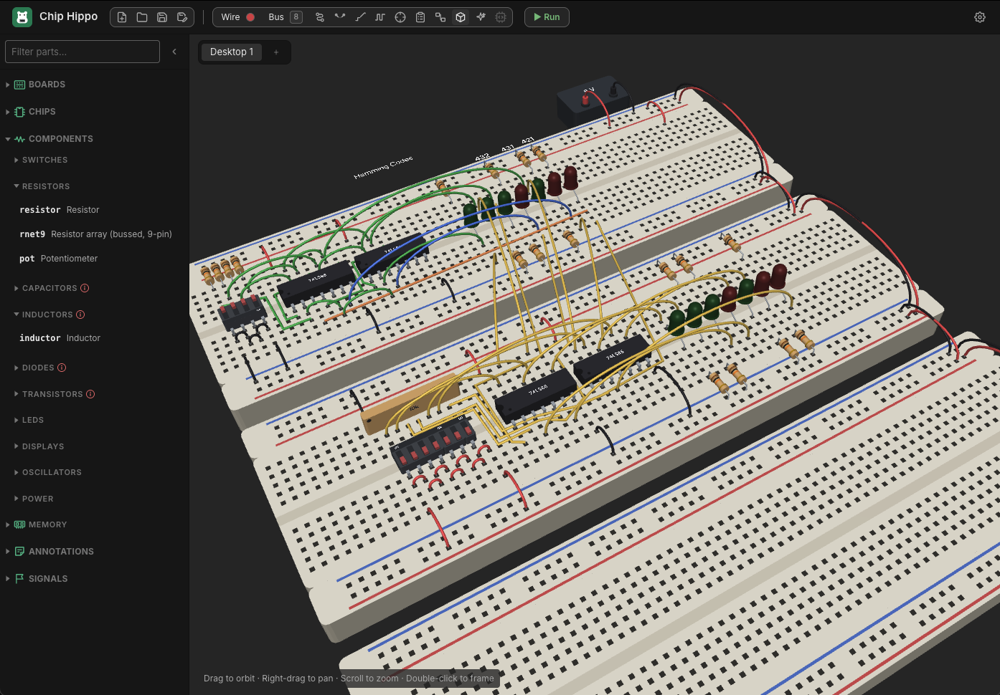

# 3D View

The **3D view** stands the circuit on your desk up in three dimensions: the
breadboards with their holes and rail stripes, every chip on its legs, the
switches, LEDs, resistors, capacitors and displays, and the jumper wires
arching between them — to turn round and look at from any side. It is a
way of *looking* at a design, not of building one: like the
[Schematic View](schematic-view.md) it is a **projection** of the desk, and
nothing you do in it changes a part, a hole or a wire.

## Switching to it

The 3D view is switched off until you turn it on: in **Settings ▸ Appearance**,
set **3D enabled** to **On** and a **3D** button appears in the toolbar.
Setting it back to **Off** hides the button again.

Click the **3D** button in the toolbar (a cube, beside the **schematic**
button) to show the 3D view in place of the breadboard; it fills in while the
3D view is up, and clicking it again goes back to the breadboard. Chip Hippo
always opens on the breadboard. The **schematic** button and `Tab` switch from
the 3D view straight to the schematic, as they do from the breadboard.

The first time it is shown — and whenever another desktop or project is
opened — it frames the whole desk.

## Moving round the desk

| Do this | To |
| --- | --- |
| Drag | Orbit round the desk |
| Right-drag, middle-drag or `Shift`+drag | Slide the view across the desk |
| Scroll, or pinch | Zoom in and out |
| Double-click, or `Cmd/Ctrl+F` | Frame the whole desk again |
| `Shift+Cmd/Ctrl+F` | Back right off, the desk small in the middle |
| `Option+Cmd+=` / `Option+Cmd+-` | Zoom in and out from the keyboard |

The desk padlock (`Cmd/Ctrl+L`) locks the scroll wheel here too, so a resting
finger on a Magic Mouse can't zoom the view.

## The running circuit

The 3D view follows the simulation: while the circuit runs, LEDs and display
segments light (and show smoke once they burn), a clock source's lamp blinks
with its output, a transistor's lamp lights while it conducts, and a
character LCD shows what is on its screen. They light from exactly the same
decisions the breadboard makes, so the two views always agree.

Edits made on the breadboard appear in the 3D view the next time you switch
to it.

## What it draws

Every part in the parts tray has a 3D model, built from the same outline and
colours the breadboard draws it with — a part sits over exactly the holes it
is plugged into, with its legs going into them. Wires arch from hole to hole
(the longer the wire, the higher the arch); routed wires lie flat along their
bends; a bus is drawn as a ribbon cable. Signal flags, Output/Input tags, and
your labels and notes are shown where you put them.

This is a first version, and it does not keep things apart: a long wire can
pass straight through a chip, and parts placed over one another overlap, just
as they can on the flat desk.

If your computer has no WebGL support, the 3D view says so instead of drawing.

## See also

- [Schematic View](schematic-view.md) — the circuit as a logical diagram.
