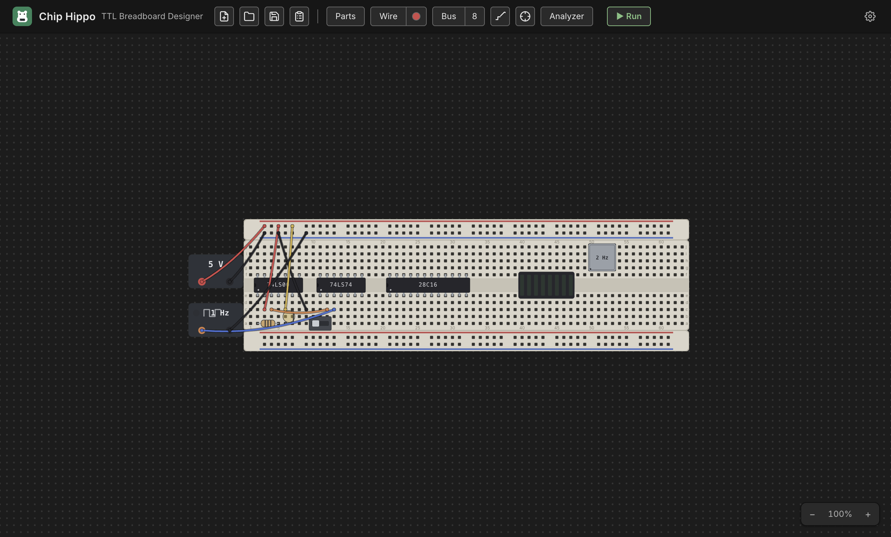

# Chip Hippo User Guide

Chip Hippo is a desktop app for designing and simulating **74xx TTL logic
circuits** on virtual solderless breadboards. Place a breadboard on the
infinite desk, populate it with 74xx DIP chips, wires, switches, LEDs, and
power sources, then press **Run** — a simulation engine traces electricity
from every power source, resolves each electrical net, and ripples changes
through the circuit exactly like a real breadboard would.

## What you can build

Anything a 74xx TTL breadboard bench can hold: combinational logic (gates,
decoders, multiplexers), sequential logic (flip-flops, counters, shift
registers), a free-running or manually stepped clock, and small memory
circuits backed by ROM/RAM chips — all wired across Full/Half/Tiny
breadboards, powered at 3 V / 5 V / 12 V, and watched settle live.

## Highlights

- **Breadboard-accurate placement** — chips, wires, and discretes snap to the
  real 0.1 in hole grid, with the same row-half/trench/rail tie-point rules
  as a physical board.
- **Live simulation** — Run the circuit and watch LEDs light, chip health
  badges report power/damage state, and switches drive the circuit live.
- **Deep inspection tools** — a connectivity **probe**, **net names/labels**,
  and a **logic analyzer** for capturing waveforms.
- **Memory chips with a hex inspector** — file-backed ROM/EEPROM images you
  program with an in-app programmer, plus a live hex/ASCII viewer.
- **A derived schematic view** — press `Tab` to flip between the physical
  breadboard and a logical diagram of chip symbols, routed named nets, and
  bus lines, kept in sync with the desk.
- **Build guide & BOM export**, and **undo/redo** across every edit, with an
  always-autosaved working document.

## Table of contents

### Getting started

- [Getting Started](getting-started.md) — install the app, place your first
  board and chip, and run your first circuit.

### Building a circuit

- [The Desk & Breadboards](the-desk.md) — pan/zoom, breadboard kits, strips
  and rails, snapping and grouping.
- [Chips & Components](components.md) — the parts palette, DIP chips,
  discretes, placement and rotation.
- [Wiring, Nets & Buses](wiring.md) — the wire tool, colors, cross-board
  wires, and multi-bit buses.
- [Power & Clock Sources](power-and-clocks.md) — PSU bricks, voltage and the
  12 V damage rule, and clock sources.
- [The 74xx Chip Library](chip-library.md) — the catalog, chip families, and
  the pin-assignments/datasheet window.

### Simulating & inspecting

- [Running a Simulation](simulation.md) — Run/Stop/Pause/Step, the settle
  model, and live views.
- [Probing & Net Names](probing.md) — the connectivity probe and naming nets.
- [Memory Chips & the Inspector](memory.md) — ROM/RAM, the programmer, and
  the hex/ASCII inspector.
- [Logic Analyzer & Timing](logic-analyzer.md) — capturing and reading
  waveforms.
- [Schematic View](schematic-view.md) — the derived logical diagram.

### Files & reference

- [Build Guide, Wiring List & BOM](build-guide.md) — deriving an assembly
  guide and bill of materials.
- [Files, Autosave & Undo](files-and-undo.md) — the working document, saved
  files, and undo/redo.
- [Settings](settings.md) — the settings dialog and its options.
- [Keyboard Shortcuts](keyboard-shortcuts.md) — every shortcut in one place.
