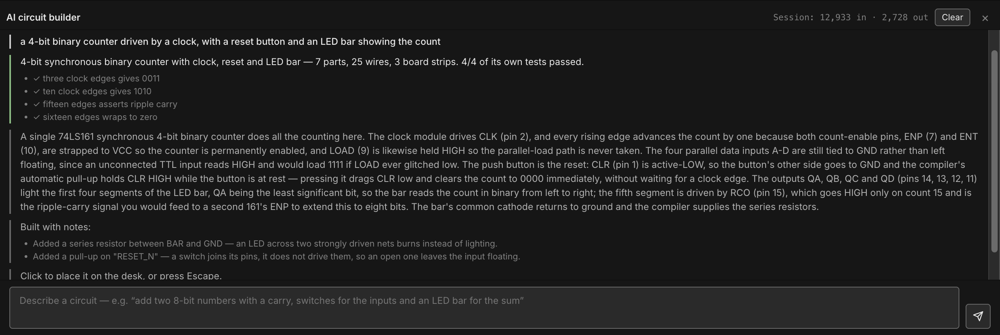
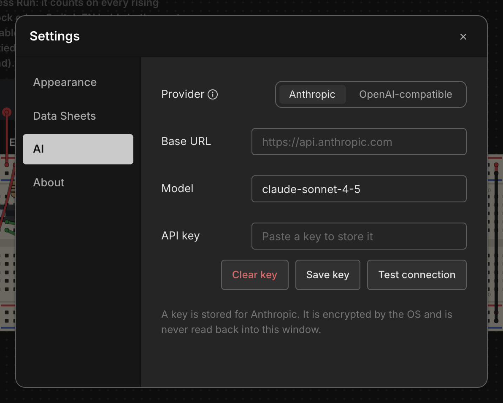
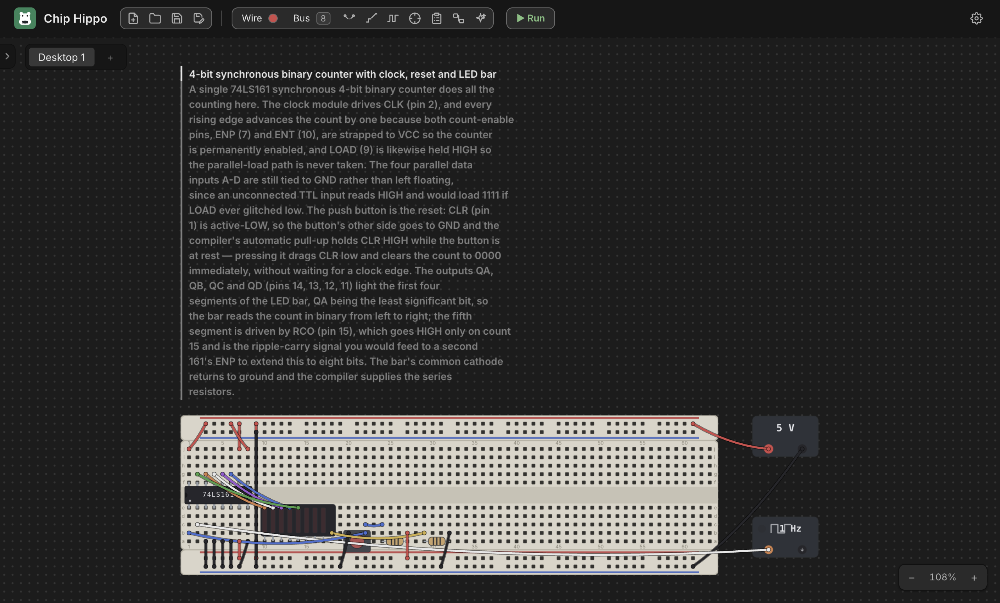

# AI Circuit Builder

The **AI builder** is a bottom-docked panel where you describe a circuit in
plain English and get a real, wired, **simulation-proven** design to place on
the desk. It uses *your own* AI connection — your key, your provider, your
account — and Chip Hippo makes no network request of any kind until you've set
one up and asked it for something.

The important thing to understand about it is what the model is and isn't
allowed to decide. It never places a chip, never picks a hole, and never draws
a wire. It answers one question — *which parts, and which of their pins are
joined?* — and Chip Hippo's own compiler does all the geometry, then proves the
result by running it through the same simulation engine the **Run** button
uses. Nothing that fails is ever offered to you.

## Setting up a connection

Open **Settings** (`Cmd/Ctrl+,`) and pick the **AI** tab. There are four
things there:

- **Provider** — **Anthropic**, or **OpenAI-compatible**. The second is
  deliberately not "OpenAI": the same request format is what Ollama, LM
  Studio, OpenRouter and vLLM all speak, so one setting plus a base URL covers
  every local and hosted endpoint worth using.
- **Base URL** — leave blank to use the provider's own default (shown as the
  field's placeholder). Point it at `http://localhost:11434` for a local
  Ollama, or at any compatible proxy.
- **Model** — also blank for the default. Any model id your endpoint accepts.
- **API key** — paste it and click **Save key**.

**Your key is never stored in Chip Hippo's settings file.** It goes straight
to your operating system's own secure credential store (Keychain on macOS, the
Credential Manager on Windows, the desktop keyring on Linux), encrypted, and it
is never read back into the app's window afterwards — the panel only ever
learns *whether* a key is configured, not what it is. If your system has no
secure store available, Chip Hippo **refuses to save the key** and tells you
so, rather than quietly writing it to disk in the clear.

Click **Test connection** to check the base URL, key and model in one small
request before you rely on them. **Clear key** forgets the stored key.

A local server that needs no key at all works fine — leave the key blank and
just set the base URL.

## Asking for a circuit

Click the **AI builder** button in the toolbar to dock the panel along the
bottom of the window (drag its top edge to resize it; it remembers whether it
was open and how tall you left it). Type a description and press `Enter` —
`Shift+Enter` gives you a newline for a longer brief.

Descriptions that work well are the ones an engineer would accept:

> add two 8-bit numbers together with a carry, switches for the inputs and an
> LED bar for the sum

> a 4-bit counter driven by a clock, showing its count on an LED bar

Be specific about the **inputs and the outputs** — what you want to set, and
what you want to see. The parts themselves you can leave to it: the model is
told, on every request, exactly which chips are in Chip Hippo's catalog and
exactly what every pin on each of them is called, so it has no reason to
invent a part that doesn't exist.

You don't need to mention power, and you shouldn't. Every chip declares its
own VCC and GND pins, so the compiler wires power itself, plants a 5 V supply,
and bridges the breadboard's two power rails. You also don't need to ask for a
series resistor on an LED — see below.

While it's working the panel shows progress; the same button becomes a
**cancel**, so a long or expensive request is always interruptible.

## What happens to the answer

Before you are shown anything at all, the answer is put through a ladder of
checks. Each one exists because of a specific way a machine-generated circuit
goes wrong *while still looking perfectly fine*:

1. **It compiles.** Parts get real seats on real breadboard columns, with an
   allocator that makes it impossible for two parts to accidentally share a
   column-half — which on a real breadboard means they're shorted together.
2. **Everything seated.** No part hangs off the end of a board with pins over
   nothing. A part like that loads without complaint and is electrically dead.
3. **The nets match.** The connections the design *asked for* are compared
   against the connections the finished breadboard *actually has*. This is the
   check that catches an accidental short, which is otherwise invisible — the
   circuit loads clean and simulates happily while computing something else.
4. **It powers up and settles.** Every chip reports OK, with no conflicts,
   no shorts, and no oscillation.
5. **Nothing is left floating.** A signal net nothing drives is reported
   rather than shipped.
6. **Its own tests pass.** This is the interesting one. The design is asked to
   state its own acceptance tests — "with these switches set this way, after
   this many clock edges, these LEDs should read this" — and Chip Hippo
   **runs them**. It's the only check that tests what the circuit *means*
   rather than whether it's internally consistent, and it's what catches a
   perfectly-built adder with its bit order reversed.

The panel reports which tests ran and whether they passed as part of the
summary.

## Placing what you get

A design that passes is **armed as a placement ghost** — the whole circuit
follows your cursor, snaps against boards already on the desk, and turns red
where it won't fit. Click to place it, or press `Escape` to discard it. A
circuit you positioned yourself is a great deal easier to trust than one that
simply appears.

However large it is, placing it is **one undo step**: `Cmd/Ctrl+Z` removes the
entire thing — boards, chips, wires and all — in one go.

Every generated circuit **explains itself**. The description above is stamped
on the desk as a caption over the boards, in the design's own words: which
chip does the work, why each tie-off is where it is, and what the compiler
added on your behalf. You didn't build it and can't ask it why it's wired the
way it is — so it says so up front. The caption is an ordinary annotation
anchored to the design, so it travels with it, and you can edit or delete it
like any other note.

## When it doesn't work

Two very different things can go wrong, and the panel distinguishes them.

**The design was wrong.** A pin named that doesn't exist, an input left
floating, an output shared with another output, a test that fails. These go
back to the model as a precise list of what failed — not as prose — and it
gets up to **two** attempts to fix them. If it still can't, the panel lists
what's still wrong and stops rather than looping at your expense.

**Chip Hippo was wrong.** If the design was described correctly but the
compiler couldn't build it, the panel says so plainly and doesn't send it back
— re-asking would only spend your tokens on a fault the model has no way to
influence.

A few things are outside what a netlist can express, and it will tell you
rather than guess:

- **Rotated two-lead parts** — a bare LED or resistor placed at an angle. Use
  the DIP-bodied displays (`bar8`, `seg8cc`) and switch banks (`sw-dip8`)
  instead, which is what it will reach for anyway.
- **Multi-corner cans** — the oscillator packages.

## LEDs and resistors

You never need to ask for a current-limiting resistor, and you shouldn't put
one in your description. Chip Hippo models the *physical* requirement, not just
the logical one: an LED conducting between two strongly-driven nets burns out
instead of lighting, exactly as it would on a real bench. So whenever a
display's common leg heads for a power rail, the compiler interposes a series
resistor for you. See [Chips & Components](components.md) for the same rule
when you're wiring by hand.

## Cost, privacy and the simulation

Requests go to whichever endpoint you configured, billed to your own account —
Chip Hippo neither proxies them nor sees them. The parts catalog that makes up
most of each request is sent in a form your provider can cache, so a repair
attempt costs far less than the first ask.

The panel won't build while the simulation is **running** — press **Stop**
first. A generated circuit is a document edit like any other, and the desk is
frozen while the circuit runs.

## See also

- [Settings](settings.md) — the AI tab in full, alongside every other
  preference.
- [Running a Simulation](simulation.md) — the engine every generated circuit
  is proved against before you see it.
- [Files, Saving & Undo](files-and-undo.md) — how a placed circuit is saved,
  and how one undo step removes it.
