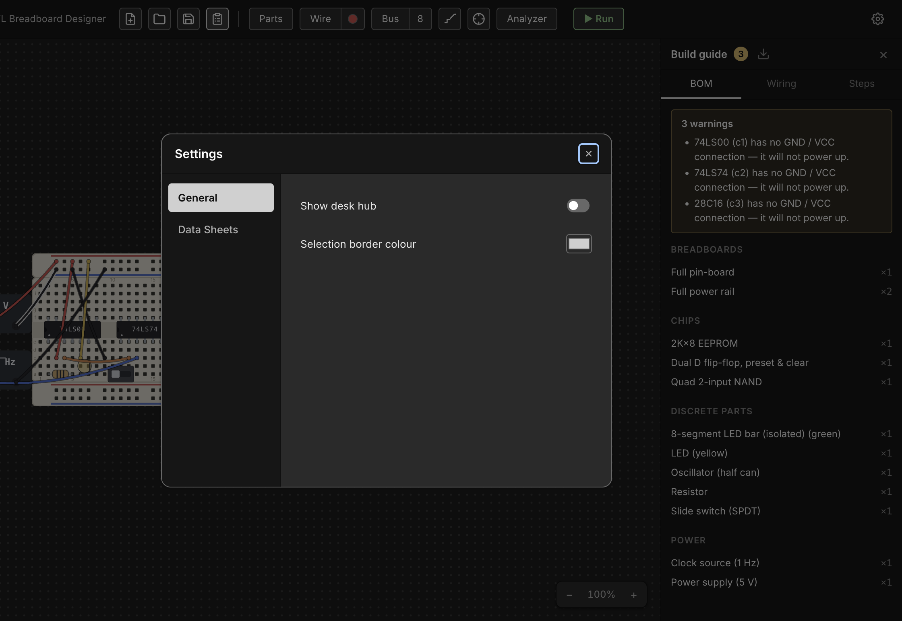

# Build Guide, Wiring List & BOM

Once a circuit is wired up on the desk, Chip Hippo can turn it into the
paperwork you'd actually want on the bench: a bill of materials (what to
buy, and how many), a human-addressed wiring list (what connects to what, in
words a person can follow with a real breadboard in hand), and an ordered
assembly checklist. None of this is stored on the document — it's derived
fresh from the live desk every time you open or change it, so it never
drifts out of sync with what you've actually built.

## Opening the build guide

Click the **Guide** icon button in the toolbar (next to the schematic file
actions) to open the build guide as a right-docked panel. Clicking it again,
or the panel's own **×** close button, hides it. The panel's open/closed
state is remembered between launches, same as the parts palette. It has
three tabs — **BOM**, **Wiring**, and **Steps** — and is read-only, so it
stays available even while a simulation is running.

The guide re-derives itself automatically whenever the document changes
while it's open (adding/removing a part or wire, renaming a net, flipping a
switch) — there's nothing to refresh by hand.

## Warnings

Above whichever tab you're on, the guide surfaces anything that looks
un-buildable or likely forgotten, with a count badge on the panel's title
when there's something to see:

- **Floating leads** — a chip or discrete pin whose lead sits over no hole.
- **Unpowered chips** — a chip whose VCC or GND pin has no connection, so it
  will never power up.
- **Single-member nets** — a wired net that only reaches one point, which
  usually means a connection you meant to make and didn't.

## The bill of materials

The **BOM** tab lists everything on the desk as counted line items, grouped
into four sections (only the non-empty ones show): **Breadboards**, **Chips**,
**Discrete parts**, and **Power**. Boards are counted by strip type (a Full
830 kit counts as its constituent rail/pin strips, not as one line), and
components are counted by catalog identity — with a few splits that matter
for actually buying the right part: LEDs split by color, PSU bricks by
voltage, and clock sources by rate. Each line reads as `title ×count`.

## The wiring list

The **Wiring** tab is net-centric, not wire-centric: instead of listing raw
wire endpoints, it lists every electrically-interesting **net** and what's
connected to it. A net only shows up here if you actually connected
something to it — either it carries a wire, or it has two or more members —
so a freshly-placed 14-pin chip with nothing wired to it doesn't spam the
list with fourteen empty rows.

Each net's members are resolved to the friendliest label available, in this
priority order:

1. A component pin at the hole — `"74LS00 pin 3 (1Y)"` (part + pin number +
   datasheet pin name, when the pin has one).
2. A pin sharing the hole's 5-hole node — a bus tap lands *beside* a pin
   rather than on it, and still resolves to that pin.
3. A PSU or clock terminal — `"Power supply +"`.
4. A power rail — `"+ rail (bb1)"`.
5. The bare hole address, as a last resort.

A net you've named (see [Probing & Net Names](probing.md)) leads with that
name instead of an anonymous net id, and buses group under a `<bus name> bus`
heading with each row labeled by bit — so naming your nets up front, before
opening the guide, makes this tab read far more like a real wiring diagram
and far less like an address dump. See
[Wiring, Nets & Buses](wiring.md) for how wires, colors, and buses work in
the first place.

A net that only reaches one salient member is flagged with a small warning
icon right in its row (and rolled into the warnings banner above).

## Assembly steps

The **Steps** tab is an ordered checklist for building the circuit from
scratch, grouped in the order you'd actually work: **Place the boards**,
**Power**, **Seat the chips**, **Add discrete parts**, **Run the signal
wires**. Each step has a checkbox — ticking it is a session-only visual aid
(nothing is persisted), useful for tracking progress while you build.

A few notable details in how steps are phrased:

- A grouped breadboard kit (rails + pin strip snapped together) is one step,
  not one per strip; a loose strip gets its own step.
- Power steps cover PSU/clock bricks (set to their configured voltage/rate)
  and then any wire that distributes power — a brick terminal or rail hole
  at either end.
- A chip's step spells out its straddle, e.g. *"straddling e5–f11, pin 1 at
  bb1.e5"* (plus a flipped note if it's rotated 180°); a linear discrete
  lists its resolved lead addresses instead.
- Signal wires are grouped last: whole buses first (one step per bus, one
  detail line per bit), then the remaining signal nets, each with its wires
  listed as `from → to` using the same friendly local labels as the wiring
  list.

## Downloading the BOM

The download icon in the panel header exports the **whole current plan** —
BOM, wiring list, and assembly steps together, headings and all — as a
Rich Text Format (`.rtf`) document, named `<schematic name>-bom.rtf` after
your current schematic file. It's a plain browser download (no save dialog,
no main-process IPC involved) generated entirely in the renderer, so it
reflects exactly what the panel is showing at the moment you click it. `.rtf`
opens in any word processor, which makes it easy to print or hand off as a
build sheet alongside the physical parts.
