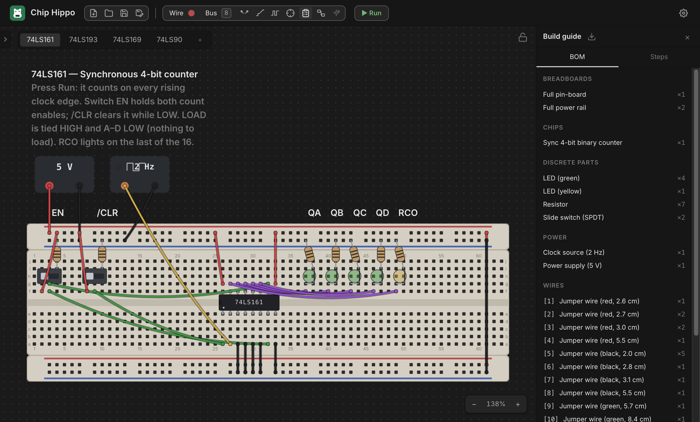

# Build Guide & BOM

Once a circuit is wired up on the desk, Chip Hippo can turn it into the
paperwork you'd actually want on the bench: a bill of materials (what to buy,
and how many — down to a numbered cutting list of every jumper), and an
ordered assembly checklist that names each of those jumpers as you come to
run it. None of this is stored on the document — it's derived fresh from the
live desk every time you open or change it, so it never drifts out of sync
with what you've actually built.



## Opening the build guide

Click the **Bill Of Materials** clipboard button at the right-hand end of the
desk-tools pill, or press `Ctrl+B` / `⌘B`, to open
the build guide as a right-docked panel. Clicking it again, or the panel's own
**×** close button, hides it — and the button stays lit for as long as the
panel is open, however you opened or closed it. The panel's open/closed
state is remembered between launches, same as the parts palette. It has
two tabs — **BOM** and **Steps** — and is read-only, so it stays available
even while a simulation is running.

The guide re-derives itself automatically whenever the document changes
while it's open (adding/removing a part or wire, renaming a net, flipping a
switch) — there's nothing to refresh by hand.

## Warnings

Above whichever tab you're on, the guide surfaces anything that looks
un-buildable or likely forgotten, with a count badge on the panel's title
when there's something to see:

- **Floating leads** — a chip or discrete pin whose lead sits over no hole.
- **Unpowered chips** — a chip whose VCC or GND pin has no connection, so it
  will never power up.
- **Single-member nets** — a wired net that only reaches one point, which
  usually means a connection you meant to make and didn't.

## The bill of materials

The **BOM** tab lists everything on the desk as counted line items, grouped
into five sections (only the non-empty ones show): **Breadboards**, **Chips**,
**Discrete parts**, **Power**, and **Wires**. Boards are counted by strip type
(a Full 830 kit counts as its constituent rail/pin strips, not as one line),
and components are counted by catalog identity — with a few splits that matter
for actually buying the right part: LEDs split by color, PSU bricks by
voltage, and clock sources by rate. Each line reads as `title ×count`.

### The cutting list

**Wires** comes last, because you wire after you seat, and it's a different
kind of list: a numbered **cutting list**, one line per colour *and cut
length*, tallied.

```
[3] Jumper wire (red, 6.1 cm)  ×3
```

That's three leads to cut the same, which is how you'd actually work through
a drawer or a spool — so the length belongs in the line rather than beside
it. The length is the **cut** length: the run from hole to hole plus the
stripped end that goes down into each hole, so a jumper crossing a single
0.1 in pitch is about 13 mm of wire, not 3. It's the same measurement, and
the same wording, as the drawing at the bottom of a wire's own
**Properties…** dialog (see [Wiring, Nets & Buses](wiring.md#wire-length)) —
a wire can't read one length there and another here.

Lines are sorted by the app's colour order, then shortest first, and
**numbered in that order**. The number is a cross-reference: every assembly
step that runs a wire calls it out as `[3]`, so you cut the pile once, number
it, and never have to re-measure anything mid-build. It only moves if the
desk itself changes — never because a colour was renamed or the language
switched.

## Assembly steps

The **Steps** tab is an ordered checklist for building the circuit from
scratch, grouped in the order you'd actually work: **Place the boards**,
**Power**, **Seat the chips**, **Add discrete parts**, **Run the signal
wires**. Each step has a checkbox — ticking it is a session-only visual aid
(nothing is persisted), useful for tracking progress while you build.

A few notable details in how steps are phrased:

- A grouped breadboard kit (rails + pin strip snapped together) is one step,
  not one per strip; a loose strip gets its own step.
- Power steps cover PSU/clock bricks (set to their configured voltage/rate)
  and then any wire that distributes power — a brick terminal or rail hole
  at either end.
- A chip's step spells out its straddle, e.g. *"straddling e5–f11, pin 1 at
  bb1.e5"* (plus a flipped note if it's rotated 180°); a linear discrete
  lists its resolved lead addresses instead.
- Signal wires are grouped last: whole buses first (one step per bus, one
  detail line per bit), then the remaining signal nets, each with its wires
  listed as `[n] from → to`. The leading `[n]` is that wire's item number
  from the cutting list above, so the callouts form a column you can read
  down while you cut.

### How an endpoint is named

A wire's two ends are resolved to the friendliest label available rather than
printed as raw addresses, in this priority order:

1. A component pin at the hole — `"74LS00 pin 3 (1Y)"` (part + pin number +
   datasheet pin name, when the pin has one).
2. A pin sharing the hole's 5-hole node — a bus tap lands *beside* a pin
   rather than on it, and still resolves to that pin.
3. A PSU or clock terminal — `"Power supply +"`.
4. A power rail — `"+ rail (bb1)"`.
5. The bare hole address, as a last resort.

A net you've named (see [Probing & Net Names](probing.md)) leads its step with
that name instead of an anonymous net id, so naming your nets up front, before
opening the guide, makes the whole tab read far more like a real assembly
sheet and far less like an address dump.

## Downloading the BOM

The download icon in the panel header exports the **whole current plan** —
the BOM and the assembly steps together, headings, item numbers and all — as
a Rich Text Format (`.rtf`) document, named `<project name>-bom.rtf`. It
mirrors the panel's tabs, so what you get on paper is what you were looking
at. It's a plain browser download (no save dialog, no main-process IPC
involved) generated entirely in the renderer, so it reflects exactly what the
panel is showing at the moment you click it. `.rtf` opens in any word
processor, which makes it easy to print or hand off as a build sheet
alongside the physical parts.
