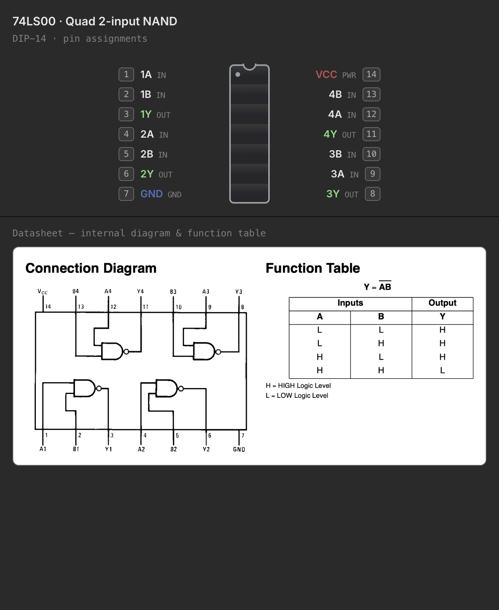

# The 74xx Chip Library

The parts palette's **CHIPS** folder holds a broad shelf of 74xx-family DIP
logic — everything from a single quad NAND gate up to octal shift registers
and 4-bit counters — every one with a datasheet-accurate pinout and, where
the simulator supports it, real behavior you can wire up and run. A separate
**Memory** group sits alongside it for address-indexed ROM/RAM parts, which
get their own dedicated page. This page is a tour of what's on the shelf and
how to read a chip's pin-assignments window once you've placed one.

## Combinational gates

The basic gate families — the classic 7400-series building blocks:

| Part | Description |
| --- | --- |
| `74LS00` | Quad 2-input NAND |
| `74LS02` | Quad 2-input NOR |
| `74LS08` | Quad 2-input AND |
| `74LS10` | Triple 3-input NAND |
| `74LS11` | Triple 3-input AND |
| `74LS20` | Dual 4-input NAND |
| `74LS27` | Triple 3-input NOR |
| `74LS30` | 8-input NAND |
| `74LS32` | Quad 2-input OR |
| `74LS86` | Quad 2-input XOR |

Alongside them, the inverter and buffer/bus-driver parts:

| Part | Description |
| --- | --- |
| `74LS04` | Hex inverter |
| `74LS05` | Hex inverter, open-collector |
| `74LS14` | Hex Schmitt-trigger inverter |
| `74LS125` | Quad tri-state buffer, active-low enable per gate |
| `74LS240` | Octal inverting tri-state buffer/line driver |
| `74LS244` | Octal (non-inverting) tri-state buffer/line driver |
| `74LS245` | Octal bidirectional bus transceiver — the one part in the catalog with true bidirectional pins |

## Sequential & MSI parts

Everything with internal state, plus the mid-scale-integration decoders and
multiplexers that build address/data logic around them.

**Flip-flops & latches**

| Part | Description |
| --- | --- |
| `74LS73` | Dual JK flip-flop, clear |
| `74LS74` | Dual D flip-flop, preset & clear |
| `74LS76` | Dual JK flip-flop, preset & clear |
| `74LS107` | Dual JK flip-flop, clear |
| `74LS112` | Dual JK flip-flop, preset & clear |
| `74LS174` | Hex D flip-flop |
| `74LS175` | Quad D flip-flop |
| `74LS173` | 4-bit D register, tri-state |
| `74LS273` | Octal D flip-flop, clear |
| `74LS75` | 4-bit bistable (transparent) latch |
| `74LS279` | Quad S̄R̄ latch |
| `74LS259` | 8-bit addressable latch |
| `74LS533` / `74LS573` | Octal transparent latch, tri-state (inverting / non-inverting) |

The `74LS73`, `74LS75`, and `74LS76` reproduce their datasheet's
**non-standard power-pin placement** — real parts don't always put VCC and
GND on the package corners, and neither do these.

**Counters & shift registers**

| Part | Description |
| --- | --- |
| `74LS90` | Decade (÷10) ripple counter |
| `74LS161` | Synchronous 4-bit binary counter |
| `74LS169` | Synchronous 4-bit up/down counter |
| `74LS193` | Synchronous up/down 4-bit counter |
| `74LS164` | 8-bit serial-in, parallel-out shift register |
| `74LS165` | 8-bit parallel-in, serial-out shift register |
| `74LS595` | 8-bit shift register with output storage latch |

**Decoders & multiplexers**

| Part | Description |
| --- | --- |
| `74LS138` | 3-to-8 line decoder |
| `74LS139` | Dual 2-to-4 line decoder |
| `74LS151` | 8-to-1 line multiplexer |
| `74LS153` | Dual 4-to-1 multiplexer |
| `74LS157` | Quad 2-to-1 selector |
| `74LS257` | Quad 2-to-1 selector, tri-state |

**Arithmetic, comparison & encoding**

| Part | Description |
| --- | --- |
| `74LS47` | BCD-to-7-segment decoder/driver |
| `74LS85` | 4-bit magnitude comparator |
| `74LS148` | 8-to-3 priority encoder |
| `74LS283` | 4-bit binary full adder |

## Memory chips

The **Memory** group carries the address-indexed parts: a couple of generic
teaching ROM/SRAM chips plus real-shaped EEPROM/EPROM/SRAM parts on wider DIP
packages. Reads and writes are wired up the same way as every other chip in
the catalog, but a non-volatile chip's contents live in a real file on disk
and are programmed through a dedicated in-app tool rather than by the circuit
itself. See [Memory Chips & the Inspector](memory.md) for the full story —
file-backing, the external programmer, and the hex/ASCII inspector.

## The sim-ready badge

Every chip in the palette that has real behavior wired up — its truth table
or state machine, not just its pinout — carries a small **sim** badge next to
its name. Hover it for a reminder: *"Behavior defined — ready for the
simulator."* In practice this covers the whole 74xx shelf on this page;
you'll only ever see a chip without the badge if a future part ships with a
pinout but no behavior yet.

## The pin-assignments window

Double-click **any** chip — or a package-footprint discrete like the `bar8iso`
LED bar, which seats and rotates exactly like a DIP chip even though it isn't
one — to open its **pin-assignments window**: a small, floating window
separate from the main desk, showing the physical DIP layout with the notch
at the top, pin 1 at the top-left, and pin numbers wrapping down the left side
and back up the right to the highest pin at the top-right, exactly as printed
on the part.

For a real chip this layout is always the **canonical, fixed arrangement** —
it matches the physical part regardless of how you've flipped it on the desk,
because a real chip's pin-1 dot is a physical feature of the package, not
something rotation changes. `bar8iso` is the one exception: it has no real
notch to key off, so its pin-assignments window reflects its **current `R`
flip** on the desk — rotate it and the corners in the dialog swap to match.

Below the pin map, chips that have one show the manufacturer's **datasheet
crop** — a cropped image of the connection diagram or function table pulled
straight from the source datasheet PDF. If a chip has no crop on file, that
part of the window simply isn't there — the pin map alone is still complete
and accurate.

When **Settings → Data Sheets** points at a local folder containing that
chip's full datasheet PDF, the window also grows a small document button in
its top-right corner; clicking it opens the PDF itself in your system's PDF
viewer. This is independent of the built-in datasheet crop — you may have
one, both, or neither for any given chip.

## Datasheets

The datasheet crops shown in the pin-assignments window are committed image
assets built once from the manufacturer PDFs (`make datasheets`), not
fetched or rendered at runtime — they work offline and load instantly. Four
parts in the sequential/MSI wave have no matching `74LS*` datasheet on file
(`74LS164`, `74LS193`, `74LS27`, `74LS76`) and simply show their pin map with
no crop below it. Pointing **Settings → Data Sheets** at your own folder of
manufacturer PDFs is a separate, optional feature — it doesn't add or replace
the built-in crops, it just adds the "open datasheet PDF" button for any part
whose PDF you have on hand.

---

See also [Chips & Components](components.md) for how chips seat into a
breadboard, and [Memory Chips & the Inspector](memory.md) for the memory
group's file-backing and inspector.
