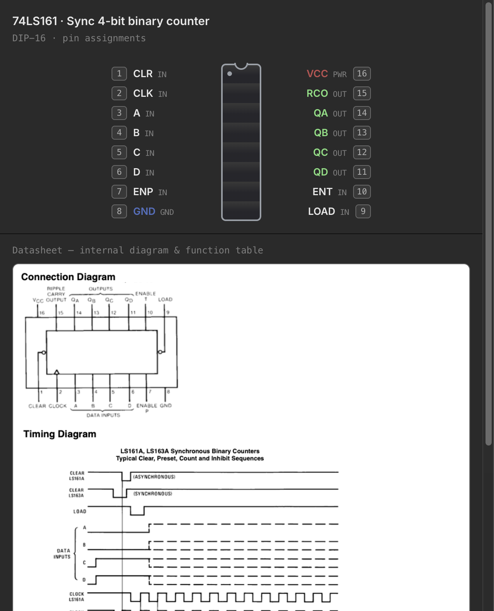

# The Chip Library

The parts palette's **CHIPS** folder holds a broad shelf of 74xx-family DIP
logic — everything from a single quad NAND gate up to octal shift registers
and 4-bit counters — every one with a datasheet-accurate pinout and real
behavior you can wire up and run. Past them, an **Interface** group carries
the 65xx peripherals (a PIA and a VIA) and a **PROCESSOR** group carries the
CPUs, while a separate **Memory** group sits below for the address-indexed
ROM/RAM parts, which get their own dedicated page. This page is a tour of what's
on the shelf and how to read a chip's pin-assignments window once you've placed
one.

## Combinational gates

The basic gate families — the classic 7400-series building blocks:

| Part | Description |
| --- | --- |
| `74LS00` | Quad 2-input NAND |
| `74LS01` | Quad 2-input NAND, open-collector — outputs on 1/4/10/13, *not* the classic quad-NAND layout |
| `74LS02` | Quad 2-input NOR |
| `74LS03` | Quad 2-input NAND, open-collector — the variant that *does* keep the classic layout (outputs on 3/6/8/11) |
| `74LS08` | Quad 2-input AND |
| `74LS10` | Triple 3-input NAND |
| `74LS11` | Triple 3-input AND |
| `74LS20` | Dual 4-input NAND |
| `74LS27` | Triple 3-input NOR |
| `74LS30` | 8-input NAND |
| `74LS32` | Quad 2-input OR |
| `74LS86` | Quad 2-input XOR |

Open-collector parts (`74LS01`, `74LS03`, `74LS05`) pull their outputs low
only and assume an external pull-up on a real bench. Chip Hippo models them
as plain gates, so they behave correctly without one — but wire the pull-up
anyway if you're prototyping something you intend to build.

Alongside them, the inverter and buffer/bus-driver parts:

| Part | Description |
| --- | --- |
| `74LS04` | Hex inverter |
| `74LS05` | Hex inverter, open-collector |
| `74LS14` | Hex Schmitt-trigger inverter |
| `74LS125` | Quad tri-state buffer, active-low enable per gate |
| `74LS240` | Octal inverting tri-state buffer/line driver |
| `74LS244` | Octal (non-inverting) tri-state buffer/line driver |
| `74LS245` | Octal bidirectional bus transceiver — the one part in the catalog with true bidirectional pins |

## Sequential & MSI parts

Everything with internal state, plus the mid-scale-integration decoders and
multiplexers that build address/data logic around them.

**Flip-flops & latches**

| Part | Description |
| --- | --- |
| `74LS73` | Dual JK flip-flop, clear |
| `74LS74` | Dual D flip-flop, preset & clear |
| `74LS76` | Dual JK flip-flop, preset & clear |
| `74LS107` | Dual JK flip-flop, clear |
| `74LS112` | Dual JK flip-flop, preset & clear |
| `74LS174` | Hex D flip-flop |
| `74LS175` | Quad D flip-flop |
| `74LS173` | 4-bit D register, tri-state |
| `74LS273` | Octal D flip-flop, clear |
| `74LS75` | 4-bit bistable (transparent) latch |
| `74LS279` | Quad S̄R̄ latch |
| `74LS259` | 8-bit addressable latch |
| `74LS533` / `74LS573` | Octal transparent latch, tri-state (inverting / non-inverting) |

The `74LS73`, `74LS75`, and `74LS76` reproduce their datasheet's
**non-standard power-pin placement** — real parts don't always put VCC and
GND on the package corners, and neither do these.

**Counters & shift registers**

| Part | Description |
| --- | --- |
| `74LS90` | Decade (÷10) ripple counter |
| `74LS161` | Synchronous 4-bit binary counter |
| `74LS169` | Synchronous 4-bit up/down counter |
| `74LS193` | Synchronous up/down 4-bit counter |
| `74LS164` | 8-bit serial-in, parallel-out shift register |
| `74LS165` | 8-bit parallel-in, serial-out shift register |
| `74LS595` | 8-bit shift register with output storage latch |

**Decoders & multiplexers**

| Part | Description |
| --- | --- |
| `74LS138` | 3-to-8 line decoder |
| `74LS139` | Dual 2-to-4 line decoder |
| `74LS151` | 8-to-1 line multiplexer |
| `74LS153` | Dual 4-to-1 multiplexer |
| `74LS157` | Quad 2-to-1 selector |
| `74LS257` | Quad 2-to-1 selector, tri-state |

**Arithmetic, comparison & encoding**

| Part | Description |
| --- | --- |
| `74LS47` | BCD-to-7-segment decoder/driver |
| `74LS85` | 4-bit magnitude comparator |
| `74LS148` | 8-to-3 priority encoder |
| `74LS283` | 4-bit binary full adder |
| `74LS83` | The same adder on its **original** pinout — VCC on pin 5, GND on pin 12, not the later JEDEC corners |
| `74LS181` | 4-bit arithmetic logic unit (DIP-24) — 16 logic or 16 arithmetic operations selected by `S0`–`S3` and `M`, with carry generate/propagate outputs for cascading |

## Interface chips (65xx)

Past the 74xx groups, the **Interface** group carries two Western Design
Center 65xx peripherals — both DIP-40, both clocked off `PHI2`, both wired the
same way you'd wire them on a real single-board computer:

| Part | Description |
| --- | --- |
| `W65C21` | W65C21 PIA (CMOS 6521/6821) — two 8-bit bidirectional ports with per-line data-direction registers, plus four handshake/interrupt lines |
| `W65C22` | W65C22 VIA (CMOS 6522) — the same two ports plus two 16-bit interval timers, an 8-bit shift register, and four handshake lines |

They're **logic-level**, not cycle-accurate: nothing here models wall-clock
timing, so the VIA's timers count `PHI2` cycles rather than seconds.

A few practical notes for building with them:

- **Address one of the peripherals** by holding its chip selects (`CS0`·`CS1`
  high and `CS2B` low on the PIA; `CS1` high and `CS2B` low on the VIA),
  picking a register with `RS0`–`RS1` (PIA) or `RS0`–`RS3` (VIA), setting
  `RWB`, and pulsing `PHI2` — writes latch on the falling edge.
- **`IRQB` is open-drain** on both peripherals, so give it a pull-up.
- You can drive the bus **by hand** — set the address, selects and `RWB`, then
  pulse `PHI2` — or wire a CPU to it from the group below.

## Processors

The **PROCESSOR** group carries the two 8-bit CPUs, both DIP-40. Each is a full
instruction-set simulation, so a program in a ROM or RAM really does fetch and
execute one instruction at a time:

| Part | Description |
| --- | --- |
| `W65C02` | W65C02S 8-bit CPU — 16-bit address bus (`A0`–`A15`), 8-bit data bus (`D0`–`D7`), `RWB`, `RESB`, `IRQB`/`NMIB`, and `SYNC` pulsing high on each opcode fetch |
| `Z80A` | Zilog Z80A 8-bit CPU — the same 16-bit address and 8-bit data buses, plus `/MREQ`, `/IORQ`, `/RD`, `/WR`, `/M1`, `/RFSH`, `/HALT`, `/WAIT` and `/BUSRQ`//`/BUSACK` |

**They disagree about the clock, and it shows in how you wire them.** The
W65C02 makes exactly one bus access per `PHI2` cycle, so its address bus
advances once per clock. The Z80 does not: an opcode fetch is four T-states
with a memory-refresh cycle glued to its back half, a plain read is three, and
an I/O cycle is four — so a Z80 instruction takes several clock cycles, `/M1`
marks which cycle is the opcode fetch, and `/RFSH` pulses behind it.

A few practical notes:

- **Both power up in reset.** Wire the reset pin to a push button to hold it.
  The W65C02 then boots from the reset vector at `$FFFC`/`$FFFD`; the Z80 has
  **no reset vector at all** and simply starts fetching at `$0000`.
- **Every Z80 control line is active LOW**, which is what the leading slash in
  its pin names records — the app has no way to draw an overbar.
- **The Z80 gives you real chip-select and strobe lines.** Wire `/MREQ` to a
  memory's `/CE`, `/RD` to its `/OE` and `/WR` to its `/WE`. That combination
  matters: during the refresh half of a fetch `/MREQ` pulses low again while
  `/RD` stays high, so a correctly wired memory does not drive the bus against
  the CPU's own refresh address.
- **`/IORQ` selects a separate 256-port I/O space**, reached with `IN`/`OUT`
  and entirely distinct from memory. The 65xx bus has no equivalent — there,
  peripherals are memory-mapped.
- **Z80 addressing is a little scrambled on the package.** `A0`–`A10` sit on
  pins 30–40 and `A11`–`A15` wrap round to pins 1–5; the data bus is not in pin
  order either. The pin-assignments window is worth keeping open.
- These parts have **no example circuit** (see below) — you can't demonstrate
  a CPU by flipping switches at it. What you want instead are the worked
  65xx machines shipped as ordinary project files; see
  [Files, Saving & Undo](files-and-undo.md#example-circuits).

## Memory chips

The **Memory** group carries the address-indexed parts: a couple of generic
teaching ROM/SRAM chips plus real-shaped EEPROM/EPROM/SRAM parts on wider DIP
packages. Reads and writes are wired up the same way as every other chip in
the catalog, but a non-volatile chip's contents live in a real file on disk
and are programmed through a dedicated in-app tool rather than by the circuit
itself. See [Memory Chips & the Inspector](memory.md) for the full story —
file-backing, the external programmer, and the hex/ASCII inspector.

## The pin-assignments window

Right-click **any** chip — or a package-footprint discrete like the `bar8iso`
LED bar, which seats and rotates exactly like a DIP chip even though it isn't
one — and choose **Pin Assignment**, at the top of its context menu, to open
its **pin-assignments window**: a small, floating window separate from the
main desk, showing the physical DIP layout with the notch
at the top, pin 1 at the top-left, and pin numbers wrapping down the left side
and back up the right to the highest pin at the top-right, exactly as printed
on the part.

For a real chip this layout is always the **canonical, fixed arrangement** —
it matches the physical part regardless of how you've flipped it on the desk,
because a real chip's pin-1 dot is a physical feature of the package, not
something rotation changes. `bar8iso` is the one exception: it has no real
notch to key off, so its pin-assignments window reflects its **current `R`
flip** on the desk — rotate it and the corners in the dialog swap to match.

Below the pin map, chips that have one show the manufacturer's **datasheet
crop** — a cropped image of the connection diagram or function table pulled
straight from the source datasheet PDF. If a chip has no crop on file, that
part of the window simply isn't there — the pin map alone is still complete
and accurate.

When **Settings → Data Sheets** points at a local folder containing that
chip's full datasheet PDF, the window also grows a small document button in
its top-right corner; clicking it opens the PDF itself in your system's PDF
viewer. This is independent of the built-in datasheet crop — you may have
one, both, or neither for any given chip.

## Example circuits

A pin map tells you where the pins are; it doesn't show you the part working.
So every 74xx chip in the catalog ships with a **worked example** — a small
bench built around that one part — and the pin-assignments window is where you
reach it. Look for the **circuit button** in the window's top-right corner,
beside the datasheet one.

Click it and the example arrives as a **new desktop** in the open project,
called `74LS138 example` (or whichever part it is), already framed on screen.
Every one is the same bench, so once you can read one you can read them all:

- a **5 V brick** feeding both power rails, and a **clock** for the clocked
  parts;
- **switched inputs** on the left, each throwing between +5 V and a pull-down
  so an input is never left floating — a part with more inputs than will fit
  gets a DIP switch bank over a resistor network instead;
- the **chip under test** in the middle, straddling the trench;
- **LED read-outs** on the right, one per output, through its own resistor. An
  active-LOW output has its LED wired the other way up, so a lit lamp always
  means *this output is asserted*;
- a **caption** above the bench saying what the demo shows.

Press **Run** (Space) and flip the switches. Each example opens in a state
chosen to show the part doing something.

A few practical notes:

- It's an ordinary desktop and an ordinary unsaved change — it doesn't reach your
  project's file until you save, and you can rename it, edit it, or delete it
  like any other.
- Asking for the same example twice doesn't make a second copy; you land back
  on the desktop you already have.
- Adding it stops a running simulation, exactly as switching desktops does.
- Parts with no bench have no button: the memory and interface chips (a RAM or
  a CPU can't be demonstrated by flipping switches at it — those are the
  computer demos, which need a program), and every discrete, brick and wire.

## Datasheets

The datasheet crops shown in the pin-assignments window are committed image
assets built once from the manufacturer PDFs (`make datasheets`), not
fetched or rendered at runtime — they work offline and load instantly. Four
parts in the sequential/MSI wave have no matching `74LS*` datasheet on file
(`74LS164`, `74LS193`, `74LS27`, `74LS76`) and simply show their pin map with
no crop below it. Pointing **Settings → Data Sheets** at your own folder of
manufacturer PDFs is a separate, optional feature — it doesn't add or replace
the built-in crops, it just adds the "open datasheet PDF" button for any part
whose PDF you have on hand.

---

See also [Chips & Components](components.md) for how chips seat into a
breadboard, and [Memory Chips & the Inspector](memory.md) for the memory
group's file-backing and inspector.
