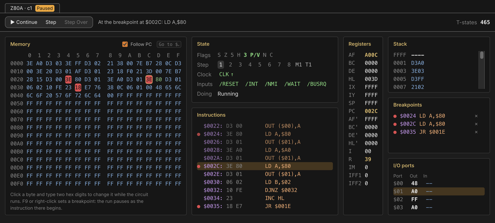
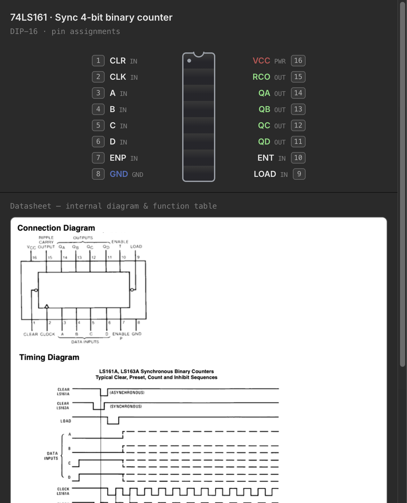

# The Chip Library

The parts palette's **CHIPS** folder holds a broad shelf of DIP logic from two
families — **74LS TTL**, everything from a single quad NAND gate up to octal
shift registers and 4-bit counters, and **CD4000 CMOS** — every one with a
datasheet-accurate pinout and real behavior you can wire up and run. Past them, an **Interface** group carries
the 65xx peripherals (a PIA and a VIA) and a **PROCESSOR** group carries the
CPUs, while a separate **Memory** group sits below for the address-indexed
ROM/RAM parts, which get their own dedicated page. This page is a tour of what's
on the shelf and how to read a chip's pin-assignments window once you've placed
one.

## Choosing a logic family

**Settings → Data Sheets → Chip family** picks which family the parts palette
shows: **74LS** (the default), **CD4000**, or **Both**. With one family, the
CHIPS folder is the familiar list of function groups — NAND, NOR, Flip-flop…
— holding that family's chips. With **Both**, CHIPS gains a `74LS` folder and
a `CD4000` folder, each holding its own function groups. The memory, interface
and processor chips belong to no family and are there in every mode.

It only filters the palette. A project's chips always load and run, whatever
is chosen, and a family the open project uses is shown anyway — so you can add
more of the parts already on its desk. Typing a CD4000 part number into the
filter while CD4000 is hidden says where to switch it on.

The families differ in more than part numbers — see
[The CD4000 CMOS family](#the-cd4000-cmos-family) below.

## Combinational gates

The basic gate families — the classic 7400-series building blocks:

| Part | Description |
| --- | --- |
| `74LS00` | Quad 2-input NAND |
| `74LS01` | Quad 2-input NAND, open-collector — outputs on 1/4/10/13, *not* the classic quad-NAND layout |
| `74LS02` | Quad 2-input NOR |
| `74LS03` | Quad 2-input NAND, open-collector — the variant that *does* keep the classic layout (outputs on 3/6/8/11) |
| `74LS08` | Quad 2-input AND |
| `74LS10` | Triple 3-input NAND |
| `74LS11` | Triple 3-input AND |
| `74LS20` | Dual 4-input NAND |
| `74LS27` | Triple 3-input NOR |
| `74LS30` | 8-input NAND |
| `74LS32` | Quad 2-input OR |
| `74LS86` | Quad 2-input XOR |

Open-collector parts (`74LS01`, `74LS03`, `74LS05`, the `74LS47`'s segment
outputs and the `74LS181`'s A=B) pull their outputs low only, as on a real
bench: a HIGH output lets go of its net and drives nothing. Give each output
a pull-up resistor to +5 V, or it floats when it should be HIGH. Because a
released output drives nothing, several can share one pulled-up net — a
wired-AND, LOW whenever any of them is.

Alongside them, the inverter and buffer/bus-driver parts:

| Part | Description |
| --- | --- |
| `74LS04` | Hex inverter |
| `74LS05` | Hex inverter, open-collector |
| `74LS14` | Hex Schmitt-trigger inverter |
| `74LS125` | Quad tri-state buffer, active-low enable per gate |
| `74LS240` | Octal inverting tri-state buffer/line driver |
| `74LS244` | Octal (non-inverting) tri-state buffer/line driver |
| `74LS245` | Octal bidirectional bus transceiver — the one part in the catalog with true bidirectional pins |

## Sequential & MSI parts

Everything with internal state, plus the mid-scale-integration decoders and
multiplexers that build address/data logic around them.

**Flip-flops & latches**

| Part | Description |
| --- | --- |
| `74LS73` | Dual JK flip-flop, clear |
| `74LS74` | Dual D flip-flop, preset & clear |
| `74LS76` | Dual JK flip-flop, preset & clear |
| `74LS107` | Dual JK flip-flop, clear |
| `74LS112` | Dual JK flip-flop, preset & clear |
| `74LS174` | Hex D flip-flop |
| `74LS175` | Quad D flip-flop |
| `74LS173` | 4-bit D register, tri-state |
| `74LS273` | Octal D flip-flop, clear |
| `74LS75` | 4-bit bistable (transparent) latch |
| `74LS279` | Quad S̄R̄ latch |
| `74LS259` | 8-bit addressable latch |
| `74LS533` / `74LS573` | Octal transparent latch, tri-state (inverting / non-inverting) |

The `74LS73`, `74LS75`, and `74LS76` reproduce their datasheet's
**non-standard power-pin placement** — real parts don't always put VCC and
GND on the package corners, and neither do these.

**Counters & shift registers**

| Part | Description |
| --- | --- |
| `74LS90` | Decade (÷10) ripple counter |
| `74LS161` | Synchronous 4-bit binary counter |
| `74LS169` | Synchronous 4-bit up/down counter |
| `74LS193` | Synchronous up/down 4-bit counter |
| `74LS164` | 8-bit serial-in, parallel-out shift register |
| `74LS165` | 8-bit parallel-in, serial-out shift register |
| `74LS595` | 8-bit shift register with output storage latch |

**Decoders & multiplexers**

| Part | Description |
| --- | --- |
| `74LS138` | 3-to-8 line decoder |
| `74LS139` | Dual 2-to-4 line decoder |
| `74LS151` | 8-to-1 line multiplexer |
| `74LS153` | Dual 4-to-1 multiplexer |
| `74LS157` | Quad 2-to-1 selector |
| `74LS257` | Quad 2-to-1 selector, tri-state |

**Arithmetic, comparison & encoding**

| Part | Description |
| --- | --- |
| `74LS47` | BCD-to-7-segment decoder/driver |
| `74LS85` | 4-bit magnitude comparator |
| `74LS148` | 8-to-3 priority encoder |
| `74LS283` | 4-bit binary full adder |
| `74LS83` | The same adder on its **original** pinout — VCC on pin 5, GND on pin 12, not the later JEDEC corners |
| `74LS181` | 4-bit arithmetic logic unit (DIP-24) — 16 logic or 16 arithmetic operations selected by `S0`–`S3` and `M`, with carry generate/propagate outputs for cascading |

## The CD4000 CMOS family

The 4000-series CMOS parts, each pinned out from its Texas Instruments
datasheet. They are **not** pin-compatible with the 74LS parts of the same
function — the CD4001B's NOR outputs are on pins 3, 4, 10 and 11, the 74LS02's
on 1, 4, 10 and 13 — so read the pin-assignments window before wiring one.

| Part | Description |
| --- | --- |
| `CD4001B` | Quad 2-input NOR |
| `CD4002B` | Dual 4-input NOR |
| `CD4025B` | Triple 3-input NOR |
| `CD4078B` | 8-input NOR/OR gate — both outputs |
| `CD4011B` | Quad 2-input NAND |
| `CD4012B` | Dual 4-input NAND |
| `CD4023B` | Triple 3-input NAND |
| `CD4068B` | 8-input NAND/AND gate — both outputs |
| `CD4093B` | Quad 2-input NAND Schmitt trigger |
| `CD4081B` | Quad 2-input AND |
| `CD4082B` | Dual 4-input AND |
| `CD4073B` | Triple 3-input AND |
| `CD4071B` | Quad 2-input OR |
| `CD4072B` | Dual 4-input OR |
| `CD4075B` | Triple 3-input OR |
| `CD4030B` | Quad exclusive-OR — the original; the CD4070B is its successor |
| `CD4070B` | Quad exclusive-OR |
| `CD4077B` | Quad exclusive-NOR |
| `CD4069UB` | Hex inverter (unbuffered) |
| `CD40106B` | Hex Schmitt-trigger inverter |
| `CD4049UB` | Hex inverting buffer/converter — **VCC on pin 1, VSS on pin 8**, not the corners |
| `CD4007UB` | Dual complementary pair plus inverter — six bare **MOSFETs**, see below |
| `CD4050B` | Hex non-inverting buffer/converter — same odd power pins |
| `CD4013B` | Dual D flip-flop with **active-HIGH** set and reset (the 74LS74's are active-LOW) |
| `CD4027B` | Dual JK flip-flop with active-HIGH set and reset — raising **both** drives Q and Q̄ HIGH together |
| `CD4017B` | Decade counter with ten decoded outputs and a carry-out |
| `CD4022B` | Octal counter with eight decoded outputs — the 4017's divide-by-8 sibling |
| `CD4020B` | 14-stage binary ripple counter — Q2 and Q3 have no pin |
| `CD4024B` | 7-stage binary ripple counter, in a **14-pin** package |
| `CD4040B` | 12-stage binary ripple counter — counts on the **falling** edge |
| `CD4060B` | 14-stage ripple counter with its own **RC oscillator** — or count an external clock on φI (see [Timers](#timers)) |
| `CD4029B` | Presettable up/down counter, binary or decade (a pin picks which) |
| `CD4510B` | Presettable BCD up/down counter with reset |
| `CD4516B` | Presettable binary up/down counter with reset |
| `CD4094B` | 8-stage shift-and-store register — its 3-state **OUTPUT ENABLE is active HIGH** |
| `CD4028B` | BCD-to-decimal decoder, ten active-HIGH outputs |
| `CD4511B` | BCD-to-7-segment latch/decoder/driver for a **common-cathode** display |
| `CD4066B` | Quad bilateral switch — an **analog switch**, see below |
| `CD4051B` | 8-channel analog multiplexer/demultiplexer — **VEE on pin 7** |
| `CD4052B` | Dual 4-channel analog multiplexer/demultiplexer — VEE on pin 7 |
| `CD4053B` | Triple 2-channel analog multiplexer/demultiplexer — VEE on pin 7 |
| `CD4047B` | Monostable/astable multivibrator — timed by one resistor and one capacitor |
| `CD4098B` | Dual retriggerable monostable |
| `CD4528B` | Dual retriggerable monostable — its pulse **lengthens with the supply** |
| `CD4538B` | Dual retriggerable precision monostable |
| `CD4541B` | Programmable timer: an RC oscillator and a 16-stage counter |

What makes the family worth learning on is how it differs from TTL:

- **A floating input is unknown, not HIGH.** A 74LS input pulls itself up; a
  CMOS input is a gate with nothing on it. Chip Hippo reads an unconnected
  CD4000 input as `X`, warns about it, and lets the unknown spread to whatever
  it feeds — a CD4017 with its RESET left floating loses its count. Tie every
  CMOS input, spare gates included, as the datasheets ask.
- **A much wider supply range.** A CD4000 part runs from 3 V to 18 V, where a
  74LS part needs 5 V — see [Power & Clock Sources](power-and-clocks.md).
- **Weaker outputs.** One standard CD4000 output can hold only one 74LS input
  LOW; the CD4049UB/CD4050B buffers drive eight. Driving the other way, a 74LS
  HIGH is marginal for a CMOS input. Both are reported — see
  [Mixing logic families](simulation.md#mixing-logic-families). The weakness
  has an upside: at 5 V and below a standard output cannot burn an LED wired
  straight onto it, so one with no resistor lights.

The Schmitt-trigger parts (CD4093B, CD40106B) behave as plain gates in the
standard engine: their hysteresis is an analog property, and their classic RC
oscillator will not run there — a capacitor on the desk carries a value for the
timing chips, but no charge. Under [Spice Lite](spice-lite.md#time-and-charging-capacitors)
the capacitor charges and each Schmitt input has its two thresholds, so the
one-gate RC oscillator runs. In the standard engine, use one of the
[timers](#timers) for an RC oscillator.

A few of the larger parts have habits of their own:

- **The up/down counters' carry is combinational.** CARRY OUT on the CD4029B,
  CD4510B and CD4516B goes LOW at the end of the count — 15 (or 9) going up, 0
  going down — while CARRY IN is LOW, and it follows UP/DOWN at once, without
  waiting for a clock. Wire one counter's CARRY OUT to the next one's CARRY IN
  and give them the same clock to chain them. Tie CARRY IN LOW on a counter on
  its own.
- **A decade counter can be preset to a code that is not a digit.** The jam
  inputs load any binary number, 10–15 included. The CD4510B's datasheet
  promises it counts back into 0–9 within two clocks going up and four going
  down, and Chip Hippo follows that part's logic gates to get there; the
  CD4029B's decade mode uses the same logic.
- **The CD4511B blanks a code above 9**, where the 74LS47 shows odd symbols.
  Its latch sits before the decoder, so LE/STROBE HIGH freezes the digit while
  lamp test (LT) and blanking (BL) still work on it.
- **The analog switches drive nothing — they connect.** A CD4066B switch whose
  CONTROL is HIGH, or the CD4051B/52B/53B channel that INH and the select pins
  pick, joins its two pins, so whatever drives one side drives the other, in
  either direction: the same 4051 multiplexes eight signals onto COM or
  demultiplexes COM out to eight. An open channel leaves each side to whatever
  else is on it, so a pin on an open channel with nothing else driving it
  floats. Chip Hippo passes logic levels only — the switch's on-resistance and
  analog voltages are out of scope — and a supply that passes through a switch
  arrives at the strength of an ordinary output: the + rail switched onto an
  output driving LOW is a fight, and a channel joining + to − is a short.
- **The CD4007UB is six MOSFETs, not gates.** Three N-channel and three
  P-channel transistors with their terminals brought out, each a switch exactly
  as a discrete MOSFET is: an N-channel joins its two terminals while its gate
  is HIGH, a P-channel while it is LOW, and a floating gate is unknown. Pair 1's
  P already sits on VDD and its N on VSS, so joining 13 to 8 makes an inverter
  from Q1 GATES (6); pair 3 is an inverter from Q3 GATES (10) to 12 once 11 is
  on VDD and 9 on VSS; pair 2's four terminals are all free. Thresholds and the
  part's analog uses — amplifiers, oscillators — are out of scope.
- **VEE is a supply pin.** The 405x parts have a negative supply, VEE (pin 7),
  for analog signals below ground. Chip Hippo has no negative supply, so tie
  VEE to VSS, as single-supply digital circuits do; until it is, the chip is
  unpowered.
- **The CD4094B's outputs follow its shift register only while STROBE is
  HIGH**, and its OUTPUT ENABLE floats them when it is LOW — the opposite sense
  of every 74LS output enable. The serial outputs QS and Q'S are never floated;
  Q'S gives the same bit half a clock later, for chaining a second 4094 on a
  slow clock.

## Timers

Seven parts take their timing from a **resistor and a capacitor** you wire to
them, as on a bench: the **555** (CHIPS ▸ Timer), and the CD4000
**CD4047B**, **CD4098B**, **CD4528B**, **CD4538B** and **CD4541B** (CD4000 ▸
Timer) and **CD4060B** (CD4000 ▸ Counter). Give the resistors and the capacitor their values in
**Properties…** (see
[Component values](components.md#component-values))
and the part runs at the rate its datasheet gives for them. There is no analog
simulation behind it: each part finds its own resistor and capacitor in the
wiring and works the time out from the datasheet's formula.

While the circuit runs, each timer prints its rate or pulse length under its
part number, and its **Properties…** card shows the same under **Timing**:

| Part | Timing pins | Formula (datasheet) |
| --- | --- | --- |
| 555 astable | RA from VCC to DISCH, RB from DISCH to TRIG + THRES, C from TRIG + THRES to GND | high 0.693·(RA+RB)·C, low 0.693·RB·C |
| 555 monostable | RA from VCC to THRES + DISCH, C from THRES + DISCH to GND | pulse 1.1·RA·C |
| 555 bistable | THRES to GND — no resistor or capacitor | none: TRIG LOW sets OUT, RESET LOW clears it |
| CD4047B | R between R (2) and RC COMMON (3), C between C (1) and RC COMMON (3) | Q/Q̄ period 4.40·RC (OSC OUT twice as fast), one-shot pulse 2.48·RC |
| CD4098B | per section: C from RX CX to CX (or GND), R from RX CX to VDD | pulse ½·R·C |
| CD4528B | per section: C from T2 to T1 (or GND), R from T2 to VDD — and T1 wired to GND | pulse 0.2·R·C·ln(VDD) |
| CD4538B | per section: C from RX CX to CX (or GND), R from RX CX to VDD | pulse R·C |
| CD4060B | Cx from φO (9), Rx from φ̄O (10), Rs from φI (11), all to one junction | oscillator period 2.2·Rx·Cx |
| CD4541B | Ctc from CTC (2), Rtc from RTC (1), Rs from RS (3), all to one junction | oscillator period 2.3·Rtc·Ctc |

Two resistors (or two capacitors) side by side between the same two points
count as one, combined the way they would be on a bench. Two in **series**
are not followed: put the single value you mean.

### The 555 works out what it is

The 555 has no mode setting, because the chip has none. It reads its own
wiring the way the silicon does:

- **Astable** — TRIG (2) and THRES (6) on one net with the capacitor from it
  to GND, and DISCH (7) between the two resistors: RA up to VCC, RB down to the
  TRIG/THRES net. It free-runs from the moment you press Run, starting HIGH.
- **Monostable** — THRES (6) and DISCH (7) on one net with the capacitor to
  GND and RA up to VCC, and TRIG (2) connected to something outside. A falling
  edge on TRIG starts a pulse; a trigger during the pulse changes nothing; a
  TRIG still held LOW when the time is up keeps the output HIGH until it is
  released.
- **Bistable** — THRES (6) tied to GND, and TRIG (2) connected to something
  outside: a set/reset latch with nothing to time. A LOW on TRIG sets the
  output HIGH and it stays HIGH; a LOW on RESET (4) clears it and it stays LOW.
  With both held LOW, RESET wins. The usual build is a pull-up resistor and a
  push button to GND on each of TRIG and RESET; DISCH (7) plays no part, so
  grounding it beside THRES, or leaving it open, is fine. It starts LOW when
  you press Run, and prints no rate on the chip.

Anything else is **not guessed at**. The part draws a warning triangle, a
notification says exactly what it is missing ("no timing capacitor from
TRIG/THRES (2, 6) to GND", or that the wiring is none of the three), and its
output stays LOW. RESET (4) LOW forces the output LOW whatever the
configuration and restarts the timing when it is released.
CONT (5) is not modelled: a bypass capacitor to GND on it is the usual thing
and harmless. The 555 runs from 4.5 V to 16 V.

### The CD4000 timers

- **CD4047B** — ASTABLE (5) HIGH or ASTABLĒ (4) LOW makes it free-run: Q and
  Q̄ square-wave, with OSC OUT (13) at twice the rate. Otherwise it is a
  one-shot: +TRIGGER (8) rising while −TRIGGER (6) is LOW, or −TRIGGER falling
  while +TRIGGER is HIGH, fires one 2.48·RC pulse, which another trigger
  does not restart. The pulse is the internal oscillator running for whole
  periods, so RETRIGGER (12) rising during it, or held HIGH, runs it on by
  one more 2.2·RC period at a time — the datasheet's "will retrigger as long
  as the RETRIGGER input is high". The datasheet's retriggerable hook-up
  ties RETRIGGER to +TRIGGER, so every further trigger during the pulse runs
  it on. EXT RESET (9) HIGH ends it and holds Q LOW.
- **CD4098B**, **CD4528B** and **CD4538B** — two independent one-shots each,
  on the same pins. A section fires on +TR rising (with −TR held HIGH) or on
  −TR falling (with +TR held LOW) — the 4528 calls them A and B — is
  **retriggerable** (a new trigger during the pulse starts the time again), and
  RESET LOW (the 4528's CD) ends the pulse at once. A section with nothing on
  its timing pins and nothing on its outputs is unused and says nothing. The
  4528 differs in two ways: its T1 pins (1 and 15) are not grounded inside the
  part, so wire them to GND or the section reports it and times nothing; and
  its pulse depends on the supply — 0.2·R·C·ln(VDD) is 0.32·R·C at 5 V and
  0.54·R·C at 15 V. (Its datasheet is a current second source's, HGSEMI's; TI
  never documented this part. Makers disagree: another maker's CD4528 sheet
  gives 0.42·R·C at 5 V, falling to 0.30·R·C at 15 V.)
- **CD4060B** — with the RC network on φO, φ̄O and φI it runs its own
  oscillator and counts it; RESET HIGH clears the count and stops it. With
  nothing on φO and φ̄O, φI is an ordinary clock input, counted on its falling
  edges — the way its example circuit uses it. A network with a piece missing
  is reported, not guessed at. A crystal (the datasheet's other oscillator) is
  not offered: the desk has no crystal to put there.
- **CD4541B** — the same idea with a programmable output. With the RC network
  on CTC, RTC and RS it runs its own oscillator (CTC drives it out, RTC its
  complement); with nothing on CTC and RTC, RS is a clock input counted on its
  **falling** edges. A and B pick which counter stage is the OUTPUT: 2^13 with
  both LOW, 2^10 with B HIGH, 2^8 with A HIGH, 2^16 with both HIGH. MODE HIGH
  recycles — a square wave at the oscillator ÷ 2^N; MODE LOW makes a **single
  transition** 2^(N−1) counts after a reset and holds it. Q/Q̄ SELECT HIGH
  inverts the output. MASTER RESET HIGH clears the count and stops the
  oscillator; with AUTO RESET LOW it starts by itself when you press Run,
  and with AUTO RESET HIGH it waits for a MASTER RESET pulse first.

### Faster than the desk can show

A timer is drawn no faster than **1 kHz** at `×1`; the speed control scales it with everything else. A timer
set faster than that **still reports its true rate** —
the readout says `48.1 kHz`, in amber, and the Timing row adds *Faster than
the desk can show: drawn at 1 kHz* — but its output is drawn oscillating at
1 kHz with its duty cycle kept. A CD4060B counting a fast oscillator still
divides it down correctly: every stage slow enough to show keeps the true
count, and only the stages faster than 1 kHz are drawn at the cap. Likewise a
pulse shorter than 0.5 ms is stretched to 0.5 ms, so it can be seen at all;
the readout still gives the real length.

Time runs at the transport's speed, so **Pause** freezes it and **Step** moves
it to the next edge (see
[The transport](simulation.md#the-transport--pause-step--speed)).

## Op-amps, drivers and optocouplers

Four parts sit between the logic and the rest of a bench. None belongs to a
logic family, so they show whichever family the tray is set to.

| Part | Group | What it is |
| --- | --- | --- |
| `LM358` | Op-amps | Two op-amps in a DIP-8 from one supply (3 V to 32 V): `1OUT · 1IN− · 1IN+ · GND · 2IN+ · 2IN− · 2OUT · VCC` |
| `ULN2003A` | Interface | Seven Darlington drivers with clamp diodes, DIP-16: inputs 1–7, outputs 16–10 opposite them, `E` (8) to ground, `COM` (9) to the load's supply |
| `4N35` | Interface | An optocoupler with its base brought out, DIP-6: LED `A` 1 · `K` 2, phototransistor `E` 4 · `C` 5 · `B` 6 |
| `PC817` | Interface | The everyday 4-pin optocoupler: LED `A` 1 · `K` 2, phototransistor `E` 3 · `C` 4 |

- **The LM358** compares on the standard engine: each unit's output is HIGH
  while IN+ reads HIGH and IN− LOW, LOW the other way round, undefined when
  they agree — which is what an op-amp with no feedback does. Wired as an
  amplifier its output is a voltage, and only
  [Spice Lite](spice-lite.md#bench-parts) has those.
- **The ULN2003A** needs no supply of its own. Each input HIGH sinks the
  output opposite it to `E`; LOW, or nothing, leaves it open, so a load runs
  from its supply into the output. Tie `COM` to the load's supply and each
  output's diode catches a coil's kick.
- **An optocoupler** shares no connection between its sides, so each may run
  from its own supply. On the standard engine `C`–`E` is a closed switch
  while the LED's anode is HIGH and its cathode LOW. Give its LED a series
  resistor, like any LED. Its **Current transfer ratio** in **Properties…**
  (50 % to 600 %; 100 % by default) is what Spice Lite carries across.

## Interface chips (65xx)

Past the 74xx groups, the **Interface** group carries two Western Design
Center 65xx peripherals — both DIP-40, both clocked off `PHI2`, both wired the
same way you'd wire them on a real single-board computer:

| Part | Description |
| --- | --- |
| `W65C21` | W65C21 PIA (CMOS 6521/6821) — two 8-bit bidirectional ports with per-line data-direction registers, plus four handshake/interrupt lines |
| `W65C22` | W65C22 VIA (CMOS 6522) — the same two ports plus two 16-bit interval timers, an 8-bit shift register, and four handshake lines |

They're **logic-level**, not cycle-accurate: nothing here models wall-clock
timing, so the VIA's timers count `PHI2` cycles rather than seconds.

A few practical notes for building with them:

- **Address one of the peripherals** by holding its chip selects (`CS0`·`CS1`
  high and `CS2B` low on the PIA; `CS1` high and `CS2B` low on the VIA),
  picking a register with `RS0`–`RS1` (PIA) or `RS0`–`RS3` (VIA), setting
  `RWB`, and pulsing `PHI2` — writes latch on the falling edge.
- **`IRQB` is open-drain** on both peripherals, so give it a pull-up.
- You can drive the bus **by hand** — set the address, selects and `RWB`, then
  pulse `PHI2` — or wire a CPU to it from the group below.

## Processors

The **PROCESSOR** group carries the two 8-bit CPUs, both DIP-40. Each is a full
instruction-set simulation, so a program in a ROM or RAM really does fetch and
execute one instruction at a time:

| Part | Description |
| --- | --- |
| `W65C02` | W65C02S 8-bit CPU — 16-bit address bus (`A0`–`A15`), 8-bit data bus (`D0`–`D7`), `RWB`, `RESB`, `IRQB`/`NMIB`, and `SYNC` pulsing high on each opcode fetch |
| `Z80A` | Zilog Z80A 8-bit CPU — the same 16-bit address and 8-bit data buses, plus `/MREQ`, `/IORQ`, `/RD`, `/WR`, `/M1`, `/RFSH`, `/HALT`, `/WAIT` and `/BUSRQ`//`/BUSACK` |

**They disagree about the clock, and it shows in how you wire them.** The
W65C02 makes exactly one bus access per `PHI2` cycle, so its address bus
advances once per clock. Every instruction takes the number of cycles the WDC
datasheet gives it, the 6502's "dummy" cycles included: an `INX` reads the
byte after it while it works, a read-modify-write such as `INC $0200` reads its
address twice before writing, and a branch that is taken spends an extra cycle
(two across a page). A dummy cycle is a real read, so a peripheral sees it
exactly as it would on a bench. The Z80 is different: one bus access takes
several clock cycles. An opcode fetch is four T-states with a memory-refresh
cycle glued to its back half, a plain read is three, and an I/O cycle is four;
`/M1` marks which cycle is the opcode fetch, and `/RFSH` pulses behind it.

A few practical notes:

- **Both power up in reset.** Wire the reset pin to a push button to hold it.
  The W65C02 then boots from the reset vector at `$FFFC`/`$FFFD`; the Z80 has
  **no reset vector at all** and simply starts fetching at `$0000`.
- **Every Z80 control line is active LOW**, which is what the leading slash in
  its pin names records — the app has no way to draw an overbar.
- **The Z80 gives you real chip-select and strobe lines.** Wire `/MREQ` to a
  memory's `/CE`, `/RD` to its `/OE` and `/WR` to its `/WE`. That combination
  matters: during the refresh half of a fetch `/MREQ` pulses low again while
  `/RD` stays high, so a correctly wired memory does not drive the bus against
  the CPU's own refresh address.
- **`/IORQ` selects a separate 256-port I/O space**, reached with `IN`/`OUT`
  and entirely distinct from memory. The 65xx bus has no equivalent — there,
  peripherals are memory-mapped.
- **Z80 addressing is a little scrambled on the package.** `A0`–`A10` sit on
  pins 30–40 and `A11`–`A15` wrap round to pins 1–5; the data bus is not in pin
  order either. The pin-assignments window is worth keeping open.
- Each has an **example circuit** (see below): a small computer, built around
  it, that types `Hello World` on an LCD as soon as you press **Run**.

### The CPU monitor

Right-click a CPU on the desk and choose **Open CPU Monitor** to watch it run.
The monitor is a separate window that shows one CPU at a time, laid out like
the Chip Designer's debugger. Each CPU on the desktop has a tab across the top;
click one to switch to it. The tab shown carries a **Running** or **Paused**
badge. While the window is open, selecting a CPU on the desk switches the
monitor to it too. Nothing is shown until you press **Run**, apart from the
breakpoint list. When you **Stop**, the monitor keeps the run's last moment on
screen, dimmed.

Under the tabs is the debugger bar: **Pause**/**Continue**, **Step** and
**Step Over** (below), and a line saying where the CPU is paused, such as
`At $8021: BEQ $8039`, or `At the breakpoint at $8021` when it stopped at one.

The window shows:

- **Memory**: 256 bytes. The opcode being run is highlighted, and the byte the
  current bus cycle is reading or writing is outlined. The monitor reads each
  address the way the CPU would: it asks your circuit's own decode logic which
  memory chip answers there. An address that no memory chip answers shows
  `--`, as do I/O chips such as a W65C22 (reading one of their registers could
  change it) and addresses where two chips answer at once.
- **State**: the flags register, the step (which bus cycle of the instruction
  is running; on a Z80, the M-cycle and its T-state), the clock phase, and the
  CPU's input pins (reset, interrupts, `RDY`/`BE` or `/WAIT`/`/BUSRQ`). An
  asserted pin is drawn bold.
- **Instructions**: eleven decoded lines. The middle line is the instruction
  in flight. The five lines above it are the instructions that actually ran,
  recorded as they happened. The five below are decoded ahead from memory in
  order, without following branches.
- **Registers**: one register to a line. If the run is paused partway through
  an instruction, they show how far it has got: PC has moved past the bytes
  already fetched, and a register being loaded changes once its byte is in.
- **Stack**: the top of the stack, one entry to a line, the newest first and
  in bold: bytes on the 6502 (from S+1 to the end of page 1), words on the Z80
  (from SP up). Click an entry to show its address in the memory block. Reset
  leaves a 65C02's S at `$FD`, so two entries are listed even before anything
  has been pushed.
- **Breakpoints**: every breakpoint on this CPU, wherever it is, with the
  instruction there (below).
- **I/O ports** (Z80 only): the last byte each port was given by an `OUT` and
  gave an `IN`, with the most recent port highlighted. An I/O port has no
  memory to read back, so what crossed it is all there is to show. The 6502
  has no I/O space: its peripherals sit at ordinary addresses.
- **Cycles** (6502) or **T-states** (Z80): how many clock cycles have run
  since Run.

The window is as large as it gets, so Stack and Breakpoints share the right
column's height evenly and scroll when they are full.

The monitor makes the most sense at a slow clock, or with the clock paused and
stepped by hand. At full speed it is a blur.

#### Moving around memory

The memory block follows the program counter, with PC's row in the middle,
until you look somewhere else. Clicking a byte, scrolling the block with the
mouse wheel, moving the selection off its top or bottom with the arrow keys
(or **Page Up**/**Page Down**), or typing an address into **Go to** (`$8000`,
`0x8000` and `8000` all work) and pressing Enter pins the block there. Tick
**Follow PC** to have it follow the program again.

#### Changing memory

While the circuit runs or is paused, click a byte in the memory block and type
two hex digits to replace it. The cursor then moves to the next byte, so you
can type a run of values one after another. Enter writes a single digit (`4`
becomes `$04`), Escape drops it, and the arrow keys move the selection. A byte
can only be typed over while it is in the block on screen.

The new byte is written exactly where the CPU would read it, in whichever
memory chip answers that address.

What happens to a byte you change in a ROM depends on the **Keep ROM edits
after Stop** box. The box appears in the monitor's header as soon as you change
a byte in a ROM during a run, and goes away again at Stop:

- **Unticked** (the default): the change lasts until you press **Stop**.
- **Ticked**: every ROM you changed during the run is saved when you press
  **Stop**, exactly as the memory inspector's **Save** would save it. A message
  names each chip that was saved. Like any change, it is an unsaved change to
  your project, and **⌘Z** undoes it.

The box is read when you press Stop, so you can tick it at any point during
the run. RAM is never kept, ticked or not: it forgets everything at Stop.

#### Changing registers

While the run is paused at the start of an instruction (where a breakpoint, a
**Step** or a **Step Over** leaves it), click a register and type its hex
digits; its last digit writes it, and Enter writes fewer. Escape lets it go,
and the up and down arrows move to the next register. Click a flag to flip it.
The 6502's `B` flag and its unused bit are not kept by the P register, so they
cannot be flipped.

A new PC moves the instruction fetch with it: the CPU carries on from the new
address, and the instruction it was about to run at the old one is dropped
from the record. If the run is paused partway through an instruction, the
registers can only be read; press **Step** first.

#### What changed

While the run is paused, the registers and flag bits that changed since it last
paused are highlighted. After a **Step**, that is what the one instruction
changed; after **Continue** to a breakpoint, it is everything that changed on
the way there. Changes you make yourself are not highlighted, and **Stop**
starts over.

#### Breakpoints

To set a breakpoint, use any of these:

- Select a byte and press **F9**.
- Right-click a byte and choose **Breakpoint**.
- Click in the left margin of an instruction line.

A byte with a breakpoint turns red, and any instruction line at that address
shows a red dot. The **Breakpoints** panel lists them all, so you can see the
ones out of view too: click an address there to show it in memory, or **×**
to remove it. The list is there before you press **Run**, so you can manage
breakpoints before the program starts.

When the CPU reaches the instruction at a breakpoint, the run **pauses** right
as the instruction begins: its opcode fetch is under way, and none of it has
run yet. The monitor window comes forward on that CPU. From there you can step
(below), or press **Continue** (**F8**) to run on until a breakpoint is
reached again.

#### Pausing and stepping

The bar's first button is **Pause** while the circuit runs and **Continue**
while it is paused; **F8** presses it either way. They are the same as the
main window's **Pause** and **Resume**.

While the run is paused (at a breakpoint, or by **Pause**), the monitor's
**Step** button, or **F6**, runs the circuit on until the CPU starts its next
instruction, and pauses there again. If an interrupt or a reset is taken
instead, the step stops at the start of that sequence. A step also stops at any
breakpoint it reaches, on any CPU. The whole circuit runs while it steps: every
free-running clock and timed part moves on with the CPU, exactly as the main
**Step** button moves them.

**Step Over** (**F7**) is offered when the instruction in flight calls a
subroutine: a 6502 `JSR`, or a Z80 `CALL`, `CALL cc` or `RST`. It runs the
whole subroutine and pauses at the instruction after the call, once the stack
is back where the call found it (so a recursive call returning to the same
place does not stop it early). A breakpoint inside the subroutine stops it
there. A short call is run at once, like a step. A long one, such as a delay
loop, carries on as a normal run at the circuit's own speed, and pauses when
the call returns; press **Pause** to give up on it where it is. The return
needs somewhere to keep its address: on a computer with no RAM behind the
stack, the subroutine never comes back to the call.

A step needs a free-running clock or a timed part to move the circuit. On a
manual clock, click the clock instead. If the CPU starts nothing new within a
few thousand clock edges (it is waiting for an interrupt, say), the step gives
up and leaves the circuit paused where it got to.

**F6**, **F7** and **F8** work only while the monitor window has the focus. If
the Chip Designer's debugger is also paused, they act on whichever of the two
windows you are in. In the main window the function keys do nothing. While the
debugger is holding the circuit in the middle of a clock edge, the monitor's
**Step** does nothing: let the debugger finish first (**Continue** or **To
Settled**).

Breakpoints fire even while the monitor window is closed. They are saved in
the project, with the desktop they were set on: they last through Stop and Run,
come back when you switch back to that desktop, and are there the next time
you open the project. Setting or clearing one is a change to the project like
renaming a desktop, so it marks the project unsaved, but it is not an edit to
the circuit: it can be done while the circuit runs, and **Undo** does not take
it back. A duplicated desktop keeps its CPUs' breakpoints; an exported one
does not carry them.

## Memory chips

The **Memory** group carries the address-indexed parts: a couple of generic
teaching ROM/SRAM chips plus real-shaped EEPROM/EPROM/SRAM parts on wider DIP
packages. Reads and writes are wired up the same way as every other chip in
the catalog, but a non-volatile chip's contents live in a real file on disk
and are programmed through a dedicated in-app tool rather than by the circuit
itself. See [Memory Chips & the Inspector](memory.md) for the full story —
file-backing, the external programmer, and the hex/ASCII inspector.

## The pin-assignments window

Right-click **any** chip — or a package-footprint discrete like the `bar8iso`
LED bar, which seats and rotates exactly like a DIP chip even though it isn't
one — and choose **Pin Assignment**, at the top of its context menu, to open
its **pin-assignments window**: a small, floating window separate from the
main desk, showing the physical DIP layout with the notch
at the top, pin 1 at the top-left, and pin numbers wrapping down the left side
and back up the right to the highest pin at the top-right, exactly as printed
on the part.

For a real chip this layout is always the **canonical, fixed arrangement** —
it matches the physical part regardless of how you've flipped it on the desk,
because a real chip's pin-1 dot is a physical feature of the package, not
something rotation changes. `bar8iso` is the one exception: it has no real
notch to key off, so its pin-assignments window reflects its **current `R`
flip** on the desk — rotate it and the corners in the dialog swap to match.

Below the pin map, chips that have one show the manufacturer's **datasheet
crop** — a cropped image of the connection diagram or function table pulled
straight from the source datasheet PDF. If a chip has no crop on file, that
part of the window simply isn't there — the pin map alone is still complete
and accurate.

When **Settings → Data Sheets** points at a local folder containing that
chip's full datasheet PDF, the window also grows a small document button in
its top-right corner; clicking it opens the PDF itself in your system's PDF
viewer. This is independent of the built-in datasheet crop — you may have
one, both, or neither for any given chip.

## Example circuits

A pin map tells you where the pins are; it doesn't show you the part working.
So almost every 74LS and CD4000 chip in the catalog ships with a **worked
example** — a small bench built around that one part — and the pin-assignments
window is where you reach it. Look for the **circuit button** in the window's top-right corner,
beside the datasheet one.

Click it and the example arrives as a **new desktop** in the open project,
called `74LS138 example` (or whichever part it is), already framed on screen.
Every one is the same bench, so once you can read one you can read them all:

- a **5 V brick** feeding both power rails, and a **clock** for the clocked
  parts;
- **switched inputs** on the left, each throwing between +5 V and a pull-down
  so an input is never left floating — a part with more inputs than will fit
  gets a DIP switch bank over a resistor network instead. A CD4000 bench also
  ties every input it does not switch, spare gates included;
- the **chip under test** in the middle, straddling the trench;
- **LED read-outs** on the right, one per output, through its own resistor. An
  active-LOW output has its LED wired the other way up, so a lit lamp always
  means *this output is asserted*;
- a **caption** above the bench saying what the demo shows.

Press **Run** (Space) and flip the switches. Each example opens in a state
chosen to show the part doing something.

The bench parts have examples of their own, each drawn as you would build it
and captioned with what to try — most of them best run with
[Spice Lite](spice-lite.md#bench-parts) on:

| Part | Desktops |
| --- | --- |
| `LM358` | **Comparator** (a pot against half the supply, an LED on the output) · **Amplifier** (gain 2) |
| `ULN2003A` | **Relay driver** — one channel a relay, another an LED |
| `4N35`, `PC817` | **Isolated switch** — a 5 V switch driving a 12 V LED on its own supply |
| `LM7805` | **9 V to 5 V** (a 74LS04 on the regulated rail) · **Under load** (an electronic load drawing 300 mA) |
| `LM317` | **3.3 V** — set by 240 Ω and 390 Ω |
| Relay | **Transistor driver** (with its flyback diode) · **No flyback diode** |
| Electronic load | **Supply limit** — a 500 mA supply under 250 mA, raise it and watch it droop |

The two **CPUs** can't be shown by flipping switches either, so each example
is a whole computer, wired and ready: the CPU, an **AT28C256** ROM with the
program already in it, a **W65C22 VIA** as the interface chip, a **16×2 LCD**
on the VIA's ports, and a reset button. Press **Run** and the program sets the
LCD up and types `Hello World` a letter about every half second. Hold the
reset button and let go to watch it again; open the
[CPU monitor](#the-cpu-monitor) to follow the program as it goes.

- **`W65C02 example`** — the ROM fills `$8000`–`$FFFF` and the VIA sits in the
  low half, split by one 74LS04 on `A15`. The clock runs at 100 Hz.
- **`Z80A example`** — the ROM fills `$0000`–`$7FFF` and needs no glue logic:
  `A15` is its chip enable and `/RD` its output enable. The VIA sits in the
  Z80's I/O space, selected by `/IORQ` and written with `OUT (n),A`. The
  clock runs at 250 Hz, because a Z80 instruction takes more clock cycles
  than a 6502's.

The ROM's program comes with the example, so you don't load anything. Like
every ROM, the copy gets its own backing file, and the program is saved in
your project with the rest of it.

The **555** is the exception: there is nothing to switch, because what it does
depends on how it is wired. Its example brings **three desktops**, one per
mode — `NE555 Monostable example`, `NE555 Bistable example` and
`NE555 Astable example` — each built the way you would on a bench, with an LED
on the output. Press the button on the monostable for a 1.1-second pulse;
press SET and RESET on the bistable to latch the LED on and off; the astable
blinks on its own at about 0.6 Hz. You land on the first; the others are the
next tabs along.

A few practical notes:

- It's an ordinary desktop and an ordinary unsaved change — it doesn't reach your
  project's file until you save, and you can rename it, edit it, or delete it
  like any other.
- Asking for the same example twice doesn't make a second copy; you land back
  on the desktop you already have. For the 555, only a desktop you have
  deleted is added again.
- Adding it stops a running simulation, exactly as switching desktops does.
- Parts with no bench have no button: the memory chips and the 65xx
  peripherals (a RAM can't be demonstrated by flipping switches at it — you
  can see them working in the CPUs' examples), the CD4000 RC timers
  (CD4047B, CD4098B, CD4528B, CD4538B and CD4541B — a timer's bench is its
  resistor and capacitor, not switches), the LM7809, LM7812 and LM7815 (the
  LM7805's example shows them all), and every other discrete, brick and wire. The CD4060B's example counts
  a clock brick on φI rather than running its oscillator.

## Datasheets

The datasheet crops shown in the pin-assignments window are committed image
assets cut by hand from the manufacturer PDFs, not fetched or rendered at
runtime — they work offline and load instantly. A part with no crop on file
simply shows its pin map with no image below it: four 74LS parts have no
matching `74LS*` datasheet (`74LS164`, `74LS193`, `74LS27`, `74LS76`), and the
CD4000 parts' crops are still being cut. Pointing **Settings → Data Sheets** at your own folder of
manufacturer PDFs is a separate, optional feature — it doesn't add or replace
the built-in crops, it just adds the "open datasheet PDF" button for any part
whose PDF you have on hand.

---

Need a part the library doesn't have? [Custom Chips](custom-chips.md) covers
designing your own.

See also [Chips & Components](components.md) for how chips seat into a
breadboard, and [Memory Chips & the Inspector](memory.md) for the memory
group's file-backing and inspector.
