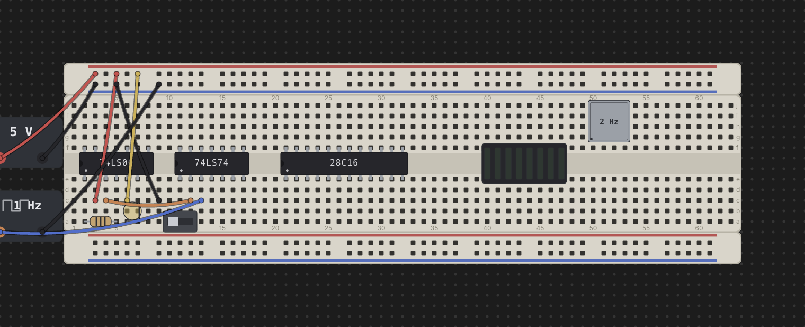

# Chips & Components

Everything that isn't a breadboard strip lives in the **Parts** palette on the
left: 74xx logic chips, memory chips, switches, LEDs, displays, resistors,
oscillators, and power/clock bricks. This page covers finding a part,
seating it on a board, and the (surprisingly varied) ways different parts
rotate and flip once they're down.

## The parts palette

The palette opens with every section collapsed, grouped by function:

- **CHIPS** — every 74xx logic family, folder-grouped, plus a separate
  **Memory** group for ROM/RAM chips.
- **COMPONENTS** — **Switches**, **Resistors**, **LEDs**, **Displays**,
  **Oscillators**, and **Power**, in that shelf order.

Type in the **Filter parts…** box to search by id, title, or description —
matching, it forces every group open so results aren't hidden behind a
collapsed folder. A chip whose behavior is wired into the simulator carries
a small **sim** badge next to its name (every chip in the catalog currently
does). Click any entry to arm placement — a ghost of the part follows your
pointer until you click it down on a board, or press `Esc` to cancel.

## Placing a DIP chip

A DIP chip always straddles the trench: half its pins seat in row **e**,
the other half in row **f**, running the standard counterclockwise DIP
numbering — pin 1 at the anchor hole in row e, pins continuing left to right
along e, then wrapping back right to left along f. The **notch** end of the
chip (or the dot beside pin 1) marks pin 1 and always faces left. Move the
ghost over a pin-board and it snaps to the nearest legal seat; it turns red
if the seat is already occupied or falls off the edge of the board.

Because a chip's footprint always occupies rows e/f no matter how it's
turned, placing one is a matter of picking the column — there's no
click-to-rotate step while placing a chip the way there is for a rail or a
resistor; instead, rotation happens afterward (see below).

## Placing a discrete

Most discretes — slide switches, push buttons, toggle buttons, LEDs (in
their default horizontal form), single-digit 7/8-segment displays, and LED
bars (bar8) — are **linear**: they seat along a run of adjacent holes in any
single grid row (any of `a`–`j`), not just rows e/f. Drop one anywhere its
footprint fits and every free hole underneath it is available.

A few parts don't fit that linear model:

- **bar8iso** — the isolated 8-segment LED bar — is packaged as a 16-pin
  DIP, so it straddles the trench exactly like a chip: anodes A1–A8 in row
  e, cathodes K1–K8 in row f.
- **Oscillator cans** (**osc-full**, **osc-half**) are rigid four-cornered
  shapes rather than a line of pins — a full can is 7 holes by 4, a half
  can 4 holes square, with legs only at the four corners. A can can seat
  anywhere on the grid, including straddling the trench, since its shape
  (not a row) determines its footprint.

## Rotating & flipping

Rotation behavior is **not one rule for every part** — it depends on what
kind of part it is. This is the part worth reading carefully.

**Chips (`R`, mid-drag or while selected).** A DIP chip's footprint maps
onto itself when flipped — same two rows, same columns — so flipping only
reverses which physical pin sits where; the chip never has to move. Select a
placed chip and press `R` to flip it 180° in place, or press `R` while
mid-drag to flip it before you drop it. Either way its pin-assignments
window updates to show the new numbering.

**bar8iso (`R` while selected).** The isolated LED bar is DIP-packaged, so
it flips exactly like a chip: `R` turns it 180° in place, the same 16 holes,
only the anode/cathode assignment per bar reverses. It does not have the
turn-in-hand behavior of a plain LED — treat it as a chip for rotation
purposes.

**Resistor and LED (`R`, both while placing and once placed).** These
two-lead parts start in a horizontal **footprint** form (pin 1 and pin 2 a
fixed span apart along one row). Press `R` while the ghost is armed to turn
it into a vertical **two-free-ends** form instead: pin 1 stays at the anchor
hole, and pin 2 becomes a free lead that can land on any other free hole —
including a hole on a different strip entirely, such as reaching up to a
power rail. Each `R` press while placing steps the ghost a further quarter
turn, cycling through all four compass directions before repeating. Once the
part is placed, select it and press `R` to rotate it 90° at a time — pin 1
stays put and pin 2's lead swings around it, hunting for the next free hole
to land in.

**Oscillator cans (`R`, but the exact step differs by state).** A can spins
around its own centre, not around one pin, and the step size changes
depending on whether you're still placing it:

- **While placing**, `R` steps the ghost a full 90° quarter-turn each
  press, so you can hunt through every orientation for one that fits.
- **Once seated and selected**, `R` behaves differently for the two sizes:
  the square **osc-half** can still steps 90° at a time, but the
  rectangular **osc-full** can jumps straight from 0° to 180° (and 90° to
  270°) — because a non-square footprint only has two genuinely distinct
  orientations once it's down (rotating it a further 90° would just retrace
  the same two footprints it already swept through while placing).

**LED polarity (`F`, while placing only).** Independent of rotation, press
`F` while an LED's placement ghost is armed to flip which lead is the anode
and which is the cathode, before you click it down.

## Occupancy — one hole, one lead

Every hole on a breadboard — and every terminal on a power/clock brick —
holds **at most one lead**, whether that's a chip pin or a wire end. Placing
a part checks every one of its derived pin positions against every other
part and every wire already on the desk; if any pin would land on an
occupied hole, or off the edge of a board entirely, the ghost turns red and
the drop is refused. This is the same rule a wire's endpoints follow (see
[Wiring, Nets & Buses](wiring.md)) — chips, discretes, and wires all compete
for the same holes, with no separate bookkeeping for any of them.

A rotated resistor or LED's free lead is the one case where a pin can
legally resolve to **nothing** — if you later move or delete the strip
under that lead, the part stays exactly where it is and that leg simply
floats, unconnected, just as it would on a real bench.

## The pin-assignments window

Double-click any placed part — chip, discrete, or brick — to open its
floating pin-assignments window: a diagram of every pin/terminal and, for
most chips, a cropped datasheet excerpt below it. A real chip's diagram
stays fixed at its canonical layout no matter how you've flipped it on the
desk (it matches the physical part, not the placement); `bar8iso` is the
exception — its diagram reflects its current `R` flip, since it has no real
notch of its own. See [The 74xx Chip Library](chip-library.md) for the full
detail on what the window shows and how it sources its datasheet crops.

---

See also: [The Desk & Breadboards](the-desk.md) for how boards and strips
work, and [Wiring, Nets & Buses](wiring.md) for connecting components
together once they're placed.
