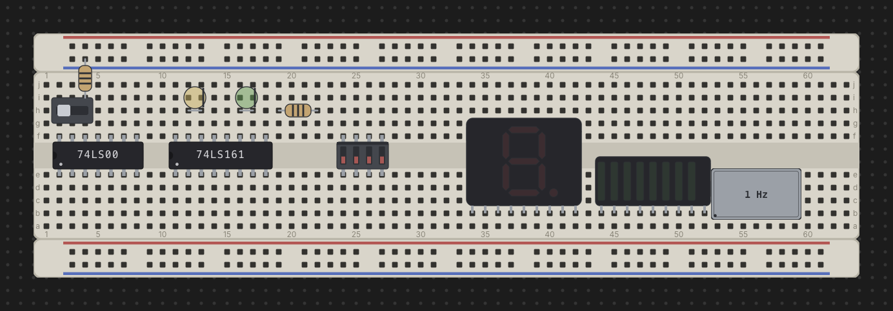

# Chips & Components

Everything that isn't a breadboard strip lives in the **Parts** palette on the
left: 74xx logic chips, 65xx interface chips, memory chips, switches, LEDs,
displays, resistors, oscillators, and power/clock bricks. This page covers
finding a part, seating it on a board, and the (surprisingly varied) ways
different parts rotate and flip once they're down.

## The parts palette

The palette opens with every section collapsed, grouped by function:

- **BOARDS** — the breadboard kits and loose strips, pinned at the top (see
  [The Desk & Breadboards](the-desk.md)).
- **CHIPS** — every 74xx logic family, folder-grouped, ending with the
  **Interface** group (the 65xx CPU/PIA/VIA).
- **COMPONENTS** — **Switches**, **Resistors**, **LEDs**, **Displays**,
  **Oscillators**, and **Power**, in that shelf order.
- **Memory** — the ROM/RAM chips, pulled out of CHIPS into a top-level group
  of their own.
- **ANNOTATIONS** — labels and notes, pinned at the bottom (see
  [Probing & Net Names](probing.md#annotations)).

The tray's right edge is a drag handle: pull it out to give long part names
more room, and the width you leave it at is remembered.

Type in the **Filter parts…** box to search by id, title, or description —
matching, it forces every group open so results aren't hidden behind a
collapsed folder. Click any entry to arm placement — a ghost of the part
follows your pointer until you click it down on a board, or press `Esc` to
cancel.

## Placing a DIP chip

A DIP chip always straddles the trench: half its pins seat in row **e**,
the other half in row **f**, running the standard counterclockwise DIP
numbering — pin 1 at the anchor hole in row e, pins continuing left to right
along e, then wrapping back right to left along f. The **notch** end of the
chip (or the dot beside pin 1) marks pin 1 and always faces left. Move the
ghost over a pin-board and it snaps to the nearest legal seat; it turns red
if the seat is already occupied or falls off the edge of the board.

Because a chip's footprint always occupies rows e/f no matter how it's
turned, placing one is a matter of picking the column — there's no
click-to-rotate step while placing a chip the way there is for a rail or a
resistor; instead, rotation happens afterward (see below).

## Placing a discrete

Most discretes — slide switches, push buttons, toggle buttons, LEDs (in
their default horizontal form), single-digit 7/8-segment displays, and LED
bars (bar8) — are **linear**: they seat along a run of adjacent holes in any
single grid row (any of `a`–`j`), not just rows e/f. Drop one anywhere its
footprint fits and every free hole underneath it is available.

A few parts don't fit that linear model:

- **bar8iso** — the isolated 8-segment LED bar — is packaged as a 16-pin
  DIP, so it straddles the trench exactly like a chip: anodes A1–A8 in row
  e, cathodes K1–K8 in row f.
- **DIP switch banks** (**sw-dip1**, **sw-dip2**, **sw-dip4**, **sw-dip8**)
  are likewise DIP-packaged (2/4/8/16 pins for 1/2/4/8 switch positions),
  straddling the trench the same way: each position's two facing pins —
  one in row e, one in row f — are its own independent SPST switch.
- **Oscillator cans** (**osc-full**, **osc-half**) are rigid four-cornered
  shapes rather than a line of pins — a full can is 7 holes by 4, a half
  can 4 holes square, with legs only at the four corners. A can can seat
  anywhere on the grid, including straddling the trench, since its shape
  (not a row) determines its footprint.
- **Character LCD modules** (**lcd16x2**, **lcd20x4**) *are* linear — a
  16-way header along 16 adjacent holes in one row — but the module itself
  is much bigger than that row. See below.

## Character LCD modules

The **Displays** group holds two HD44780 character-LCD modules: a 16×2
(the standard 1602A) and a 20×4 (the 2004A). They're drawn to their real
sizes — 80 × 36 mm and 98 × 60 mm of PCB — and their screens are **live**:
run the circuit, drive the module, and the characters appear on the glass.

Both plug in through a **16-way header along one row**, and the pin
assignment is identical between them, so what you learn wiring one applies
to the other. The header runs along the module's **top** edge, which means
the body hangs **below** the row it plugs into — so seat one on a **bottom
row (`a`)** and it clears the board it's plugged into rather than covering
it. The placement ghost shows you the whole module, so you can see this
before you click.

Driving one is the ordinary HD44780 parallel bus: put a command or character
code on `DB0`–`DB7`, set `RS` (0 = instruction, 1 = data) and `R/W`
(0 = write), and pulse `E` — the byte latches on `E`'s falling edge. Wire
`VDD`/`VSS` to a 5 V rail. `V0` (contrast) and `A`/`K` (backlight) are
present on the pinout but cosmetic here. During a *read* the module drives
`DB0`–`DB7` itself, so tri-state anything else sharing that bus.

Both modules show the same controller datasheet in their pin-assignments
window — it's one document, because `RS`/`R/W`/`E`, the bus and the address
maps are the controller's and are identical across the two sizes.

## Rotating & flipping

Rotation behavior is **not one rule for every part** — it depends on what
kind of part it is. This is the part worth reading carefully.

**Chips (`R`, mid-drag or while selected).** A DIP chip's footprint maps
onto itself when flipped — same two rows, same columns — so flipping only
reverses which physical pin sits where; the chip never has to move. Select a
placed chip and press `R` to flip it 180° in place, or press `R` while
mid-drag to flip it before you drop it. Either way its pin-assignments
window updates to show the new numbering.

**bar8iso and DIP switch banks (`R` while selected).** The isolated LED bar
and every DIP switch bank are DIP-packaged, so they flip exactly like a
chip: `R` turns the part 180° in place, the same holes, only the pin
numbering per position reverses (a switch bank's own position states don't
move — position 1 is still position 1, just wired to the opposite pins now).
Neither has the turn-in-hand behavior of a plain LED — treat them as chips
for rotation purposes.

**Resistor and LED (`R`, both while placing and once placed).** These
two-lead parts start in a horizontal **footprint** form (pin 1 and pin 2 a
fixed span apart along one row). Press `R` while the ghost is armed to turn
it into a vertical **two-free-ends** form instead: pin 1 stays at the anchor
hole, and pin 2 becomes a free lead that can land on any other free hole —
including a hole on a different strip entirely, such as reaching up to a
power rail. Each `R` press while placing steps the ghost a further quarter
turn, cycling through all four compass directions before repeating. Once the
part is placed, select it and press `R` to rotate it 90° at a time — pin 1
stays put and pin 2's lead swings around it, hunting for the next free hole
to land in.

**Oscillator cans (`R`, but the exact step differs by state).** A can spins
around its own centre, not around one pin, and the step size changes
depending on whether you're still placing it:

- **While placing**, `R` steps the ghost a full 90° quarter-turn each
  press, so you can hunt through every orientation for one that fits.
- **Once seated and selected**, `R` behaves differently for the two sizes:
  the square **osc-half** can still steps 90° at a time, but the
  rectangular **osc-full** can jumps straight from 0° to 180° (and 90° to
  270°) — because a non-square footprint only has two genuinely distinct
  orientations once it's down (rotating it a further 90° would just retrace
  the same two footprints it already swept through while placing).

**LED polarity (`F`, while placing only).** Independent of rotation, press
`F` while an LED's placement ghost is armed to flip which lead is the anode
and which is the cathode, before you click it down.

## Moving a seated part — with or without its wiring

Dragging a placed part re-seats the part and **leaves every wire where it
was**. That is often what you want while a circuit is still bare, but once
it's wired it quietly changes the circuit: the pins land on different
column-halves, the wires stay in the holes you laid them in, and what was
pin 1's input is now pin 3's.

So, exactly as with pulling a mated strip out of a board group, hold a
modifier while you start the drag:

- **Option-drag** — moves the part **and its wiring together**. Every wire
  end sitting in a column-half one of the part's pins occupies comes along,
  keeping its own row and its offset from the part, so the circuit after the
  move is the circuit before it. The far end of each wire stays put.

Only the wires actually connected to the part come — a wire in a column the
part merely spans without having a pin there (a push button reaches two holes
three columns apart, not the one between them) is left alone, because it was
never connected to it.

**To see what would come, hold Option.** With a part selected, holding Option
rings every wire end that would travel with it, and releasing Option puts the
rings away — so you can check before you commit to the drag rather than
discover it during one. A wire connected to the part at *both* ends gets two
rings; a wire connected at one end gets one, on the end that moves. A part
with nothing attached simply shows nothing.

The drop is **all or nothing**. If any of those wire ends has nowhere to go —
its hole is taken by something that isn't moving, or it would run off the end
of the strip — the part *and* every wire it would have carried turn red, and
releasing puts everything back. Half a move would silently cut the
connections it left behind, which is the very thing the gesture exists to
avoid.

Two details worth knowing:

- Whether the wiring comes is decided when you **press**, not when you let
  go. Once the part is in hand, the set is fixed.
- A part can't be Option-dragged **across the trench** while it's wired —
  rows `a`–`e` and `f`–`j` are separate nodes, so a wire that kept its row
  would no longer be connected to the pin beside it. That drop is refused.

`Shift` is not this modifier: Shift-drag always rubber-bands a selection,
including when the press lands on top of a part.

## Occupancy — one hole, one lead

Every hole on a breadboard — and every terminal on a power/clock brick —
holds **at most one lead**, whether that's a chip pin or a wire end. Placing
a part checks every one of its derived pin positions against every other
part and every wire already on the desk; if any pin would land on an
occupied hole, or off the edge of a board entirely, the ghost turns red and
the drop is refused. This is the same rule a wire's endpoints follow (see
[Wiring, Nets & Buses](wiring.md)) — chips, discretes, and wires all compete
for the same holes, with no separate bookkeeping for any of them.

A rotated resistor or LED's free lead is the one case where a pin can
legally resolve to **nothing** — if you later move or delete the strip
under that lead, the part stays exactly where it is and that leg simply
floats, unconnected, just as it would on a real bench.

## The pin-assignments window

Right-click any placed part — chip, discrete, or brick — and choose
**Pin Assignment**, at the top of its context menu, to open its floating
pin-assignments window: a diagram of every pin/terminal and, for
most chips, a cropped datasheet excerpt below it. A real chip's diagram
stays fixed at its canonical layout no matter how you've flipped it on the
desk (it matches the physical part, not the placement); a DIP-packaged
discrete — `bar8iso` or any DIP switch bank — is the exception: its diagram
reflects its current `R` flip, since it has no real notch of its own. See
[The Chip Library](chip-library.md) for the full
detail on what the window shows and how it sources its datasheet crops.

---

See also: [The Desk & Breadboards](the-desk.md) for how boards and strips
work, and [Wiring, Nets & Buses](wiring.md) for connecting components
together once they're placed.
