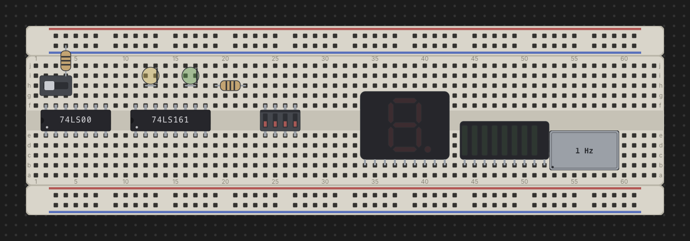

# Chips & Components

Everything that isn't a breadboard strip lives in the **Parts** palette on the
left: 74LS and CD4000 logic chips, CPUs, 65xx interface chips, memory chips, switches, LEDs,
displays, resistors, capacitors, inductors, diodes, transistors, oscillators, the 555 timer,
and power/clock bricks. This page covers
finding a part, seating it on a board, and the (surprisingly varied) ways
different parts rotate and flip once they're down.

## The parts palette

The palette opens with every section collapsed, grouped by function:

- **BOARDS** — the breadboard kits and loose strips, pinned at the top (see
  [The Desk & Breadboards](the-desk.md)).
- **CHIPS** — the logic chips, folder-grouped by function, ending with the
  **Timer** group (the **555 timer**), the **Interface** group (the 65xx
  PIA/VIA) and the **PROCESSOR** group (the W65C02 and Z80A CPUs). Which logic
  family it shows — 74LS, CD4000, or both, each in a folder of its own — is
  **Settings → Data Sheets → Chip family** (see
  [Choosing a logic family](chip-library.md#choosing-a-logic-family)). The 555
  belongs to neither family, so it shows in every mode; showing CD4000 alone,
  it shares the **Timer** group with the CD4000 timers.
- **COMPONENTS** — **Switches**, **Resistors**, **Capacitors**,
  **Inductors**, **Diodes**, **Transistors**, **LEDs**, **Displays**,
  **Oscillators**, and **Power**, in that shelf order. Capacitors, Inductors,
  Diodes and Transistors carry a red **(i)** beside their names: these parts
  do only part of what the real ones do, and are there for the export and a
  complete design (see
  [Inductors, diodes and transistors](#inductors-diodes-and-transistors)).
- **Memory** — the ROM/RAM chips, pulled out of CHIPS into a top-level group
  of their own.
- **ANNOTATIONS** — labels and notes (see
  [Probing & Net Names](probing.md#annotations)).
- **SIGNALS** — bench stimulus buttons, pinned at the bottom (see
  [External signals](power-and-clocks.md#external-signals)).

With the tray shut, the strip it leaves on the desk's edge carries one icon per
section in the same order — click one to open the tray on that section alone.
To keep the tray down to one section all the time, turn on **Auto-close tray
folders** in [Settings](settings.md#appearance): opening any folder then
closes the rest.

The tray's right edge is a drag handle: pull it out to give long part names
more room, and the width you leave it at is remembered.

Type in the **Filter parts…** box to search by id, title, or description —
matching, it forces every group open so results aren't hidden behind a
collapsed folder. Click any entry to arm placement — a ghost of the part
follows your pointer until you click it down on a board, or press `Esc` to
cancel.

## Placing a DIP chip

A DIP chip always straddles the trench: half its pins seat in row **e**,
the other half in row **f**, running the standard counterclockwise DIP
numbering — pin 1 at the anchor hole in row e, pins continuing left to right
along e, then wrapping back right to left along f. The **notch** end of the
chip (or the dot beside pin 1) marks pin 1 and always faces left. Move the
ghost over a pin-board and it snaps to the nearest legal seat; it turns red
if the seat is already occupied or falls off the edge of the board.

The **wide chips** — the 24-, 28-, 32- and 40-pin packages: the memories, the
6502 and its peripherals, the Z80 and the 74LS181 — are 0.6 inch across, twice
a small chip, and seat at that true width: pin 1 in row **d**, the other row
of pins in row **h**, six holes apart. The chip's body covers rows e, f and g
between them, so those holes can't take a wire or another part's lead — wire
to each pin from the rows outside it instead (a–c below, i–j above). A desk
saved before wide chips seated this way keeps them in rows e and f just as
they were; move one on its own and it takes its true width, bringing the wires
you carry with **Option** out from under its body.

Because a chip's footprint is the same two rows no matter how it's turned,
placing one is a matter of picking the column — there's no click-to-rotate
step while placing a chip the way there is for a rail or a resistor; instead,
rotation happens afterward (see below).

## Placing a discrete

Most discretes — slide switches, push buttons, toggle buttons, LEDs (in
their default horizontal form), single-digit 7/8-segment displays, and LED
bars (bar8) — are **linear**: they seat along a run of adjacent holes in any
single grid row (any of `a`–`j`), not just rows e/f. Drop one anywhere its
footprint fits and every free hole underneath it is available.

A few parts don't fit that linear model:

- **bar8iso** — the isolated 8-segment LED bar — is packaged as a 16-pin
  DIP, so it straddles the trench exactly like a chip: anodes A1–A8 in row
  e, cathodes K1–K8 in row f.
- **DIP switch banks** (**sw-dip1**, **sw-dip2**, **sw-dip4**, **sw-dip8**)
  are likewise DIP-packaged (2/4/8/16 pins for 1/2/4/8 switch positions),
  straddling the trench the same way: each position's two facing pins —
  one in row e, one in row f — are its own independent SPST switch.
- **Oscillator cans** (**osc-full**, **osc-half**) are rigid four-cornered
  shapes rather than a line of pins — a full can is 7 holes by 4, a half
  can 4 holes square, with legs only at the four corners. A can can seat
  anywhere on the grid, including straddling the trench, since its shape
  (not a row) determines its footprint.
- **Character LCD modules** (**lcd16x2**, **lcd20x4**) _are_ linear — a
  16-way header along 16 adjacent holes in one row — but the module itself
  is much bigger than that row. See below.

## Component values

A **resistor** has a **Resistance**, a **capacitor** a **Capacitance**, an
**inductor** an **Inductance**, a **Zener diode** a **Zener voltage** and a
**transistor** a **Part number**. Right-click the part, choose
**Properties…**, and either pick from the field's list — the ▾ beside it, or
↓ — or type any value at all, the way it is printed on a parts drawer or a
schematic. Typing narrows the list to the entries holding what you have typed
(`4` leaves 47Ω, 470Ω, 4.7kΩ, 47kΩ and 470kΩ; `u` finds µ).

| Typed                                   | Reads as    |
| --------------------------------------- | ----------- |
| `470`, `470R`, `470Ω`, `470 ohms`       | 470Ω        |
| `4.7k`, `4k7`, `4.7 k`, `4.7 kilo ohms` | 4.7kΩ       |
| `1M`, `1meg`, `2M2`                     | 1MΩ, 2.2MΩ  |
| `2R2`, `0.47`                           | 2.2Ω, 0.47Ω |
| `100n`, `100nF`, `0.1uF`, `0.1µF`       | 100nF       |
| `4n7`, `10 microfarads`                 | 4.7nF, 10µF |
| `10uH`, `1 millihenry`                  | 10µH, 1mH   |
| `5.1`, `5.1V`, `5V1`                    | 5.1V        |

A plain number is in the field's own unit — ohms, farads, henries or volts —
so `100` in a Capacitance is a hundred farads, which is out of range and says
so. The prefixes are `p` `n` `u`/`µ` `m` `k` `M` `G`, or spelled out (`pico`
… `giga`, and `meg` as SPICE writes it). A lowercase `m` is always milli and
an uppercase `M` always mega: `1m` on a resistor is a milliohm, refused as out
of range rather than guessed at. A prefix letter — or `R` for ohms, `V` for
volts — can stand in for the decimal point (`4k7`, `2R2`, `4n7`, `5V1`). A
unit belonging to something else is refused by name: `10uF` in a Resistance
is "a capacitance, not a resistance".

Press Enter or move out of the field to apply it. A value that reads is shown
back in its tidy form — `100 kilo ohms` becomes `100kΩ` — to three figures,
or to as many as you typed (`4753` is `4.753kΩ`; nothing is rounded away). One
that doesn't stays as you typed it, in red with the reason under it ("Not a
resistance value", "Out of range: 0.1Ω to 100MΩ"), and the part keeps the
value it had. Any value in range is taken, on the list or not.

| Field                      | Range         | List                           |
| -------------------------- | ------------- | ------------------------------ |
| Resistance                 | 0.1Ω – 100MΩ  | the E12 series, 10Ω – 1MΩ      |
| Capacitance (ceramic)      | 1pF – 100µF   | 10pF – 1µF                     |
| Capacitance (electrolytic) | 100nF – 100mF | 1µF – 1mF                      |
| Inductance                 | 1nH – 10H     | 1µH – 100mH                    |
| Zener voltage              | 1.8V – 200V   | 2.4V – 30V, each with its part |

A **Zener**'s list pairs each voltage with its part — `5.1V (1N4733A)` — and
picking one sets both. Typing a voltage on the list (`5.1`, `5V1`) brings its
part number with it, typing a part number on it (`1n4742`) picks its entry,
and any other voltage stands alone, with no part number.

A capacitor's **Type** (Ceramic or Electrolytic) and a transistor's **Type**
(NPN, PNP, N- or P-channel MOSFET) swap the part where it stands and reopen
its card as the new one; like any change to the wiring, the Type is greyed
while the circuit runs. The value comes across untouched, so a capacitance
outside the new type's range shows red rather than being changed. A
transistor's list holds the parts of its own type, and a part number from
another type's list is cleared by the swap (one you typed yourself is kept).
Typing another type's part number is allowed, with a warning — `2N3906 is a
PNP transistor`.

An older project's values load as they were. One that cannot be read is kept
exactly as written, and shows red when you open the card.

On the desk a resistor wears its **colour code** — four bands for a value two
figures say (`4.7k`: yellow, violet, red, gold), five for one that needs three
(`4.99k`) — and a capacitor has its value printed on it. Both values appear in
the [Schematic View](schematic-view.md), the [BOM](build-guide.md), and the
[KiCad export](exporting.md#kicad).

A resistor's value changes nothing in the simulation: a resistor is a weak pull
whatever it measures, and a lamp is lit or burnt by whether one is in the
loop. Only the timing chips read it (below).

## Potentiometers

**COMPONENTS ▸ Resistors ▸ Potentiometer** is a three-pin trimmer: a
resistive track between the two outer pins and a **wiper** on the middle pin
that taps it. It seats along one row like a switch, pins 1, W and 3 in three
holes side by side.

Its **Properties…** card has the track's **Resistance** (picked or typed
like any resistor's) and the wiper's **Position**, a slider from 0 % to 100 %. The
resistance from the wiper to pin 1 is Position × Resistance, and to pin 3 is
what is left of the track:

| Position | Wiper ↔ pin 1 | Wiper ↔ pin 3 |
| -------- | ------------- | ------------- |
| 0 %      | 0 — a wire    | 100k          |
| 10 %     | 10k           | 90k           |
| 50 %     | 50k           | 50k           |
| 90 %     | 90k           | 10k           |
| 100 %    | 100k          | 0 — a wire    |

(for a 100k part). The slider shows exactly that as you move it — the
resistance to pin 1 at its left end and to pin 3 at its right, `15k ━●━━━ 85k`
— and changing the Resistance updates both. It applies as you drag it, while the
circuit runs as well, and the brass screw on the part turns to show where the
wiper is.

Each side with track left behaves exactly like a resistor: a weak pull, and a
value the timing chips read — a pot as a 555's RB tunes its rate. A side with
**none** left is the wiper resting on that pin: a plain wire, so the two nets
join, and an LED fed through it with nothing else in the loop **burns**.

## Capacitors

**COMPONENTS ▸ Capacitors** holds two:

- **Capacitor (ceramic)** — a disc, not polarised, leads one hole apart.
- **Capacitor (electrolytic)** — a can with a stripe down its **negative**
  side, leads one hole apart. Pin 1 is `+`, pin 2 is `−`.

Both place, rotate and bend exactly like a resistor (see
[Rotating & flipping](#rotating--flipping)), and they take holes the way any
part does, so a wire or a pin can't share one.

**A capacitor carries a value, not charge.** It does not filter, smooth,
decouple or store anything, and it connects nothing: the simulation treats it
as open, even when its legs sit across the two rails. What it is for is the
**timing chips** — the 555, the CD4047B, the CD4060B, the CD4098B and the
CD4538B read the capacitor (and the resistors) wired to their timing pins and
run at the rate the datasheet gives for those values; see
[Timers](chip-library.md#timers). A capacitor still counts as connected when
the checks ask whether a net has anything on it.

A reversed electrolytic makes no difference to the simulation. Watch the
stripe anyway if you mean to build it.

The first time you place a capacitor a note says all this; **Don't show
again** puts it away for good.

## Inductors, diodes and transistors

On the standard engine these parts do as much as a logic simulator can
honestly do, and no more: no forward drop, no gain, no thresholds, no Zener
breakdown, no inductive kick. [Spice Lite](spice-lite.md#diodes-and-transistors)
simulates all of those. What they always do is **export to KiCad as the real part** (see
[Exporting](exporting.md#kicad)). Every one of them — and the capacitors —
has an optional **Part number** in **Properties…** (`1N4148`, `2N2222`,
`2N7000`…). It is printed on the part, listed in the
[BOM](build-guide.md) and written to the export, and it changes nothing about
how the part behaves.

**Inductors** (**COMPONENTS ▸ Inductors**) take an optional **Inductance**
(see [Component values](#component-values)); leave it blank for a bare
inductor.
Its **Style** is the part it is, seen from above like everything on the
desk: a **Coil** — a toroid standing on edge over its leads, copper wound
round a dark ferrite ring — or a **Can**, a drum in a black sleeve, its value
printed on top. **Holes between
leads** is **1** (leads 0.2 in apart, the smallest part), **2** (0.3 in, the
default) or **3** (0.4 in, the biggest). On a part lying along a row it moves
the second lead, so a size whose lead would land on a taken hole, or off the
end of the board, is refused — with the reason under the choice — and the
choice is greyed while the circuit runs, like any other change to the
wiring. On the standard engine an inductor **conducts
like a wire**: its two leads are one net, whatever it looks like. So one
across the rails is a short, exactly as a wire would be. Under
[Spice Lite](spice-lite.md#inductors) one with an Inductance is a real
inductor, and its card gains a **Winding** choice.

**Diodes** (**COMPONENTS ▸ Diodes**) are the **Diode** and the **Zener
diode**. Pin 1 is the anode; pin 2, the cathode, is the end the band marks. A
diode is **one-way**: a HIGH on its anode passes to its cathode, and nothing
ever passes back. A LOW or undriven anode leaves the cathode to whatever else
is on it — so two diodes into one net, with a pull-down resistor there, make a
**diode-OR**. The HIGH passes at the strength it arrived with: from a rail or a
chip output it drives the cathode, through a resistor it only pulls it. Like an
LED, a diode wired forward straight across two strongly driven nets (rail to
rail, or an output into ground) **burns**. A Zener takes an optional **Zener
voltage**, picked with its part number or typed (see
[Component values](#component-values)), printed and exported, but in
the simulation it is exactly a diode: reverse breakdown is analog, so it
regulates nothing here.

**Transistors** (**COMPONENTS ▸ Transistors**) are an **NPN** and a **PNP**
bipolar transistor and an **N-channel** and a **P-channel MOSFET**, each
standing over three holes in a row with its pin letters printed on it: `E B C`
for the BJTs, `S G D` for the MOSFETs. A BJT is a **TO-92** unless you pick
**TO-220** (a TIP120 or a TIP31C) under **Package** in its **Properties…**; a
MOSFET is a **TO-220** — the power part, its metal tab behind it — unless you
pick **TO-92**. The package is how it is drawn, listed in the BOM and
exported; on the standard engine it is never how it behaves (under
[Spice Lite](spice-lite.md#diodes-and-transistors) it picks the default
**Grade**). Its **Type** turns it into any of the four where it stands.
Picking a part number from the list sets its package (and, under Spice Lite,
its grade) to match. Real pinouts differ by part number
(a 2N2222 is E·B·C, a BC547 C·B·E, an IRLZ44N G·D·S), so select one and press
`R` to turn it end-for-end. In the simulation each is a **switch**:

| Part             | Control  | Joins                         | On while the control is |
| ---------------- | -------- | ----------------------------- | ----------------------- |
| NPN              | Base `B` | Collector `C` and emitter `E` | HIGH                    |
| PNP              | Base `B` | Emitter `E` and collector `C` | LOW                     |
| N-channel MOSFET | Gate `G` | Drain `D` and source `S`      | HIGH                    |
| P-channel MOSFET | Gate `G` | Source `S` and drain `D`      | LOW                     |

When it is on, the two switched pins are joined as a closed switch joins them;
when it is off, they are apart. What an **undriven** or undefined control does
is where the two kinds differ, as they do on a bench:

- A **BJT** follows its base and remembers nothing: with its base floating or
  undefined it is **off**.
- A **MOSFET's gate holds charge**: it stays in the last state its gate was
  driven to — **off** until the gate has been driven at all. So a gate left
  floating (or driven by a floating CMOS output) keeps the MOSFET on or off
  rather than passing the confusion down the channel. While it runs on that
  held charge, the lamp on its face is ringed in amber, its hover says so, and
  its **Properties…** card warns you: a real gate leaks that charge away, so
  tie it to a defined level with a resistor.

While the circuit runs, a transistor's lamp lights while it conducts. Put a
resistor in an LED's leg as you would on a bench — with none, the LED burns —
and a transistor switched on straight across the rails is a short.

A pin wired only to one of these parts **counts as connected**, conducting
or not: a reversed diode or an off transistor is a valid board, not a floating
input. Supplies don't pass through them, though — a chip powered through a
diode or a transistor sees no supply and stays unpowered.

## Character LCD modules

The **Displays** group holds two HD44780 character-LCD modules: a 16×2
(the standard 1602A) and a 20×4 (the 2004A). They're drawn to their real
sizes — 80 × 36 mm and 98 × 60 mm of PCB — and their screens are **live**:
run the circuit, drive the module, and the characters appear on the glass.

Both plug in through a **16-way header along one row**, and the pin
assignment is identical between them, so what you learn wiring one applies
to the other. The header runs along the module's **top** edge, which means
the body hangs **below** the row it plugs into — so seat one on a **bottom
row (`a`)** and it clears the board it's plugged into rather than covering
it. The placement ghost shows you the whole module, so you can see this
before you click.

Driving one is the ordinary HD44780 parallel bus: put a command or character
code on `DB0`–`DB7`, set `RS` (0 = instruction, 1 = data) and `R/W`
(0 = write), and pulse `E` — the byte latches on `E`'s falling edge. Wire
`VDD`/`VSS` to a 5 V rail. `V0` (contrast) and `A`/`K` (backlight) are
cosmetic in the standard engine; under [Spice Lite](spice-lite.md#character-lcds)
the backlight is an LED and `V0` sets the contrast. During a _read_ the
module drives `DB0`–`DB7` itself, so tri-state anything else sharing that
bus.

Both modules show the same controller datasheet in their pin-assignments
window — it's one document, because `RS`/`R/W`/`E`, the bus and the address
maps are the controller's and are identical across the two sizes.

## Rotating & flipping

Rotation behavior is **not one rule for every part** — it depends on what
kind of part it is. This is the part worth reading carefully.

**Chips (`R`, mid-drag or while selected).** A DIP chip's footprint maps
onto itself when flipped — same two rows, same columns — so flipping only
reverses which physical pin sits where; the chip never has to move. Select a
placed chip and press `R` to flip it 180° in place, or press `R` while
mid-drag to flip it before you drop it. Either way its pin-assignments
window updates to show the new numbering.

**bar8iso and DIP switch banks (`R` while selected).** The isolated LED bar
and every DIP switch bank are DIP-packaged, so they flip exactly like a
chip: `R` turns the part 180° in place, the same holes, only the pin
numbering per position reverses (a switch bank's own position states don't
move — position 1 is still position 1, just wired to the opposite pins now).
Neither has the turn-in-hand behavior of a plain LED — treat them as chips
for rotation purposes.

**Resistor, capacitor, inductor, diode and LED (`R`, both while placing and once placed).** These
two-lead parts start in a horizontal **footprint** form (pin 1 and pin 2 a
fixed span apart along one row). Press `R` while the ghost is armed to turn
it into a vertical **two-free-ends** form instead: pin 1 stays at the anchor
hole, and pin 2 becomes a free lead that can land on any other free hole —
including a hole on a different strip entirely, such as reaching up to a
power rail. Each `R` press while placing steps the ghost a further quarter
turn, cycling through all four compass directions before repeating. Once the
part is placed, select it and press `R` to rotate it 90° at a time — pin 1
stays put and pin 2's lead swings around it, hunting for the next free hole
to land in.

**Transistors (`R` while selected, or while placing).** A transistor turns
end-for-end in place, as the bussed resistor array does: the same three
holes, with the pin order reversed (`E B C` becomes `C B E`), which is how
its letters read on its face.

**Oscillator cans (`R`, but the exact step differs by state).** A can spins
around its own centre, not around one pin, and the step size changes
depending on whether you're still placing it:

- **While placing**, `R` steps the ghost a full 90° quarter-turn each
  press, so you can hunt through every orientation for one that fits.
- **Once seated and selected**, `R` behaves differently for the two sizes:
  the square **osc-half** can still steps 90° at a time, but the
  rectangular **osc-full** can jumps straight from 0° to 180° (and 90° to
  270°) — because a non-square footprint only has two genuinely distinct
  orientations once it's down (rotating it a further 90° would just retrace
  the same two footprints it already swept through while placing).

**LED polarity (`F`, while placing only).** Independent of rotation, press
`F` while an LED's placement ghost is armed to flip which lead is the anode
and which is the cathode, before you click it down.

## Moving a seated part — with or without its wiring

Dragging a placed part re-seats the part and **leaves every wire where it
was**. That is often what you want while a circuit is still bare, but once
it's wired it quietly changes the circuit: the pins land on different
column-halves, the wires stay in the holes you laid them in, and what was
pin 1's input is now pin 3's.

So, exactly as with pulling a mated strip out of a board group, hold a
modifier while you start the drag:

- **Option-drag** — moves the part **and everything plugged into it**. Every
  wire end sitting in a column-half one of the part's pins occupies comes
  along, keeping its own row and its offset from the part, so the circuit
  after the move is the circuit before it. The far end of each wire stays put.

**A resistor or LED plugged into the part comes too — by the leg that is
connected to it.** A leg in one of the part's column-halves is attached to it
exactly as a jumper in the next hole along is, so it travels; the other leg
stays exactly where it is and the part simply **bends** around it, the way a
resistor's legs bend on a real bench. Plugged in at _both_ legs, it travels
whole instead. (A chip's pins can't bend, so a chip next door is never dragged
along — it isn't a lead, it's a body.)

Only what is actually connected to the part comes — a wire or a leg in a
column the part merely spans without having a pin there (a push button reaches
two holes three columns apart, not the one between them) is left alone,
because it was never connected to it. And nothing chases further than one
step: what travels lands in the same column-half its pin lands in, so a rider
never leaves anything of its own stranded behind it.

**To see what would come, hold Option.** With a part selected, holding Option
rings every wire end and every leg that would travel with it, and releasing
Option puts the rings away — so you can check before you commit to the drag
rather than discover it during one. Something connected at _both_ ends gets
two rings, so a resistor that will travel whole reads differently from one
that will bend; something connected at one end gets one ring, on the end that
moves. A part with nothing attached simply shows nothing.

The drop is **all or nothing**. If any of those has nowhere to go — its hole
is taken by something that isn't moving, it would run off the end of the
strip, or the bend would squeeze a resistor's legs closer than its body is
long — the part _and_ everything it would have carried turn red, and releasing
puts everything back. Half a move would silently cut the connections it left
behind, which is the very thing the gesture exists to avoid.

A resistor or LED is dragged by its two ends rather than by a footprint, and
that makes one distinction: dragging its **body** moves both legs together, so
Option carries its wiring exactly as for any other part; dragging **one leg**
is a re-bend, and carries nothing — that leg can land in any hole, at any
angle, on any strip, so there is nothing for a wire to follow. (An LED lying
flat is only one hole wide, so there is no body to grab between its legs;
stand it up with `R`, or move it as part of a selection.)

Two details worth knowing:

- Whether the wiring comes is decided when you **press**, not when you let
  go. Once the part is in hand, the set is fixed.
- Moving **across the trench** takes the wiring over with it, keeping the
  arrangement. Rows `a`–`e` and `f`–`j` are separate nodes, so a wire that
  stayed in its row would be left in the half its pin had just left — it
  travels the same number of holes the part did instead, so a wire two holes
  from the part is still two holes from it, on the same side. Drag far enough
  that the wiring would run off the edge of the board and the drop is refused;
  a row nearer the trench fits.
- Moving to **another board** works the same way — the wiring lands in the
  matching holes over there, and anything the wires reach back to stays where
  it is. While the part is over the gap between two boards there is nowhere for
  it to land, so the wiring sits where it really is and turns red until the
  part is over holes again.

`Shift` is not this modifier: Shift-drag always rubber-bands a selection,
including when the press lands on top of a part.

### Moving several parts at once

A selection drags as one unit. Marquee a group of parts (Shift-drag), or add
them one at a time with `Cmd`/`Ctrl`-click, then drag any one of them: every
selected part travels by the same amount, keeping the arrangement exactly as
you built it. Power and clock bricks count as parts here, and come too.

Everything above applies unchanged, just to the whole group:

- **Option** takes the wiring with it — every wire, and every resistor or LED
  leg, riding _any_ member. A wire between two selected parts travels at both
  ends; one that leaves the group keeps its far end where it is; a resistor
  plugged into a member bends after it exactly as above.
- Holding Option **rings** every end and leg that would travel, across all of
  them.
- The drop is **all or nothing**. If one part, or one wire end, or one leg has
  nowhere to land, every member and everything riding it turns red and
  releasing puts the lot back — a group that dropped some of its members would
  be a rearrangement you never asked for.
- The whole move is **one undo step**.

A **board** in the selection is the one case that declines: strips have their
own drag, which carries everything seated on them under rules a part re-seat
knows nothing about. Pressing a part then does nothing and leaves the
selection alone — `Cmd`/`Ctrl`-click the board back out and drag the parts, or
grab the board itself, which drags its own snapped group with everything seated
on it and replaces the selection the way any plain click does. And a plain
click inside a selection narrows it to the part you clicked, exactly as
clicking a part outside one does.

One thing a selection does **not** carry: a **wire** you selected that isn't
plugged into any of the parts moving. Wires travel because they ride a pin, not
because they are highlighted — so a wire selected on its own (to delete or
recolor it) stays exactly where it is while the parts move around it.

## Occupancy — one hole, one lead

Every hole on a breadboard — and every terminal on a power/clock brick —
holds **at most one lead**, whether that's a chip pin or a wire end. Placing
a part checks every one of its derived pin positions against every other
part and every wire already on the desk; if any pin would land on an
occupied hole, or off the edge of a board entirely, the ghost turns red and
the drop is refused. This is the same rule a wire's endpoints follow (see
[Wiring, Nets & Buses](wiring.md)) — chips, discretes, and wires all compete
for the same holes, with no separate bookkeeping for any of them.

A rotated resistor or LED's free lead is the one case where a pin can
legally resolve to **nothing** — if you later move or delete the strip
under that lead, the part stays exactly where it is and that leg simply
floats, unconnected, just as it would on a real bench.

## The pin-assignments window

Right-click any placed part — chip, discrete, or brick — and choose
**Pin Assignment**, at the top of its context menu, to open its floating
pin-assignments window: a diagram of every pin/terminal and, for
most chips, a cropped datasheet excerpt below it. A real chip's diagram
stays fixed at its canonical layout no matter how you've flipped it on the
desk (it matches the physical part, not the placement); a DIP-packaged
discrete — `bar8iso` or any DIP switch bank — is the exception: its diagram
reflects its current `R` flip, since it has no real notch of its own. See
[The Chip Library](chip-library.md) for the full
detail on what the window shows and how it sources its datasheet crops.

---

See also: [The Desk & Breadboards](the-desk.md) for how boards and strips
work, and [Wiring, Nets & Buses](wiring.md) for connecting components
together once they're placed.
