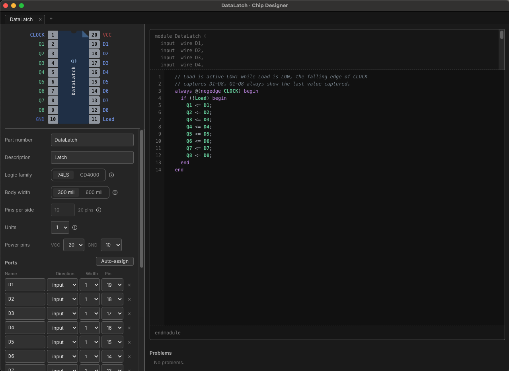
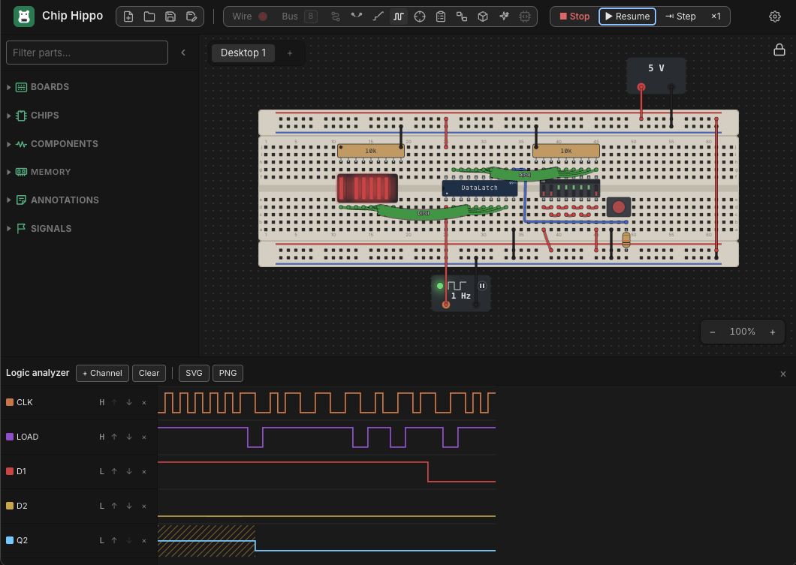

# Custom Chips

When the part you need isn't in the library, design it. A **custom chip** is a
DIP package you lay out yourself — how many pins, which is which — with its
behaviour written in a small, strict subset of **Verilog**. It sits in the
parts tray beside the library, places like any chip, and runs in the
simulation like any chip. While the circuit runs you can stop inside it and
step through its code a statement at a time.



Custom chips are **yours, not one project's**: every chip you design is kept
in Chip Hippo's own chip library on this computer, so it is in the tray of
every project you open. A project file carries the chips its desktops use, so
it opens complete on another computer — and opening a project that uses a
chip your library doesn't have adds that chip to your library. Exporting a
desktop takes the chips it uses with it, and importing one brings them in the
same way.

If a project carries its own, older copy of a chip you have since changed,
that project keeps using its copy while it is open, so its circuit is built
exactly as it was. Editing the chip there saves the edit to your library too.

## Making a chip

In the parts tray, open **CHIPS ▸ CUSTOM** (after the library's chips, or
beside the 74LS and CD4000 folders when the tray shows both families) and
click **New chip…**. The
**Chip Designer** window opens on a fresh design — a two-input NAND on a
14-pin package, so there is something working to change. Right-click a chip
in the tray for **Edit Design…**, **Duplicate Design** and **Delete Design**.
Deleting a design removes it from your library; a chip placed on a desktop of
the open project can't be deleted until it has been removed from the desk.

The designer is one window with a tab per open design. The left half is the
package — its pinout drawn as a datasheet draws it, which stays in view at the
top, and under a line the fields that define it, which scroll on their own.
The right half is the code. Drag the divider between the halves to give the
package more room (a chip of several units has a wide pin table); double-click
it to put it back. Chip Hippo remembers where you left it.

### The package

- **Part number** — what is printed on the chip, up to 16 letters, digits,
  `-` and `_`. It is also the Verilog module's name.
- **Description** — a line shown beside it in the tray and in the BOM.
- **Logic family** — 74LS or CD4000. It decides what an input left open reads
  (HIGH for 74LS, unknown for CD4000) and the supply the chip needs, exactly
  as for the library's parts of that family.
- **Body width** — 300 mil or 600 mil, which is where it seats on the board:
  a 300-mil chip straddles the trench in rows e and f, a 600-mil one in rows d
  and h.
- **Pins per side** — from 2 to 20, so from 4 to 40 pins.
- **Units** — how many copies of the module the package holds, up to six
  (see [Units](#units)).
- **Power pins** — which pins are VCC and GND (VDD and VSS for CD4000).
- **Ports** — the module's inputs and outputs: a name, a direction (input,
  output, or **inout** for a pin the chip both reads and drives, such as a
  data bus) and a width
  of 1 to 16 bits, and at the end of the row the pin it is on — one column
  per unit. A port wider than one bit takes one pin per bit, so its bits are
  listed under it, each with its own pins. **Auto-assign** puts every bit
  that has no pin on the next free one. When there are more units than the
  pane has room for, the pin columns scroll sideways while each port's name
  stays in view.

While a chip is placed on any desktop of the open project its **size and
width are fixed** — its instances are seated in holes, and moving their pins
would silently rewire every desk it is on. Everything else, the code included,
can still change. To change the package of a chip in use, remove it from the
desk first, or duplicate the design. (Other projects that use the chip are not
rewired by a change made here: each keeps its own copy in its file.)

### The code

The **module header** — `module`, the port list, `endmodule` — is generated
from the package and shown above and below the editor, read-only. You write
only the **body**: declarations, `assign` statements and `always` blocks. So
the code's pins can never drift from the chip's: rename a port in the package
and the header follows. The header takes up to two fifths of the code area
and scrolls past that; drag the line under it to make it taller or shorter,
and double-click the line to put it back.

The code is checked as you type. Problems are listed under the editor with
their line numbers, and the line is marked in the gutter. A chip whose
package or code has a problem still places, but it **drives nothing** (every
output floats), and pressing Run says which chips those are.

Hover a pin on the package to light every use of it in the code; hover a name
in the code to light its pins on the package.

## The Verilog subset

What is supported behaves as real Verilog does, so code written here reads
correctly to anyone who knows the language — and anything outside the subset
is **refused with a message saying so**, never approximated.

```verilog
// Ports: CLK, RST_N in; Q[3:0] out — a 4-bit binary counter with an
// asynchronous reset.
reg [3:0] count = 4'd0;

always @(posedge CLK or negedge RST_N)
  if (!RST_N)
    count <= 4'd0;
  else
    count <= count + 1;

assign Q = count;
```

**Supported**

- `wire` and `reg` declarations, with a constant range (`reg [7:0] r;`) and
  an optional initial value (`reg q = 1'b0;`); `integer` (a signed 32-bit
  variable); `parameter` and `localparam` (and `parameter integer`).
- **Arrays** of `reg` or `integer` — memories — with one dimension:
  `reg [7:0] mem [0:32767];`. Read or write one word at a time,
  `mem[address]`; an address that is unknown or out of range reads `x` and
  writes nothing. An array may hold up to 32,768 words, and a chip's arrays
  up to 65,536 words between them. Only an `always @(posedge …)` or an
  `initial` block may write an array (from `always @(*)` it would be a
  latch), and an array can't be given a value where it is declared — fill it
  from an `initial` block. A word starts as `x`, as in a real simulator.
- Continuous `assign`.
- `always @(*)` (or a full list of signals, `@(a or b)`) for combinational
  logic.
- `always @(posedge CLK)`, with `negedge` as needed, and asynchronous controls
  in the same list: `@(posedge CLK or negedge RST_N)`, tested in the block's
  leading `if`, as a synthesis tool expects.
- `initial` blocks, for a starting value.
- `begin … end`, `if` / `else`, and `case` / `casez` / `casex` with `default`.
- **Named blocks** with variables of their own:
  `begin : fill integer i; … end`. The declarations come first, take no
  initial value, and are seen only inside the block — the watch panel shows
  them as `fill.i`.
- **`for` and `repeat` loops** whose bounds are constants (see
  [Loops](#loops)).
- Blocking `=` and non-blocking `<=`, with Verilog's semantics: a
  non-blocking assignment takes effect after every block triggered by the same
  edge has run.
- Operators: bitwise `& | ^ ~ ~^`, reduction (`&a`, `|a`, `^a` and their
  negations), logical `&& || !`, equality `== != === !==`, comparison
  `< <= > >=`, shifts `<< >> <<< >>>`, arithmetic `+ - * / % **`, the ternary
  `?:`, concatenation `{a, b}` and replication `{4{a}}`, and bit, part and
  indexed part selects (`a[3]`, `a[7:4]`, `a[i +: 4]`, `a[i -: 4]`).
- Numbers in Verilog's forms — `13`, `4'b1010`, `8'hFF`, `'d9` — with `x`
  and `z` digits.

Values are four-state (`0`, `1`, `x`, `z`) and up to 32 bits wide. A `reg`
with no initial value starts as `x`, as in a real simulator. Signedness is
Verilog's: a plain number such as `13`, an `integer`, and a parameter given
one of them are signed, everything else is unsigned, and an expression is
signed only when every value in it is — so `(0 - 1) < 2` is true, while
`(count - 1) < 2` with an 8-bit `count` compares unsigned.

**Not supported** — `while` and `forever` loops (every evaluation has to
finish), delays (`#`; the simulation is zero-delay), functions and tasks,
system tasks such as `$display` (the debugger's watch panel shows every
value), `signed` declarations (use `integer`), arrays of more than one
dimension or of wires, gate primitives, module instances (use units instead),
and compiler directives.

**Also refused, because they are mistakes**: assigning an input; driving one
signal from two places; a `reg` driven by `assign` or a `wire` set in an
`always` block; an `assign` to a bit a variable picks (`assign Y[S] = A;` —
choose the bit in an `always @(*)` instead); an `always @(*)` that leaves a
signal unset on some path (it would be a latch); a signal set with `<=` and
then read in the same `always @(*)`, where it would still hold its old value
(use `=` there); an event list that misses a signal the block reads; and a
combinational loop (`assign` and `always @(*)` cannot hold state — a clocked
block can). A loop's counter is the one exception to the latch rule: a `for`
inside an `if` leaves it unset when the loop does not run, which is fine as
long as nothing reads it there. Undriven outputs and unused registers are
warnings rather than errors.

### Inout pins

An **inout** port is a pin the chip both reads and drives, as a memory's or a
processor's data bus is. Drive it with `assign`, giving `z` whenever the chip
should let go of it; reading it reads the **pin** — whatever the board has
settled it to, the chip's own drive included. An inout can't be set from an
`always` block, and, like an output, can't share a pin with another unit.

```verilog
// Ports: A[14:0], CE_N, OE_N, WE_N in; D[7:0] inout — a 32K × 8 static
// RAM on the HM62256's pins. A write takes the byte on the bus as WE_N
// rises.
reg [7:0] mem [0:32767];

always @(posedge WE_N)
  if (!CE_N)
    mem[A] <= D;

assign D = (!CE_N && !OE_N && WE_N) ? mem[A] : 8'bz;
```

### Loops

A `for` or `repeat` loop is accepted only when Chip Hippo can tell, before
anything runs, how many times it goes round — so that every evaluation is
sure to finish:

- A `for` loop sets **one counter** in its first and last parts —
  `for (i = 0; i < 8; i = i + 1)` — and its start, condition and step use
  only numbers, parameters and the counter itself. The body may not change
  the counter.
- A `repeat (n)` count is a constant.
- Declare the counter first: at the top (`integer i;`) or in a named block.
  Declaring it in the loop header, `for (integer i = 0; …)`, is
  SystemVerilog, not Verilog. A counter declared at the top may count loops
  in only one `always` block; give each block a counter of its own.
- In an `always @(*)` a loop may go round at most 1,024 times in all; in a
  clocked or `initial` block, 65,536 — enough to clear two of the largest
  arrays. A loop that would never end (a 4-bit counter counting to 16) is
  refused.

```verilog
// Ports: IN[7:0] in; ONES[3:0] out — how many inputs are high.
always @(*) begin : count
  integer i;
  ONES = 0;
  for (i = 0; i < 8; i = i + 1)
    ONES = ONES + IN[i];
end
```

When the debugger is stopped inside a loop, the counter's value is in the
watch panel; a breakpoint in the loop's body stops once for each time round,
and one on the `for` line stops each time the counter is set.

### One clock per module

A module has at most **one clock**. Every edge-triggered block uses the same
clock input, and any other signal in an edge list must be an asynchronous
control tested first in the block. Logic on a second clock belongs in a
second chip.

### Units

A multi-unit package — a quad NAND, a dual flip-flop — is the **same module
repeated** on separate pins. Write the module once, set **Units**, then give
each unit its own pins in its column of the Ports table. The pinout prefixes each unit's pin
names with its number, as the datasheets do (`1A`, `2A`, …). A port can share
one pin between units — a common clock or enable — in which case that pin
keeps the bare name. An output or inout can never share a pin.

### Examples

Every construct the subset accepts appears in at least one of the snippets
below, and most show several. Each is a module body as you would type it in
the designer; its first comment names the ports it expects — add them in the
package, and the generated header declares them. Every snippet compiles as
it stands.

- [Gates and reductions](#gates-and-reductions) — comments, a `wire`
  declared with its value, `assign` (several in one statement), bitwise
  `~ & | ^ ~^`, reduction `^a ~^a |a ~|a ~&a`, logical `! && ||`.
- [Comparisons and a multiplexer](#comparisons-and-a-multiplexer) —
  `> >= == != < <=`, the ternary `?:`, and `===` (with `!==`).
- [Arithmetic](#arithmetic) — `+ - * / %`, unary minus, and a
  concatenation on the left of `assign`.
- [Shifts and selects](#shifts-and-selects) — `<< >>`, part selects
  `D[3:0]`, bit selects `D[N]`, indexed part selects `D[N +: 2]`,
  concatenation `{a, b}` and replication `{4{a}}`.
- [Numbers](#numbers) — every way of writing a number, `x`, `z` and `?`
  digits, and `localparam`.
- [A decoder](#a-decoder) — `always @(*)`, `case`, several values on one
  item, and `default`.
- [A priority encoder](#a-priority-encoder) — `casez`, `casex`, and
  `begin … end` inside a `case`.
- [Sensitivity lists](#sensitivity-lists) — `always @(a or b)` and
  `always @(a, b)`.
- [A counter](#a-counter) — `parameter`, `**`, a `reg` with a starting
  value, `always @(posedge … or negedge …)` with an asynchronous clear,
  `if` / `else if`, and `<=`.
- [A shift register](#a-shift-register) — `initial`, `negedge`, and the
  difference between `<=` and `=`.
- [Signed values](#signed-values) — `integer`, `parameter integer`, a
  signed comparison and `>>>`.
- [A ROM and a register file](#a-rom-and-a-register-file) — arrays, filling
  one from `initial` with a `for` loop, and a named block with a counter of
  its own.
- [Repeating a statement](#repeating-a-statement) — `repeat`.
- [Inout pins](#inout-pins) and [Loops](#loops) above have their own: an
  inout data bus, and a `for` loop in `always @(*)`.

#### Gates and reductions

Bitwise operators work bit by bit, as the gates in a 74LS00 do; reduction
operators fold a whole vector down to one bit; logical operators read a
vector as simply true (any bit 1) or false.

```verilog
// Ports: A[3:0], B[3:0] in;
//        NAND4[3:0], XNOR4[3:0], MIX4[3:0], ODD, EVEN, ANY, NONE, NOTALL,
//        IDLE, EITHER out.

/* Bitwise operators work bit by bit, as a gate package does: four
   2-input gates per line here. */
wire [3:0] both = A & B;         // a wire declared with its value
assign NAND4 = ~both,            // ~ inverts; one assign can set several
       XNOR4 = A ~^ B;           // XNOR (^~ is the same operator)
assign MIX4  = (A | B) ^ 4'b0101;

// Reduction operators fold a whole vector down to one bit.
assign ODD    = ^A;              // 1 when A has an odd number of 1s
assign EVEN   = ~^A;
assign ANY    = |A;
assign NONE   = ~|A;
assign NOTALL = ~&A;             // and &A: every bit is 1

// Logical operators read a vector as true (any bit 1) or false.
assign IDLE   = !A && !B;
assign EITHER = A || B;
```

#### Comparisons and a multiplexer

A comparison answers 1 or 0 — or `x`, when an `x` bit leaves it unable to
tell. The
ternary picks one of two values, and with an `x` condition keeps the bits
both values agree on.

```verilog
// Ports: A[3:0], B[3:0], SEL in; GT, GE, EQ, NE, LT, LE, Y[3:0], SEL_OPEN out.

// A 74LS85-style magnitude comparator…
assign GT = A > B;
assign GE = A >= B;
assign EQ = A == B;
assign NE = A != B;
assign LT = A < B;
assign LE = A <= B;

// …and a 2-to-1 multiplexer: SEL high picks A, low picks B.
assign Y = SEL ? A : B;

// === and !== compare x and z bits exactly, and never answer x
// themselves. A CD4000-family chip reads an open input as x, so on one
// this says whether SEL is connected.
assign SEL_OPEN = (SEL === 1'bx);
```

On a 74LS-family chip an open input reads 1 instead, as a TTL input does.

#### Arithmetic

An expression is worked out as wide as the widest thing in it — the left-hand
side included — so a sum keeps its carry when there is room for it.

```verilog
// Ports: A[3:0], B[3:0], CIN in;
//        SUM[3:0], COUT, DIFF[3:0], NEG[3:0], PROD[7:0], QUOT[3:0], REM[3:0] out.

assign {COUT, SUM} = A + B + CIN;  // a concatenation on the left: the sum is
                                   // worked out 5 bits wide, and its top bit
                                   // lands in COUT
assign DIFF = A - B;               // wraps round, as 4-bit hardware does
assign NEG  = -A;                  // two's complement (unary + also exists)
assign PROD = A * B;               // PROD is 8 bits, so nothing is lost
assign QUOT = A / B;               // dividing by 0 gives x
assign REM  = A % B;
```

#### Shifts and selects

```verilog
// Ports: D[7:0], N[2:0] in; ROTL[7:0], SWAP[7:0], BIT, PAIR[1:0], FILL[3:0] out.

assign ROTL = (D << N) | (D >> (8 - N)); // rotate left by N: << and >>
                                         // shift 0s in (<<< and >>> are
                                         // the same on unsigned values)
assign SWAP = {D[3:0], D[7:4]};          // part selects, joined the other
                                         // way round by a concatenation
assign BIT  = D[N];                      // one bit, picked by an input
assign PAIR = D[N +: 2];                 // two bits from bit N upwards;
                                         // D[N -: 2] counts down. A bit
                                         // past the end reads x
assign FILL = {4{D[0]}};                 // replication: D[0] four times
```

#### Numbers

A number may be a plain decimal, or a size, an apostrophe, a base (`b`, `o`,
`d`, `h`) and digits. With no size it is 32 bits wide.

```verilog
// Ports: Y[7:0] out.
localparam TEN    = 10;            // a plain number: 32 bits, signed
localparam MASK   = 8'b1010_0101;  // 8 bits in binary; _ is only for reading
localparam LIMIT  = 8'hFF;         // hex — and 8'o377 octal, 8'd255 decimal
localparam SEVEN  = 'd7;           // a base with no size: 32 bits, unsigned
localparam FLOAT  = 8'bz;          // all z: a leading x or z fills the width
localparam ENDS   = 4'b1??1;       // ? is z, read as "don't care" by casez
localparam HALF_X = 8'hx5;         // an x digit is 4 x bits in hex
assign Y = MASK & LIMIT;
```

#### A decoder

An `always @(*)` block is combinational: it runs whenever anything it reads
changes, and it must set its outputs on every path through it, or it would
be a latch. A `case` with a `default` covers every path, and so does one
that lists every value its subject can take.

```verilog
// Ports: BCD[3:0] in; SEG[6:0] out — segments g…a, 1 = lit, as a
// common-cathode display wants them.
always @(*)
  case (BCD)
    4'd0: SEG = 7'b011_1111;
    4'd1: SEG = 7'b000_0110;
    4'd2: SEG = 7'b101_1011;
    4'd3: SEG = 7'b100_1111;
    4'd4: SEG = 7'b110_0110;
    4'd5: SEG = 7'b110_1101;
    4'd6: SEG = 7'b111_1101;
    4'd7: SEG = 7'b000_0111;
    4'd8: SEG = 7'b111_1111;
    4'd9: SEG = 7'b110_1111;
    4'd10, 4'd11, 4'd12, 4'd13, 4'd14, 4'd15:
      SEG = 7'b000_0000;         // several values, one statement: blank,
                                 // as a CD4511 blanks them
    default:
      SEG = 7'bxxx_xxxx;         // BCD has an x or z bit
  endcase
```

#### A priority encoder

`casez` treats a `z` or `?` bit, on either side, as matching anything;
setting `VALID` before the `case` gives it a value on every path.

```verilog
// Ports: REQ[7:0] in; CODE[2:0], VALID out — the highest request wins,
// as on a 74LS148 (here active high).
always @(*) begin
  VALID = 1'b1;                  // a value first, so every path sets it
  casez (REQ)
    8'b1???_????: CODE = 3'd7;   // casez: a ? (or z) bit matches anything
    8'b01??_????: CODE = 3'd6;
    8'b001?_????: CODE = 3'd5;
    8'b0001_????: CODE = 3'd4;
    8'b0000_1???: CODE = 3'd3;
    8'b0000_01??: CODE = 3'd2;
    8'b0000_001?: CODE = 3'd1;
    8'b0000_0001: CODE = 3'd0;
    default: begin
      CODE  = 3'd0;
      VALID = 1'b0;              // no request at all
    end
  endcase
end
```

`casex` does the same for `x` bits too:

```verilog
// Ports: OP[3:0] in; KIND[1:0] out.
always @(*)
  casex (OP)
    4'b1xxx: KIND = 2'd3;        // casex: x bits match anything too
    4'b01xx: KIND = 2'd2;
    default: KIND = 2'd0;
  endcase
```

#### Sensitivity lists

`@(*)` is the easy way, but a block may list what it reads instead — and
must then list all of it.

```verilog
// Ports: A, B, C in; MAJ, ODD out.
always @(A or B or C)             // a list naming everything the block reads…
  MAJ = (A & B) | (A & C) | (B & C);

always @(A, B, C)                 // …the same with commas; @(*) or @*
  ODD = A ^ B ^ C;                // works it out for you
```

#### A counter

A clocked block runs on its clock's edge. Any other signal in its event list
is an asynchronous control, and must be tested first, in the block's leading
`if`; a clocked block may leave a `reg` unset, and it keeps its value.

```verilog
// Ports: CLK, CLR_N, LOAD_N, EN, D[3:0] in; Q[3:0], TC out — a
// 74LS161-style counter.
parameter  WIDTH = 4;                  // a named constant…
localparam TOP   = 2 ** WIDTH - 1;     // …and one worked out from it (15)

reg [WIDTH-1:0] count = 0;             // a reg, with its value at power-up

always @(posedge CLK or negedge CLR_N)
  if (!CLR_N)                          // the asynchronous clear, tested first
    count <= 0;
  else if (!LOAD_N)
    count <= D;
  else if (EN)
    count <= count + 1;
  // with none of them, count keeps its value — a clocked block may

assign Q  = count;
assign TC = (count == TOP) && EN;      // terminal count: about to roll over
```

#### A shift register

```verilog
// Ports: CLK, D in; Q1, Q2, Q3 out — on each FALLING clock edge every
// stage takes what the stage before it held before the edge.
reg s1, s2, s3;

initial begin                     // power-up values, set once before
  s1 = 1'b0;                      // the circuit runs
  s2 = 1'b0;
  s3 = 1'b0;
end

always @(negedge CLK) begin
  s1 <= D;                        // <= (non-blocking): all three are read
  s2 <= s1;                       // first, and written together when the
  s3 <= s2;                       // block is done
end

assign Q1 = s1;
assign Q2 = s2;
assign Q3 = s3;
```

Written with `=` instead — `s1 = D; s2 = s1; s3 = s2;` — each assignment
would take effect before the next line read it, and one edge would copy `D`
into all three stages.

#### Signed values

An `integer` is a signed 32-bit variable. An expression is signed only when
everything in it is signed: `temp < FREEZE` compares signed numbers, while
`T < FREEZE` would compare `T` with -5 read as an unsigned 32-bit number.

```verilog
// Ports: T[7:0] in; COLD, HOT, HALF[7:0] out — T is a temperature in
// two's complement, -128 to 127.
integer temp;                     // a signed 32-bit variable
parameter integer FREEZE = -5;    // a signed constant (a plain -5 is too)

always @(*) begin
  temp = T;                       // T is unsigned: 8'hFB becomes 251, not -5…
  if (T[7])
    temp = temp - 256;            // …so a negative reading is made so here
  COLD = temp < FREEZE;           // both signed: a signed comparison
  HOT  = temp > 40;
  HALF = temp >>> 1;              // >>> keeps a signed value's sign
end
```

#### A ROM and a register file

An array holds words; read or write one at a time. An `initial` block can
fill one before the circuit runs — here with a `for` loop:

```verilog
// Ports: ADDR[3:0] in; DATA[7:0] out — a 16-word ROM of squares.
reg [7:0] rom [0:15];
integer i;

initial                           // filled once, before the circuit runs
  for (i = 0; i < 16; i = i + 1)
    rom[i] = i * i;

assign DATA = rom[ADDR];          // read a word: any address, any time
```

A clocked block writes its words, a whole array of them in a loop if it
likes:

```verilog
// Ports: CLK, CLR, WE, WA[2:0], RA[2:0], D[7:0] in; Q[7:0] out — eight
// 8-bit registers: write one on a rising edge, read any one at any time.
reg [7:0] regs [0:7];

always @(posedge CLK)
  if (CLR) begin : clear          // a named block, with a variable of its own
    integer r;
    for (r = 0; r < 8; r = r + 1)
      regs[r] <= 8'd0;            // an array is written a word at a time
  end else if (WE)
    regs[WA] <= D;

assign Q = regs[RA];
```

#### Repeating a statement

```verilog
// Ports: X[3:0] in; X4[15:0] out — X to the fourth power.
always @(*) begin
  X4 = X;
  repeat (2)                      // a fixed number of times
    X4 = X4 * X4;                 // squared, then squared again
end
```

## Debugging a chip while it runs

Place the chip, wire it up and press **Run**. The Chip Designer window turns
into the **debugger** while the circuit runs, and back into the designer when
you press Stop. (A design can't be edited while the circuit runs.)

### Breakpoints

A custom chip runs like any other until you give it somewhere to stop. Two
kinds of breakpoint do that:

- **A line of code.** Click a line number in the editor's margin (or press
  **F9** on the line) and the number turns into a solid red circle. When a
  change on a chip's pins makes its code run that line, the chip stops there,
  before the line executes. Click the circle to take the breakpoint off. A
  breakpoint belongs to the design, so it stops every placed copy of the chip,
  and you can set it before you press Run or while the circuit is running. It
  stays with its line as you edit the code above it.
- **Break on Settled** — pause at the moment the board settles after the chip
  has changed, to inspect where everything ended up. Switch it on for one
  placed chip from its right-click menu on the desk, or from the debugger bar.

A breakpoint on a line that can never stop the chip — a comment, a
declaration, `begin` or `end`, the second line of a statement — is drawn as a
**hollow** circle and ignored. Click it to take it off. While the package or
the code has an error, the chip runs no code, so every breakpoint is hollow
until the error is fixed.

A chip with a breakpoint it can reach carries a small red badge on the board,
and a chip paused in its code pulses. When a breakpoint fires the board
**stalls** — clock edges wait, nothing else moves — and the debugger window
comes forward with the paused statement highlighted.

### The debugger bar

The global Run / Stop / Pause / Step controls are unchanged, and remain the
only ones that act on the whole simulation. The debugger has its own bar,
scoped to the chip in view:

| Control | What it does |
|---|---|
| **Continue** | Run on until the next breakpoint — later in the same block, or on any chip. |
| **Step** | Execute one statement. Stepping past the end of a chip's reaction stops at the next statement it runs. |
| **Step Out** | Finish this chip's reaction and hand its outputs to the board. |
| **To Settled** | Run until the board settles, ignoring breakpoints, and stop there. |
| **Detach** | Stop debugging this chip and let it run — the simulation carries on. |
| **Break on Settled** | The settled breakpoint, for the chip in view. |
| **Settled** lamp | Green when the board has settled: every chip idle, nothing held. |

Detach is not Stop: the chip just ignores its breakpoints for the rest of the
run. Switch on **Break on Settled**, or set a breakpoint while its tab is
showing, and it stops again. The next Run debugs it as usual.

### Tabs

Each chip being debugged has its own tab — several chips reacting to the same
change each get one, so you can step them in any order. Tabs are ordered by
when their change arrived, alphabetically when changes arrive together.
Selecting a custom chip on the desk switches the window to its tab, and a new
tab never takes the focus from the one you are stepping. A tab's badge says
what it is doing:

| Badge | Meaning |
|---|---|
| **Paused** | Stopped at a breakpoint, waiting for you. |
| **Paused · N held** | Paused, with N changes from other chips waiting for it. |
| **Idle** | Its reaction is finished and its outputs are written; it keeps its last values until a new change arrives. |
| **Settled** | Stopped at the settled breakpoint. |
| **Detached** | Nothing will stop it (no breakpoint it can reach, and Break on Settled off), or it was detached — it runs normally and never pauses. |

### How changes are ordered

Within one pass, every chip that reacts reads its inputs **as they were when
the pass began**, and its outputs reach the board when it finishes — the
same rule as Verilog's non-blocking assignment. A change that arrives at a
chip while it is paused mid-reaction is **held**, not dropped and not applied
halfway through; when the chip finishes, it reacts to the held value only if
it differs from the one it used. The board is settled only when every tab is
idle and nothing is held.

### The watch panel

Under the code, the **Watch** panel lists every pin and every internal `wire`,
`reg` and `integer` of the chip with its current value — in Verilog's
notation, with the decimal beside it when no bit is unknown (an `integer`'s
can be negative) — updating as you step. A value a non-blocking assignment is
about to write is shown after an arrow beside the old one. An inout pin shows
its level, with what the chip **drives** onto it beside it. An array is one
row giving its size, with how many of its words are about to be written;
**Show words** opens its contents below it, in hex, the words about to change
marked. For a multi-unit chip, pick which unit to watch.

## On the desk



A placed custom chip is the design you drew. Its **Properties…** card shows
the design's **part number** as its *Name* and the design's *Description*.
Changing either one there changes the design, so the desk, the tray and the
Chip Designer all show the change, and a change made in the designer shows on
the card too. The part number follows the same rule in both places. Neither
can be changed while the circuit runs.

**Pin Assignment** opens the same floating pin-assignments window every chip
has, drawn from the design's pins and headed by its part number. It stays up
to date while you change the design. Where a library chip's window has its
datasheet and example-circuit buttons, a custom chip's has one button, which
opens the chip in the **Chip Designer**. The right-click menu also has
**Open in Chip Designer**.

## Elsewhere in the app

A custom chip appears as itself in the schematic, the 3D view, the build
guide and the BOM (by its part number and description), and in a KiCad
export as a DIP of its size, valued with its part number. The Digital export
leaves it out, and says so — Digital has no way to run its Verilog. The AI
circuit builder does not use custom chips.
