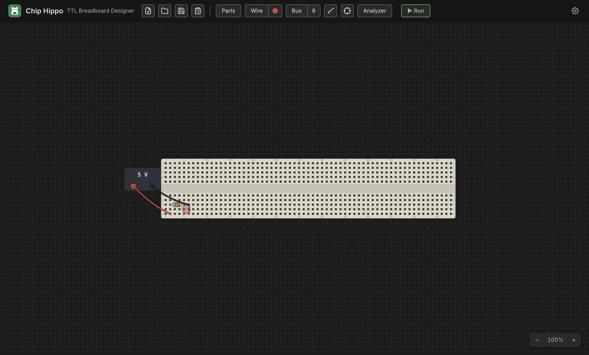

# Getting Started

This page walks through building the smallest possible circuit — a breadboard,
a power supply, and an LED — from a completely empty desk to a lit LED. It
takes about five minutes and introduces the tools you'll use for every larger
circuit afterward.

## Launch Chip Hippo

Open the installed app like any other desktop program (or, if you're running
from source, `make debug`). Chip Hippo opens on an **infinitely pannable,
zoomable desk** — drag to pan, scroll or pinch to zoom, and the header's
zoom controls (bottom-right of the desk) reset or step the view. The first
time you launch, the desk is empty and shows a hint: *"Open Parts and add a
breadboard to get started."*

## Open the parts palette

Click **Parts** in the header toolbar (or press `Ctrl+P` / `⌘P`) to open the
palette panel on the left. At the top is the **board selector** (Full / Half
/ Tiny breadboards, plus loose strips); below that, chips and components
grouped by function, with a filter box to search by name.

## Add a breadboard

In the palette's **BOARDS** section, click **Full-size** (830 tie points) —
the default recommendation for a first circuit; it has the most room and
both power rails already attached. A translucent ghost of the whole kit
follows your cursor. Move it over open desk space and click to drop it.

The Full kit places three strips as one rigid group: a power rail, the
pin-board, and a second power rail — exactly like a real solderless
breadboard. You can drag the whole board later by its body, or reopen the
palette any time to add more.

## Add power

Still in the palette, open the **COMPONENTS ▸ Power** group and click
**Power supply**. A small PSU brick ghost follows your cursor — click open
desk space near the breadboard to place it. A PSU brick isn't seated on the
board; it's a free-standing part with two wireable terminals, **+** and
**−**.

Right-click the placed PSU to open its context menu and confirm it's set to
**5 V** (new PSUs default to 5 V, but 3 V and 12 V are also on the menu — 12 V
is enough to damage a chip, so save it for parts rated to take it). The same
menu removes the PSU if you want to start over.

## Add an LED

Back in the palette, open **COMPONENTS ▸ LEDs** and click **LED**. A small
color swatch popover appears first — pick red (or any color) to arm
placement. Move the ghost over a free row of breadboard holes and click to
seat it — an LED's two legs land in adjacent holes on the same row, anode
first. (Press `F` while the ghost is in hand to flip which leg is the anode,
or `R` to stand it up on two free ends instead of a footprint row.)

Chip Hippo's LED is idealized — no series resistor is required to protect it,
so you can wire it straight to a supply.

## Wire it up

Press `W` (or click **Wire** in the toolbar) to arm the wire tool. Click a
free hole or terminal to anchor the first end, then click a second free point
to lay the wire — a rubber-band preview tracks your cursor between clicks,
and it turns red over an illegal target. The tool stays armed, so you can
lay several wires in a row without re-arming it; press `Esc` to cancel a
pending wire, or `Esc`/click **Wire** again to disarm the tool.

Lay two wires:

1. **PSU `+` → the LED's anode hole** (or a rail hole in the same row/column
   as the anode, then the anode's row completes the path through the board).
2. **PSU `−` → the LED's cathode hole**, the same way.

The active wire color is shown as a dot on the **Wire** button; click the
dot to open the color palette and pick a different one — the color you pick
stays active for every wire you lay afterward, so use different colors for
positive and return paths if you want them easy to tell apart at a glance.

## Run it

Press **Run** in the header toolbar (or `Space`) to start the simulation. The
engine traces power from the PSU, resolves the electrical net at every hole,
and settles the circuit — the LED should light immediately, since anode-high
through cathode-low is exactly what a driven LED needs.

While running, editing is locked (you can't move parts or lay new wires),
but the connectivity **probe**, the **logic analyzer**, and the **build
guide** all stay live. Press **Stop** (or `Space` again) to freeze the
simulation and return to editing.

If the LED doesn't light, double-check both wires land on the correct
terminal (`+`/`−`) and hole, and that the PSU is on and not showing a damage
badge.

## What next

- **[The Desk & Breadboards](the-desk.md)** — pan/zoom, breadboard kits,
  strips and rails, snapping and grouping multiple boards together.
- **[Chips & Components](components.md)** — the parts palette in depth: DIP
  chips, discretes, placement, and rotation.
- **[Wiring, Nets & Buses](wiring.md)** — the wire tool in depth, cross-board
  wires, colors, and multi-bit buses.
- **[Power & Clock Sources](power-and-clocks.md)** — PSU voltage and the
  12 V damage rule, plus clock sources for sequential circuits.
- **[Running a Simulation](simulation.md)** — Run/Pause/Step, the settle
  model, and how live views (LEDs, chip badges) work.
