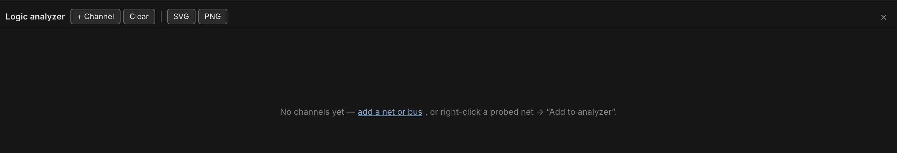

# Logic Analyzer & Timing

The **Analyzer** is a bottom-docked panel that records the live simulation
and draws it as a scrolling timing diagram — one lane per signal you've
chosen to watch, a step waveform for a single net or a hex value-lane for a
bus, with two draggable cursors for measuring the time between two points.
It's a passive recorder: it reads the same broadcast the LEDs and chip
badges already render from, so opening it, closing it, or adding channels
never changes how the circuit behaves.

## Opening the analyzer

Click **Analyzer** in the toolbar, or press `Cmd/Ctrl+A`, to dock the panel
along the bottom of the window. Click the button again, press the shortcut
again, or click the panel's **×** to close it — the panel remembers whether
it was open and how tall you left it (drag its top edge to resize, from a
compact strip up to half the window).

With no channels added yet, the panel shows a prompt instead of an empty
grid: **add a net or bus**, or right-click a probed net and choose **Add to
analyzer**.

## Adding a channel

There are two ways to add a channel:

- **From the panel** — click **+ Channel** in the header. The menu lists
  every *named* net (see [Probing & Net Names](probing.md)) and every bus in
  the document that isn't already on a channel; picking one adds it.
- **From the probe tool** — arm the probe (`I`), right-click any net on the
  desk, and choose **Add to analyzer**. This works on ANY net the probe can
  reach, named or not — it's the way to watch a signal you haven't bothered
  to name. Using it also opens the panel automatically if it was closed.

Each channel gets a row in the left-hand gutter: a color dot (cycled from a
fixed palette unless the channel has its own color), the net or bus name,
its current value, and three small controls — **↑** / **↓** to reorder the
channel, and **×** to remove it. Channels are saved with the document
(`doc.scopeChannels`), so a schematic reopens with its analyzer setup
intact, and adding/removing/reordering a channel rides the normal undo/redo
stack. A channel that loses its target (the net was deleted, the bus was
removed) simply reads as undriven rather than disappearing — it comes back
to life if the target returns.

## Reading a waveform

A single-bit channel (a **net**) draws as a step waveform inside its lane:

- **High** traces along the top of the lane, **Low** along the bottom.
- **Floating (Z)** draws a dashed line through the lane's midline.
- **Unknown/conflict (X)** — including anywhere the net is undriven — fills
  the region with a diagonal amber hatch instead of a line.

The gutter's value column always shows the channel's current level (or its
value at cursor A, once one is placed — see below).

## Multi-bit (bus) lanes

A channel bound to a **bus** (see [Wiring, Nets & Buses](wiring.md)) doesn't
draw a two-level waveform — decoding eight or sixteen individual traces
would be unreadable. Instead it draws a **value-lane**: a band that necks
down to a point at every change and displays the bus's current value as
hex (`0x1A`, uppercase) centered in the band, wide enough for the label to
fit. The bus is decoded from its member wires' bit positions (as parsed
from a name like `D[7:0]`); if even one member is floating or unknown, the
whole word is undecodable for that span and the lane hatches just like an
unknown net.

## Cursors & Δ

Click anywhere in the waveform area to drop **cursor A** at that tick;
`Shift`-click to drop **cursor B**. Drag either cursor to slide it to a
different tick — the gutter's value column updates to show each channel's
value at cursor A while it's placed. With only cursor A down, the header
reads `t=<tick>`; with both down, it reads the delta between them —
**Δ N ticks**, plus a millisecond figure when a clock source on the desk
gives the analyzer a time base to convert against.

While the simulation is running, the view auto-scrolls to keep the newest
tick in sight; scrolling the lanes away from the right edge turns this
"follow" behavior off until you scroll back. **Clear** in the header wipes
the recorded trace and both cursors without touching the channel list;
starting a fresh **Run** does the same automatically.

## Export

Two buttons in the header export the diagram exactly as currently rendered
— every channel, the full retained trace, and a label column identifying
each lane:

- **SVG** — downloads a self-contained `timing.svg` (colors resolved to
  concrete values, not the app's live CSS variables, so it renders
  correctly outside Chip Hippo).
- **PNG** — rasterizes that same SVG at 2× scale and downloads it as
  `timing.png`.

Both are plain browser downloads (no file dialog, no IPC round-trip) and do
nothing if there are no channels or nothing has been recorded yet.

## See also

- [Probing & Net Names](probing.md) — arming the probe, naming a net, and
  the "Add to analyzer" context-menu entry.
- [Wiring, Nets & Buses](wiring.md) — laying the buses a bus channel decodes.
