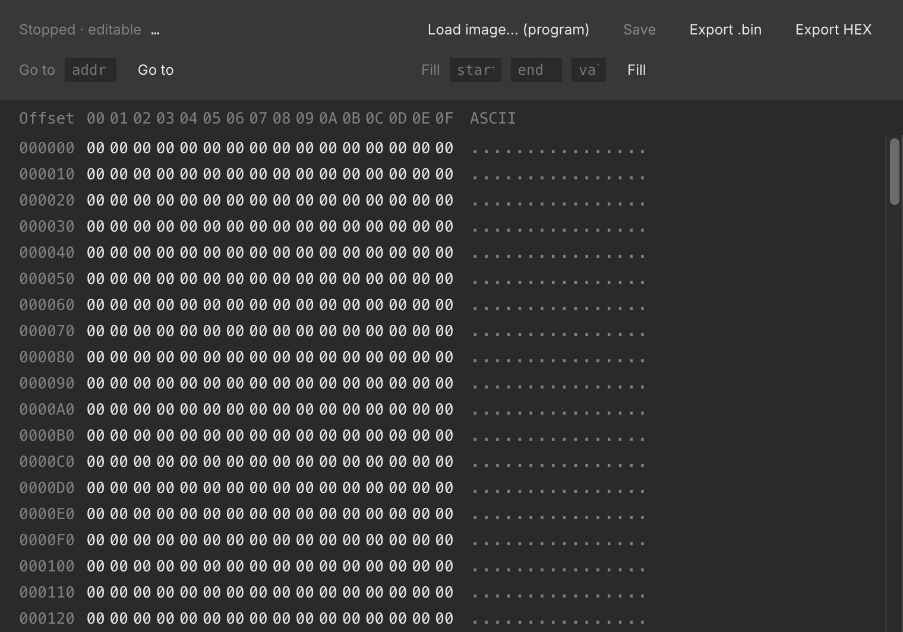

# Memory Chips & the Inspector

Chip Hippo's memory catalog covers both sides of the RAM/ROM divide: address
an 8K/32K/128K SRAM for scratch storage that behaves exactly like real
silicon (it forgets everything at power-off), or a ROM/EPROM/EEPROM that
holds a real byte image between runs — the same image, opened in a floating
**inspector**, that you can browse, hand-edit, and program from a file. This
page covers what each kind actually stores, how to get data into a ROM, and
how the inspector works.

## Volatile vs. non-volatile

Every memory chip in the catalog is one of two kinds, and the difference
matters more than the pinout:

- **Volatile (SRAM)** — `ram-8k`, `HM62256` (32K×8), `AS6C1024` (128K×8).
  Contents live only for the current run: they start as random noise every
  time you press **Run**, whatever the circuit writes stays readable until
  you **Stop**, and then it's gone. Nothing is ever saved to disk for these
  parts — there's no image to lose, because there was never a file.
- **Non-volatile (ROM/EPROM/EEPROM)** — `rom-8k`, `28C16` (2K×8 EEPROM),
  `AM27C1024` (64K×16 EPROM). These chips are backed by a real file on disk
  in the app's own working folder, so their contents persist across runs and
  across closing and reopening the document. An unprogrammed chip reads back
  random noise too — just like an unprogrammed EPROM off the shelf — until
  you program it. (Exactly which file backs which chip is an internal
  bookkeeping detail you never need to touch by hand.)

The chip's **blurb** in the parts palette and pin-assignments window always
says which kind it is, and its behavior — read timing, chip-enable/output-
enable pins, address/data bus width — is otherwise ordinary combinational
logic. See [The 74xx Chip Library](chip-library.md) for the full catalog and
the pin-assignments window.

## Programming a ROM

The circuit itself can never write a non-volatile chip. An EEPROM or EPROM's
real write cycle isn't something the simulator drives — Chip Hippo treats
every non-volatile part as read-only from the circuit's point of view, the
same way you couldn't reprogram a 27C-series EPROM just by wiggling its pins
on a breadboard. Any write a chip reports during simulation is silently
dropped if the chip is non-volatile.

The only way to put data into a ROM is the **external programmer**:

1. Right-click the chip on the desk.
2. Choose **Load image… (program)**.
3. Pick a `.bin` (raw bytes) or `.hex` (Intel HEX) file.

The image is copied to the start of the chip's memory. If the file is
smaller than the chip, only the start is overwritten and the rest is left
alone; if it's larger, it's truncated to fit — either way you get a warning
telling you what happened. Once programmed, the chip is flagged
**programmed**, which rides undo/redo like any other edit, and the chip
keeps its new contents the next time you open the document or press Run.

Programming is only available while editing is unlocked (i.e. the
simulation is stopped) — see [Running a Simulation](simulation.md).

## The memory inspector

Every memory chip — SRAM or ROM alike — has a floating **inspector**
window: double-click the chip on the desk, or right-click it and choose
**Inspect memory…**. It's a hex/ASCII grid, one row per 16 bytes, with a
toolbar for **Go to** (jump to an address), **Fill** (write a byte value
across a start/end range), **Save**, and Import/Export.

What you can do depends on whether the simulation is running and what kind
of chip it is:

- **Stopped, ROM/EPROM/EEPROM** — the grid is editable. Click a hex or ASCII
  cell to type a new byte value directly, or select a range and **Fill** it.
  **Save** writes your edits back to the chip's file and flags it
  **programmed**, exactly like using the external programmer.
- **Stopped, SRAM** — shows the chip's last contents from before it was
  stopped (or noise, if it's never been run) as a read-only snapshot; there's
  nothing to save, since SRAM has no file.
- **Running, any chip** — the grid is a **live, read-only** mirror of the
  simulator's own byte image. Bytes the circuit writes are tinted as they
  change, so you can watch a counter or a shift register fill memory in real
  time. Editing resumes once you stop.

The inspector also shows the chip's backing-file path for a non-volatile
part (handy for locating the raw `.bin` outside the app), and stays open and
live-updating as long as the desk document does.

## Import & export (Intel HEX)

Beyond loading a raw `.bin`, the inspector's toolbar can **Export** the
current contents as either a raw `.bin` or an **Intel HEX** `.hex` file —
useful for round-tripping through an assembler toolchain or another tool
that expects the hex format. The external programmer (above) accepts either
extension coming in: a `.hex` file is decoded before it's written to the
chip.

## A missing backing file

Because a ROM's contents live in a file separate from the desk document,
it's possible for that file to go missing without the document changing —
the classic case is deleting the chip and then **undoing** the delete. If
Chip Hippo finds a chip flagged **programmed** but its backing file is gone,
it recreates the file as fresh noise and warns you that the chip's data was
lost, so you know to reload the image rather than trusting stale contents.

---

See also [The 74xx Chip Library](chip-library.md) for the memory chips in
context with the rest of the catalog, and
[Files, Autosave & Undo](files-and-undo.md) for how the desk document itself
is saved and versioned.
