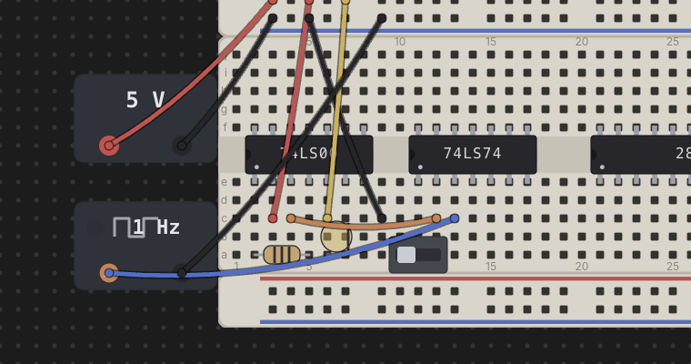

# Power & Clock Sources

Every circuit needs somewhere to draw power from and, for sequential parts, a
signal to step them along. Chip Hippo gives you two kinds of desk-level
**bricks** for this — a **power supply (PSU)** and a **clock source** —
neither of which seats on a breadboard. They sit loose on the desk with their
own addressable terminals, and you wire those terminals into a board's rails
(or straight to a chip's pins) just like any other wire run.

## PSU bricks

Add a **Power supply** from the parts palette (**Power** group) and drop it
anywhere on the desk — it isn't tied to a board. It draws as a small body with
a voltage badge and two terminal pads: a red **`+`** and a black **`−`**.
Those pads are addressable wire endpoints, `psu1.+` and `psu1.-` for the
first PSU you place, exactly like a breadboard hole — click-click a wire from
each terminal into a power rail (or directly to a chip's VCC/GND pins) to
energize a circuit.

A PSU has no on/off switch of its own — it's always "live" the moment the
simulation is running; what matters is which voltage it's set to and what
it's wired into.

## Choosing a voltage — and the 12 V damage rule

Right-click a PSU brick to pick its voltage: **3 V**, **5 V**, or **12 V**.
The picker stays available even while the simulation is running, so you can
change voltage on the fly and watch the effect.

- **5 V** — normal operation. A chip whose VCC net carries a 5 V supply and
  whose GND net is properly grounded runs exactly to its datasheet behavior.
- **3 V** — underpowered. The chip is inert — every output floats/reads as if
  disconnected — but nothing is harmed. Useful for demonstrating what an
  underpowered chip looks like without any risk.
- **12 V** — **damage**. This is Chip Hippo's "magic smoke" rule: any chip
  (or oscillator can, which is powered the same way) whose VCC net sees 12 V
  is immediately marked **damaged** and goes permanently inert, independent
  of anything else on the net. Damage is real bookkeeping, persisted with the
  circuit — it doesn't clear on its own, and it doesn't clear on Stop.

A chip can also come up **reversed** — a PSU `−` on its VCC pin's net at the
same time as a PSU `+` on its GND pin's net — which is reported separately
from plain unpowered/underpowered, since it specifically means the supply
leads are swapped.

Live chip health (powered / underpowered / reversed / damaged) shows as a
badge on each chip while running — see [Running a Simulation](simulation.md)
for how those badges and the rest of the settle model work. This page only
covers what puts a chip into each state.

## Replacing a damaged part

A damaged chip or oscillator can stays damaged and inert until you swap it
out. Right-click the damaged part and choose **Replace chip** (or **Replace
part** for an oscillator can) — this is the one part action that stays
available even while the simulation is running, since surviving a burnout and
carrying on is exactly the scenario it exists for. Replacing resets the
damage flag; everything else about the part (position, wiring, rate) is
unchanged.

There's no undo-the-damage option beyond this — 12 V is meant to sting a
little, the same way it would on a real bench.

## Clock sources

Add a **Clock source** from the palette (**Power** group) for a free-running
or manually stepped square wave to drive a sequential chip's clock pin. Like
a PSU, a clock brick is desk-level — it doesn't seat on a board — and exposes
two addressable terminals: **`out`** and **`gnd`** (`clk1.out` / `clk1.gnd`).
Wire `out` to a chip's clock input and `gnd` to your circuit's ground.

Right-click a clock brick to set its rate:

- **1 / 2 / 5 / 10 Hz** — free-running. Once the simulation is running, the
  brick toggles its `out` level on its own at the chosen rate; a small lamp
  on the body lights while the output is HIGH.
- **Manual** — click-to-toggle. No timer runs it; instead, while the
  simulation is running, clicking the brick's body flips `out` from LOW to
  HIGH (or back) once per click — handy for single-stepping a counter or
  flip-flop by hand and watching each edge land.

The rate picker, like the PSU's voltage picker, stays available while
running, so you can retune a clock's speed mid-simulation.

An **oscillator can** (a discrete part that seats directly on a board rather
than as a desk brick) behaves the same electrically — it's a free-running
square-wave source powered like a chip, with its own right-click rate picker
— but it only ever free-runs; a real crystal has no click-to-toggle pin, so
it has no manual mode.

## The transport drives the edges

Free-running clocks (and oscillator cans) don't tick on their own outside a
simulation — their edges are driven by the **Run/Pause/Step/speed transport**
in the header, described fully in
[Running a Simulation](simulation.md). Briefly: **Run** (`Space`) starts
every free-running clock at its configured rate; **Pause** freezes them in
place without stopping the simulation; **Step** advances every free-running
clock by exactly one half-period and re-settles the circuit, useful for
watching a sequential chain edge by edge; and the **speed** control scales
every free-running clock's rate together (it has no effect on a manual
clock, which only ever moves on a click). A manual clock only responds to
clicks while the simulation is actually running — stopped, its body is inert
like everything else on the desk.

---

See [Wiring, Nets & Buses](wiring.md) for how to route power-rail and clock
wiring generally, and [Running a Simulation](simulation.md) for how power
state and clock edges feed into the settle model and live views.
