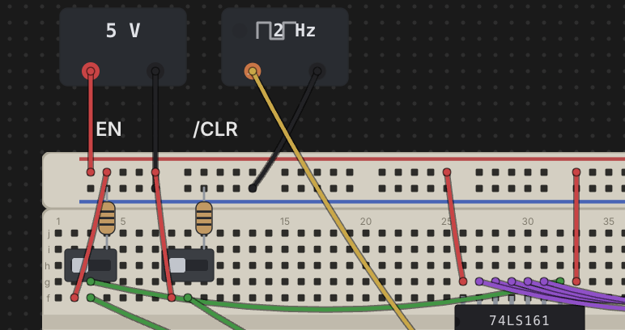

# Power & Clock Sources

Every circuit needs somewhere to draw power from and, for sequential parts, a
signal to step them along. Chip Hippo gives you two kinds of desk-level
**bricks** for this — a **power supply (PSU)** and a **clock source** —
neither of which seats on a breadboard. They sit loose on the desk with their
own addressable terminals, and you wire those terminals into a board's rails
(or straight to a chip's pins) just like any other wire run.

There is a third kind of source, and it does not live on the desk at all:
**external signals**, the bench stimulus buttons pinned down the right-hand
edge of the viewport. They are covered at the end of this page.

## PSU bricks

Add a **Power supply** from the parts palette (**Power** group) and drop it
anywhere on the desk — it isn't tied to a board. It draws as a small body with
a voltage badge and two terminal pads: a red **`+`** and a black **`−`**.
Those pads are addressable wire endpoints, `psu1.+` and `psu1.-` for the
first PSU you place, exactly like a breadboard hole — click-click a wire from
each terminal into a power rail (or directly to a chip's VCC/GND pins) to
energize a circuit.

A PSU has no on/off switch of its own — it's always "live" the moment the
simulation is running; what matters is which voltage it's set to and what
it's wired into.

## Choosing a voltage — and the 12 V damage rule

Right-click a PSU brick and choose **Properties…** to pick its voltage:
**3 V**, **5 V**, or **12 V**. It's a live setting — the dropdown stays
available and applies immediately even while the simulation is running, so
you can change voltage on the fly and watch the effect.

- **5 V** — normal operation. A chip whose VCC net carries a 5 V supply and
  whose GND net is properly grounded runs exactly to its datasheet behavior.
- **3 V** — underpowered. The chip is inert — every output floats/reads as if
  disconnected — but nothing is harmed. Useful for demonstrating what an
  underpowered chip looks like without any risk.
- **12 V** — **damage**. This is Chip Hippo's "magic smoke" rule: any chip (or
  oscillator can, which is powered the same way) whose VCC net sees 12 V is
  immediately marked **damaged** and goes inert for the rest of that run,
  independent of anything else on the net. It stays dead while the run lasts —
  a failed chip doesn't recover while the power is still wrong — and **Stop**
  makes it whole again.

A chip can also come up **reversed** — a PSU `−` on its VCC pin's net at the
same time as a PSU `+` on its GND pin's net — which is reported separately
from plain unpowered/underpowered, since it specifically means the supply
leads are swapped.

Live chip health (powered / underpowered / reversed / damaged) shows as a
badge on each chip while running — see [Running a Simulation](simulation.md)
for how those badges and the rest of the settle model work. This page only
covers what puts a chip into each state.

## Recovering from a 12 V mistake

Press **Stop**. Every damaged chip on the desk is restored, and you can rewire
and run again. You don't lose the part, and you don't have to delete and
re-place anything.

12 V is meant to be *noticed*, not to cost you the chip: the red badge and the
warning are the point, and they've done their job by the time you stop. Wiring a
supply to the wrong rail is a mistake about the circuit — one you can see and
fix — so it stays fixable. Find where 12 V is reaching a VCC net (the
[probe tool](probing.md) is the quick way), correct it, and press **Run**.

## Clock sources

Add a **Clock source** from the palette (**Power** group) for a free-running
or manually stepped square wave to drive a sequential chip's clock pin. Like
a PSU, a clock brick is desk-level — it doesn't seat on a board — and exposes
two addressable terminals: **`out`** and **`gnd`** (`clk1.out` / `clk1.gnd`).
Wire `out` to a chip's clock input and `gnd` to your circuit's ground.

Right-click a clock brick and choose **Properties…** to set its rate:

- **1 / 2 / 5 / 10 / 20 / 50 / 100 Hz** — free-running. Once the simulation is
  running, the brick toggles its `out` level on its own at the chosen rate; a
  small lamp on the body lights while the output is HIGH. The slow end is for
  watching a single edge land; the fast end is for letting a counter or a CPU
  actually get somewhere while you watch. Above about 20 Hz the lamp and any
  LEDs on the circuit blur into a steady glow — that's the point at which the
  [logic analyzer](logic-analyzer.md) becomes the way to see what happened.
- **Manual** — click-to-toggle. No timer runs it; instead, while the
  simulation is running, clicking the brick's body flips `out` from LOW to
  HIGH (or back) once per click — handy for single-stepping a counter or
  flip-flop by hand and watching each edge land.

The rate dropdown, like the PSU's voltage one, is a live setting — it applies
immediately and stays available while running, so you can retune a clock's
speed mid-simulation.

An **oscillator can** (a discrete part that seats directly on a board rather
than as a desk brick) behaves the same electrically — it's a free-running
square-wave source powered like a chip, with its own rate field in its
Properties dialog — but it only ever free-runs; a real crystal has no
click-to-toggle pin, so it has no manual mode.

## The transport drives the edges

Free-running clocks (and oscillator cans) don't tick on their own outside a
simulation — their edges are driven by the **Run/Pause/Step/speed transport**
in the header, described fully in
[Running a Simulation](simulation.md). Briefly: **Run** (`Space`) starts
every free-running clock at its configured rate; **Pause** freezes them in
place without stopping the simulation; **Step** advances every free-running
clock by exactly one half-period and re-settles the circuit, useful for
watching a sequential chain edge by edge; and the **speed** control scales
every free-running clock's rate together (it has no effect on a manual
clock, which only ever moves on a click). A manual clock only responds to
clicks while the simulation is actually running — stopped, its body is inert
like everything else on the desk.

## External signals

A **signal** is bench stimulus: a labelled button pinned to the right-hand edge
of the desk, and a pointed **flag** whose tip plugs into any hole on any
breadboard. Pressing the button injects a level at that hole. Nothing about a
signal takes up board space, and — unlike a push button, which you can only
hold one of at a time — **you can assert several signals at once**.

Add one from the parts palette's **SIGNALS** section: pick *Signal*, then click
anywhere on the desk. The click position does not matter; the button always
goes to the next free slot on the rail, with its flag waiting beside it.

Each button's coloured dot shows the **key** that presses it — `1` for the top
button, down to `9`, then `0` for the tenth — and the flag prints the same key
inside its body. That key is how you tell a flag's button at a glance.
Selecting a flag on the desk also outlines its button on the rail.

**Drag the flag onto a board** and its point snaps into the hole under the
cursor. Press **R** while it is selected to turn it a quarter-turn about that
point, so it can lie in whichever direction has room. A flag claims its hole
exactly like a wire end or a chip pin does, so nothing else can use it while
the flag is there.

To take a flag off the board, drag it onto bare desk, or right-click it and
choose **Remove Signal**. Either way the flag goes back beside its button on
the rail, and its position and rotation are cleared, so the next drag starts
fresh. The signal itself stays. **Delete Signal** on the same menu (or the
**Delete** key while the flag is selected) removes the signal altogether,
button included.

### Momentary, toggle, and the resting level

Right-click a flag (or a button) for **Properties…**:

| Field | What it does |
| --- | --- |
| **Name** | The label shown on the button |
| **Description** | The button's tooltip |
| **Color** | The colour shared by the button's dot and its flag — any of the seven signal colours, even one another signal already uses |
| **Type** | **Momentary** asserts while held; **Toggle** flips on each press and stays |
| **Default value** | The level the signal rests at — **Low** or **High** |

A placed signal is **always** driving its net. A momentary signal rests at its
default and asserts the *opposite* while you hold it, which is what makes
"Default: High" the natural setting for an active-low `/RESET` line: it sits
high, and pressing the button pulses it low. A toggle's current level is reset
to the default every time you Run, so a run always starts from a known state.

A signal drives at the same strength as a chip output, so two signals arguing
over one net — or a signal fighting a chip's output pin — is reported as a
conflict, exactly as two chip outputs on one net would be.

### Pressing them

While the circuit is running, **1–9 and then 0 press the signal buttons**, top
to bottom — the key each button (and its flag) shows. No modifier, so you can
hold several down together — `1` and `3` at once is two signals asserted at
once. (Those digits pick the wire colour and the bus width
while the Wire or Bus tool is armed, but Run puts both tools away, so the two
meanings never collide.) Clicking a button with the mouse does the same thing
for one signal at a time.

There are **ten signals** per desktop — one per digit key. The palette's
*Signal* row goes grey once all ten are in use.

A new signal takes the next colour in the sequence red, blue, green, yellow,
orange, white, purple, starting with the first one no signal is using. Once all
seven are in use the sequence starts again from red, so the eighth, ninth and
tenth signals share a colour with the first three — their keys tell them apart.
Deleting a signal frees its colour for the next one you add. The signal colours
are the eight jumper colours **minus black**, which is the bench's ground
colour: a black flag would read as a ground tie, and its button's dot would all
but vanish against the dark rail.

A project saved before black was withdrawn still opens; any signal that was
black is given a colour on load, and keeps its name, type, resting level and
wherever its flag was planted. Nothing else on the rail is recoloured.

---

See [Wiring, Nets & Buses](wiring.md) for how to route power-rail and clock
wiring generally, and [Running a Simulation](simulation.md) for how power
state and clock edges feed into the settle model and live views.
