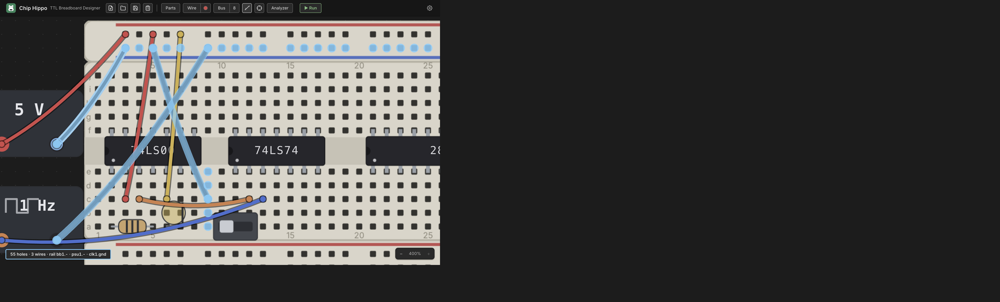

# Probing & Net Names

Once a circuit is wired up, the probe is how you ask "what's this actually
connected to?" — click any hole, pin, or terminal and Chip Hippo highlights
every other point that shares the same electrical net, live, without needing
to trace wires with your eyes. This page covers arming the probe, reading its
net summary, naming a net so it reads clearly everywhere in the app, dropping
free-text annotations on the desk, and sending a net to the logic analyzer.



## The probe tool

Press `I` or `P` (either key toggles it — no modifier), or click **Probe** in
the toolbar. With the probe armed:

- **Hover** a hole, rail point, PSU/clock terminal, chip pin, or a wire and
  its whole net lights up — a transient highlight that follows your cursor.
- **Click** a point to **pin** the highlight so it stays put while you move
  the cursor elsewhere (handy for comparing it against a second net). Click
  the pinned point again to unpin it.
- `Esc` unpins first, then a second `Esc` disarms the tool; `M` disarms
  whichever of the wire, bus, or probe tool is currently armed.

Unlike the wire, bus, and placement tools, **the probe stays available while
a simulation is running** — editing locks on **Run**, but you can keep
probing the live circuit the whole time. See [Running a
Simulation](simulation.md) for what Run/Stop locks and what stays live.

## Reading the net summary

A highlighted net draws as a glow: dots on member holes and terminals, rings
around member chip pins, and a glow stroke along every member wire — brighter
when pinned. Below it, a status readout summarizes the same net in one line,
for example:

```
VCC · H · 23 holes · 3 chip pins · 2 wires · rail bb1.t+ · psu1.+
```

The pieces, in order, appear only when relevant:

- The net's **name**, if you've given it one (see below).
- Its current **level** (`H`/`L`/`Z`/`X`) while a simulation is running —
  gone when stopped, since an unpowered net has no level to report.
- A **connectivity summary** — hole/pin/wire counts, which rails it touches,
  and any PSU/clock terminals it reaches.

Under the hood, every hole, rail node, wire, active switch/button bridge, and
component pin gets partitioned into these nets by a union-find pass over the
whole document — the same netlist the simulator resolves each net's level
from.

## Naming a net

A net's default identity is just its smallest member address (`bb1.a12`, say)
— useful internally, meaningless at a glance. Right-click a point while
probing to give the net a real name:

- **Name this net…** (or **Rename net…** if it already has one) opens a
  prompt with quick picks for **VCC**, **GND**, and **CLK**, or type anything
  you like.
- **Clear name** removes it.

The name binds to the specific point you right-clicked, but resolves to
whatever net that point sits on at any given moment — so it survives rewiring
around it. If an edit later merges two separately-named nets into one, one
name wins deterministically and the other is dropped; nothing crashes, but
it's worth a glance if a net you named seems to have picked up its neighbor's
label instead.

Naming isn't just cosmetic: a named net is what makes the [Schematic
View](schematic-view.md) and the [Build Guide, Wiring List &
BOM](build-guide.md) readable — `VCC`/`GND`/`CLK` and your own signal names
carry through instead of raw hole addresses.

## Annotations

For notes that aren't about a net at all — reminders, section headers, "TODO:
add a pull-up here" — drop a free-text **annotation** on the desk from the
**Annotations** section at the bottom of the parts palette:

- **Label** — a short one-line caption.
- **Note** — a multi-line block.

Picking one arms a placement ghost like a part; click anywhere on the desk to
drop it, which opens an inline editor immediately so you can type right away.
Drop it **on top of a part** and it **anchors** to that part — the ghost
shows the anchored state before you click — so the annotation rides along
whenever that part moves. Drop it on open desk and it just sits at that
world position.

Double-click an annotation any time to re-edit its text (`Enter` commits a
label; a note keeps `Enter` for newlines, so use `⌘Enter`/`Ctrl+Enter` to
commit). Drag its body to reposition it, and right-click for **Edit** /
**Remove**. Annotations are pure decoration — they carry no electrical
meaning and are invisible to the netlist, occupancy, and the simulator.

## Sending a net to the analyzer

Probing a net you want to watch over time? Right-click it and choose **Add to
analyzer** to pin it as a channel without leaving the probe tool. See [Logic
Analyzer & Timing](logic-analyzer.md) for capturing and reading the resulting
waveform.

## See also

- [Wiring, Nets & Buses](wiring.md) — laying the wires and buses whose nets
  you're probing.
- [Running a Simulation](simulation.md) — what a net's level means and when
  the probe keeps working while editing locks.
- [Logic Analyzer & Timing](logic-analyzer.md) — capturing a probed net's
  waveform over time.
- [Schematic View](schematic-view.md) — where net names show up in the
  derived logical diagram.
