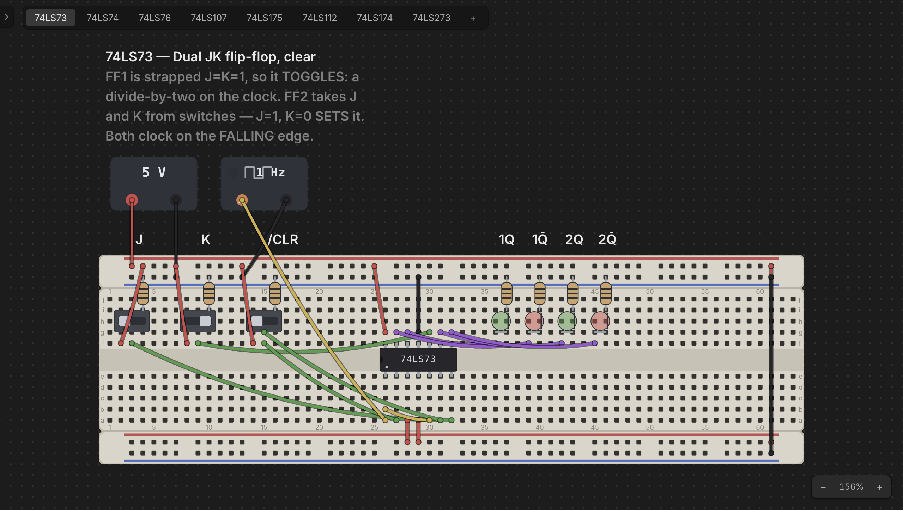

# Projects & Desktops

A big build eventually needs a bench beside it. You want to work out a clock
module, an address decoder, or a memory map *without* doing it in the middle of
everything else — and then drop the finished thing into the main design.

That's what a **project** is for. A project is a workspace holding several
**desktops**, shown as tabs above the desk. Each desktop is a complete desk of
its own — its own boards, chips, wiring, camera position, and undo history —
and a design worked out on one can be copied straight onto another.

**The project is the document.** One `.chiphippo` file holds all of it: every
desktop, and the contents of every ROM you programmed. That's the whole design
in a single file you can email, drop in a repo, or carry to another machine.
There are no companion files to keep together and nothing to go missing.

**Every desktop is the same.** There is no special "main" desk and no lesser
one: they are peers, all with the same menu, and which is the build and which
is the bench is entirely up to you. Any of them can be renamed, duplicated, or
deleted — the only rule is that a project always keeps at least one.

**There is always a project open.** From the first launch, the desk you are
looking at is a desktop of one — a brand-new project with no name, no home of
its own, and a single desktop called `Desktop 1`. Nothing has to be created
before you can start building, and nothing has to be named before you can add
a second desktop.

## Adding desktops

**Just press +** at the end of the tab strip. It asks you nothing: a new empty
desktop appears beside the others, named `Desktop 2`, `Desktop 3`, and so on,
and you land on it.

**Right-click the +** for the other way one arrives:

- **New Desktop** — the same thing the plain click does.
- **Import Desktop…** — one read in from a file (see *Moving a desktop between
  projects* below).

Either way it's an addition, and nothing already there is touched.

There is a third way one arrives, and it doesn't belong on the **+** because
it belongs to a *part*: a chip's **example circuit**. Right-click any 74xx chip
on the desk, choose **Pin Assignment**, and click the circuit button in that
window's top-right corner — a worked bench for that part lands as a desktop of
its own, called `74LS138 example`. See
[The Chip Library](chip-library.md#example-circuits).

The **Desktop** menu has the same two plus the rest, acting on the desktop
you're looking at:

- **New Desktop** — the same thing as pressing **+**.
- **Duplicate Desktop** — a copy of this desk, landing right beside it. The
  copy is brand-new hardware: a ROM on it gets its own backing file, so
  programming the copy never touches the original.
- **Import Desktop…** — read a `.desktop.chiphippo` (or a loose `.chiphippo`
  design) in as a new desktop. See *Moving a desktop between projects* below.
- **Export Desktop…** — write this desktop out as a self-contained file.
- **Desktop Properties…** — its **Name** and **Description**.
- **Delete Desktop** — remove it from the project.

Adding, renaming, duplicating and deleting a desktop are ordinary unsaved
changes, exactly like moving a chip: nothing reaches the project's file until you
save it, and closing without saving undoes all of it.

## Saving

The **File** menu is the project's, because the project is the only document
there is:

- **New Project** (`Cmd/Ctrl+N`) — a blank slate: a fresh unnamed project
  holding one new, empty desktop. However many desktops you had, a new project
  always starts as a single one, numbered from `Desktop 1` again.
- **Open…** (`Cmd/Ctrl+O`) — pick a `.chiphippo` project to open.
- **Open Recent** — the last ten projects you saved or opened, most recent
  first.
- **Save** (`Cmd/Ctrl+S`) — write the project to its file.
- **Save As…** (`Shift+Cmd/Ctrl+S`) — write it to a new one.
- **Project Properties…** — the project's **Name**, **Description**, and the
  read-only **Location** of its file (blank until it has been saved).

The toolbar's four file buttons are the same four actions, and the window
title's • means the project has changes you haven't saved.

**You never have to choose a file.** A project that has never been given a home
lives in Chip Hippo's own working slot, and `Cmd/Ctrl+S` writes it there with
no dialog at all — design something, save it, quit, and it's there when you come
back. **Save As…** is what gives the project a real file when you want one; it
takes the project's name from the file you pick, so there's no separate "name
this project" step. From then on Save just writes that file and moves it to the
top of the recent list.

## Changing projects

**New Project** and **Open…** both replace what's open, so nothing is allowed to
go with it unasked:

- A project that has **never been given a home** is always asked about, whether
  or not anything in it is unsaved. It lives in Chip Hippo's one working slot,
  the project taking its place is about to claim that slot, and there is nowhere
  else for it to go — so replacing it loses it either way, and even a
  `Cmd/Ctrl+S` into the slot doesn't change that. You're offered **save** (which
  gives it a file of its own), **discard**, or **cancel**.
- A **saved** project has a file nothing is claiming, so it's only asked about
  when it has changes: **save**, **discard**, or **cancel**.

Choose to save and it goes through, then the action you asked for carries on —
you're never made to ask twice. Cancel, at that dialog or at a dialog behind
it, and nothing happens at all.

## Working across tabs

Click a tab to put that desktop on the desk. Everything follows the active tab:

- **Undo/redo** is per desktop. Switch away and back, and `Cmd/Ctrl+Z` still
  undoes that desk's last edit, not the other one's.
- Each desktop remembers **where you were** — its camera position comes back
  with it. Panning and zooming are never counted as changes to the design.
- The **simulation stops** when you switch. A running circuit belongs to the
  desk it's running on, so the transport resets rather than following you to
  another desktop. Any open pin-assignment or memory-inspector windows close
  for the same reason: they were pointing at chips on the desk you just left.

Tabs carry no marker of their own. There is one save and one dirty marker,
because there is one document: the window title shows the project — `Untitled`
until you name it — the active desktop, and a leading • if anything anywhere in
the project is unsaved.

## Managing tabs

Right-click a tab for its menu:

- **Properties…** opens the same dialog every part, board, and wire has, with
  the same two fields — a **Name**, which is what the tab reads, and a
  **Description**, a note on what this bench is for. Hover the tab to see the
  description.
- **Duplicate Desktop** copies it, landing the copy right beside it.
- **Export Desktop…** writes it out on its own (below).
- **Delete Desktop** removes it from the project. Any desktop can go — there's
  nothing special about the first one — except the **last** one left, because a
  project with no desktops would have nothing to open. Its design goes with it,
  but its file is untouched: close the project without saving and it comes back.

Desktop numbers only ever count up: deleting `Desktop 2` doesn't make the next
one `Desktop 2` again, so a name you wrote in a note keeps meaning the same
bench. Rename them to whatever the benches actually are — `CPU`, `Clock`,
`Decoder` — through Properties…

## Moving a desktop between projects

Since a desktop isn't a file, moving one somewhere else is a **snapshot**:

- **Desktop ▸ Export Desktop…** writes the desk to a `.desktop.chiphippo` file
  — its boards, parts and wiring, plus the contents of any ROM on it. The file
  is self-contained and has no link back: it is a copy, and nothing you do to
  the project afterwards changes it.
- **Import Desktop…** — on the **Desktop** menu, and by right-clicking the tab
  strip's **+** — reads one back as a **new** desktop, keeping the name it was
  exported under. Import is always an addition, so no file operation can ever
  replace the desk you're looking at.

An imported desktop is brand-new hardware in the same way a duplicate is: import
the same file twice and the two copies' ROMs are independent. Opening a
`.desktop.chiphippo` with **File ▸ Open…** works too — it becomes a new project
of one desktop.

## Copying a design from one desktop to another

For a *part* of a desk rather than the whole of it, copy and paste:

1. On the desktop holding it, **shift-drag a marquee** around the design — the
   boards, the chips on them, and the wiring. A marquee takes in any board it
   encloses *completely*, and the selected set is outlined as one block.
2. Press `Cmd/Ctrl+C`. The whole sub-assembly is copied: the boards, everything
   seated on them (whether or not the box touched it), every wire with **both**
   ends inside the set, and the buses, net names, and anchored labels riding
   them. A wire with one end outside is left behind — it would have to be cut.
3. Click the tab you want it on and press `Cmd/Ctrl+V`.

The design appears **under the cursor as a translucent ghost**, following it
with no button held — the same way a fresh breadboard does when you pick one
from the palette. Move it where you want it:

- Boards outline **green** where the design will land and **red** where it
  overlaps something already on that desk.
- Bring it near a board that's already there and it **snaps flush**, dovetailing
  exactly as a board you dragged into place would.
- **Click** to drop it. **Esc** throws it away and leaves the desk untouched.

The drop is all-or-nothing: if any board would land on top of something, the
click is refused rather than pasting half a design and silently cutting its
wiring. The whole paste is a single undo step, and the pasted design is brand
new hardware — fresh boards, fresh parts, and (for a ROM) its own fresh backing
file, so editing the copy never touches the original.

The clipboard survives switching tabs, so you can paste the same design onto
several desktops, or stamp it more than once on the same one.

## Leaving a project

A project stays open between sessions — named or not. Relaunch Chip Hippo and
it comes back on the desktop you were last on: the unsaved project from its
working slot if there is one, and otherwise the project you used most recently.
Starting or opening another one asks first about anything you'd lose (see
*Changing projects* above).

**Closing the window or quitting asks the same question.** Because you didn't
ask for a save, it doesn't ask you where anything goes: the project is written
to the file it already has, or — having none yet — to the working slot, where
the next launch will find it. Discard instead and the session's changes are
gone. Cancel and nothing closes at all.

## Opening an older project

Projects saved by an earlier version of Chip Hippo kept each desktop in a
`.desktop.chiphippo` file of its own and listed their paths. Opening one brings
every one of those designs into the single file, and **nothing of yours is
deleted** — the old desktop files are left exactly where they are, and it is the
project that changes shape. If one of those files has since been moved or
deleted, that desktop opens empty and Chip Hippo tells you which file it was
looking for.
