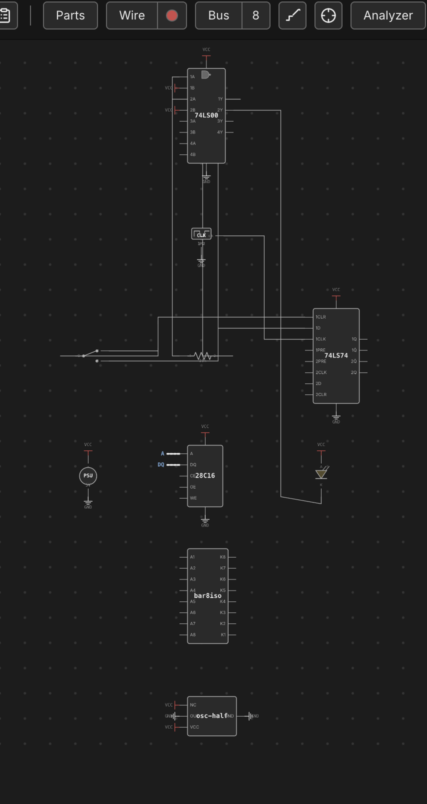

# Schematic View

The desk shows your circuit exactly as you built it — a physical breadboard
with chips seated in holes and wires running point to point. The **schematic
view** shows the same circuit the way an engineer would draw it: chip
symbols, named nets, and bus lines, laid out automatically. It's a
**projection**, not a second document — the breadboard is still the single
source of truth, and nothing you do in the schematic changes a hole, a pin,
or a wire on the desk.

## Switching views

Press `Tab` to flip between the **Breadboard** and **Schematic** views (not
while a text field has focus — typing a `Tab` there behaves normally, e.g.
to move between fields). The schematic reuses the desk's own camera, so
pan and zoom feel identical in both views and your position is preserved
when you switch back. The first time you open the schematic in a session it
automatically fits the whole diagram in the viewport; after that, panning
and zooming are exactly what you left them.

If the desk has no chips on it yet, the schematic shows a short hint instead
of an empty canvas — add a chip on the breadboard and switch back to see it
appear.

## Chip symbols & routed nets

Every chip is drawn as a labelled box (or, for a plain gate chip, a small
distinctive shape — AND/OR/NAND/NOR/XOR/NOT/BUFFER — badged at the top of
the box) with named pin stubs instead of physical DIP pins. Discretes get
their own recognizable symbols too: an LED's diode triangle, a resistor
body, a switch, a push button, a PSU or clock source block. VCC and GND
pins don't route across the page like a signal would — each one drops a
small power-rail symbol right at the pin, the way a real schematic keeps
power off the signal routing.

Everything else is connected by **routed nets**: orthogonal lines that run
chip-to-chip along the net they belong to, labeled with the net's name where
there's room. A group of pins wired as a bus (see
[Wiring, Nets & Buses](wiring.md)) collapses into a single **fat bus line**
instead of drawing every bit as its own wire — the same visual shorthand a
hand-drawn schematic uses for a data or address bus.

## Auto-layout & nudging

The schematic lays itself out automatically and deterministically: the same
circuit always produces the same diagram, with chips arranged left-to-right
roughly along the direction signals flow and edges routed to keep crossings
down. You never have to arrange it by hand — but if a particular symbol
lands somewhere inconsistent, drag it to a better spot. That drag is stored
as a **per-symbol position hint**, not a real coordinate: it only ever
affects where that symbol sits on THIS derived diagram, and it has no effect
on the component's actual place on the breadboard. Nets simply re-route to
follow wherever you drop it.

An **Auto-layout** button in the schematic clears every position hint at
once and lets the algorithm re-place everything from scratch — useful after
nudging things into a mess, or after a big edit has made your old
arrangement stale.

## Live simulation tint

Press **Run** and the schematic lights up exactly like the breadboard does:
the routed lines tint by their net's live level, an LED symbol lights when
its anode reads high and its cathode reads low, and a chip symbol picks up
the same health badge (unpowered / underpowered / reversed / damaged) you'd
see on its physical package. Both views are driven from the same simulation
state, so whichever one you're looking at when you hit Run shows the
identical picture — there's nothing to keep in sync by hand. See
[Running a Simulation](simulation.md) for what each level color and health
badge means.

## The probe is shared

The connectivity **probe** (see [Probing & Net Names](probing.md)) is armed
and driven from the breadboard, but its highlight is not confined to it:
probing a net on the desk highlights that same net in the schematic too —
by its stable net id, not by screen position — so you can hover a wire on
the physical board and immediately see which chip symbols and bus lines it
corresponds to in the logical diagram. The highlight is applied to both
views at once, whichever one happens to be visible, so switching to the
schematic after probing shows the net already picked out. It's the same
underlying net, just drawn two different ways.

---

See also: [The Desk & Breadboards](the-desk.md) for the physical view this
diagram is derived from, and [Wiring, Nets & Buses](wiring.md) for how wires
and buses become the nets the schematic routes.
