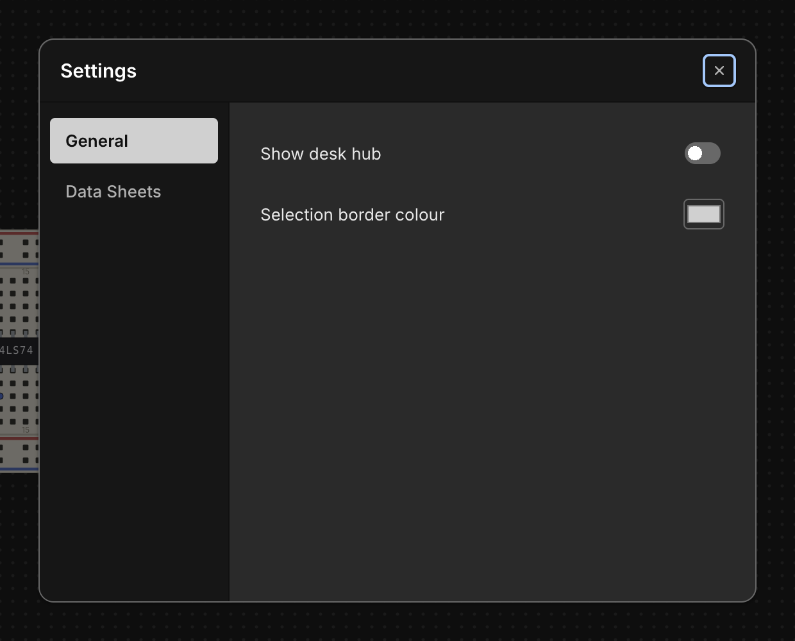

# Settings

Chip Hippo keeps its handful of app-wide preferences in one small **Settings**
dialog — a tabbed master-detail card with a left nav rail and a panel on the
right. It's deliberately minimal: two tabs, a couple of controls each, applied
live the moment you change them.

## Opening Settings

Open the dialog with `Cmd/Ctrl+,`, or click the gear icon in the top-right
corner of the header. Both routes lead to the same dialog seeded with your
current settings, so it doesn't matter which you use.

## General

The **General** tab holds two controls:

- **Show desk hub** — off by default. This toggles a debug overlay (the
  `DeskHud`) on the desk; most users can leave it off.
- **Selection border colour** — a `#rrggbb` colour picker for the outline
  drawn around whatever's selected on the desk. Leave it unset to use the
  theme's default accent colour instead of a custom one.

Both take effect immediately — there's no separate Apply or OK step.

## Data Sheets

The **Data Sheets** tab points Chip Hippo at an external folder of
manufacturer datasheet PDFs on your machine. Click **Browse…** to pick a
folder with the native file picker; the chosen path is shown next to it, with
a trash-can button to clear it back to no folder selected.

Name the PDFs in that folder after each chip's catalog reference (for
example `74LS00.pdf`). When a chip's file is found there, its
[pin-assignments window](chip-library.md) grows a button that opens the PDF
in your system's default viewer. This is separate from the small datasheet
crop the pinout window already shows for most chips — the external folder is
for the full manufacturer document, not the built-in crop.

## What else persists automatically

A few things aren't part of this dialog but are remembered between sessions
without any action on your part: the app window's position and size, and the
desk camera — your current pan position and zoom level. Close Chip Hippo and
reopen it, and you're back exactly where you left off.

See [Files, Autosave & Undo](files-and-undo.md) for how your circuit itself
is saved.
