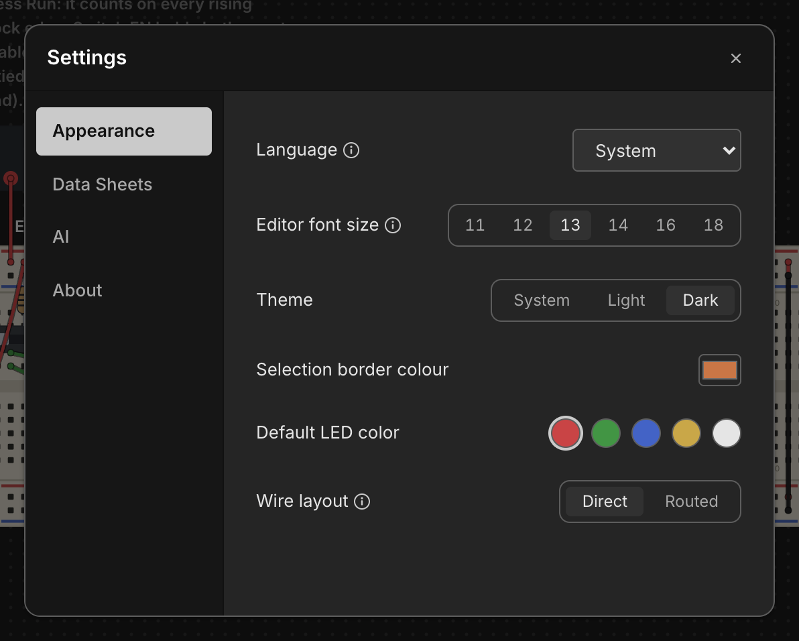

# Settings

Chip Hippo keeps its handful of app-wide preferences in one small **Settings**
dialog — a tabbed master-detail card with a left nav rail and a panel on the
right. It's deliberately minimal: four tabs, a few controls each, applied
live the moment you change them.

## Opening Settings

Open the dialog with `Cmd/Ctrl+,`, or click the gear icon in the top-right
corner of the header. Both routes lead to the same dialog seeded with your
current settings, so it doesn't matter which you use.

## Appearance

The **Appearance** tab is the one the dialog opens on:

- **Theme** — **System**, **Light** or **Dark**. System follows your
  operating system's own setting; the other two pin it. The choice applies to
  every Chip Hippo window at once, including the floating pinout, memory
  inspector and user-guide windows, and to the native menus and dialogs.
- **Selection border colour** — a `#rrggbb` colour picker for the outline
  drawn around whatever's selected on the desk. Leave it unset to use the
  theme's default accent colour instead of a custom one.
- **Default LED color** — which colour a newly placed LED, LED bar or
  seven-segment digit gets. Unlike the others this one isn't applied live; it's
  read when you place a part, so changing it doesn't recolour anything already
  on the desk. Any placed part's colour can still be changed from its
  **Properties…** dialog.
- **Wire layout** — **Direct** (the default) or **Routed**, the layout method
  a newly laid wire gets. Direct wires sag from hole to hole; routed wires run
  straight and can be bent around obstacles by dragging points into them (see
  [Wiring](wiring.md#wire-layout-direct-or-routed)). Like the LED colour it's
  read when you lay a wire, so wires already on the desk keep the layout they
  have — change one from its own **Properties…** dialog.

Everything but the LED colour and the wire layout takes effect immediately —
there's no separate Apply or OK step.

## Data Sheets

The **Data Sheets** tab points Chip Hippo at an external folder of
manufacturer datasheet PDFs on your machine. Click **Browse…** to pick a
folder with the native file picker; the chosen path is shown next to it, with
a **Clear** button that resets it to no folder selected.

Name the PDFs in that folder after each chip's catalog reference (for
example `74LS00.pdf`). When a chip's file is found there, its
[pin-assignments window](chip-library.md) grows a button that opens the PDF
in your system's default viewer. This is separate from the small datasheet
crop the pinout window already shows for most chips — the external folder is
for the full manufacturer document, not the built-in crop.

If you don't already have a collection, **Download…** fetches one for you. It
pulls a datasheet for every part Chip Hippo has a published source on file
for, names each file after the part it belongs to, and points the setting
above at that folder when it's done — so the buttons appear with nothing else
to set up. A progress window counts the files in and names anything that
couldn't be fetched; closing it stops the download and keeps whatever already
arrived. The sources are:

- [Texas Instruments](https://www.ti.com/) — the current manufacturer's own
  documents for much of the 74LS family;
- [Microchip](https://www.microchip.com/) — the Atmel EEPROM parts;
- [Alliance Memory](https://www.alliancememory.com/) — the large SRAM;
- the [Western Design Center](https://www.westerndesigncenter.com/) — likewise
  for the 65xx parts;
- the [USC EE 459Lx reference
  library](https://ece-classes.usc.edu/ee459/library/) — vendor scans of the
  older 74LS parts, collected for a university course, plus the HD44780, the
  memory parts and the DIP resistor/oscillator packages;
- a datasheet archive, for the one part whose maker no longer publishes it.

Expect a few tens of megabytes in total; the modern manufacturer PDFs are
much larger than the old scans.

Between them they don't carry every part in the catalog, so some chips will
still have no PDF button. Press **Download…** again whenever you like — it
replaces what it fetched last time. It always writes to Chip Hippo's own
folder and never to one you picked yourself, so a collection of your own is
never overwritten: **Browse…** and **Download…** are simply two ways of
setting the same folder, and whichever you did last is the one in effect.

## AI

The **AI** tab is where you point Chip Hippo at your own AI connection, for
the [AI circuit builder](ai-builder.md). Nothing here is required — the app
works completely without it, and contacts no AI provider until a connection is
configured and you ask the builder for something. (The only other times Chip
Hippo reaches the network at all are the datasheet **Download…** button above,
while you're pressing it, and the update check on the **About** tab below,
which is switched off until you turn it on.)

- **Provider** — **Anthropic**, or **OpenAI-compatible**. The second covers
  Ollama, LM Studio, OpenRouter, vLLM and anything else speaking that request
  format; you supply the base URL.
- **Base URL** and **Model** — leave either blank to use the chosen provider's
  default, which is shown as the field's placeholder. Both commit when you
  leave the field or press `Enter`, not as you type.
- **API key** — paste it and click **Save key**. **Clear key** forgets it.
  A local server that needs no key works with this left blank.
- **Test connection** — one small request that checks the base URL, key and
  model together, so a typo is found here rather than on your first build.

**The key is never written to Chip Hippo's settings file.** It's handed to
your operating system's own secure credential store — Keychain on macOS, the
Credential Manager on Windows, the desktop keyring on Linux — encrypted, and
it's never read back into the app's window afterwards; the dialog only learns
*whether* a key is stored. If no secure store is available on your system,
Chip Hippo **refuses to save the key** and says so rather than quietly writing
it out in the clear.

## About

The **About** tab shows which version of Chip Hippo you're running, and is
where updates are handled.

- **Check automatically** — **On** or **Off**, and **Off** is the default. On,
  Chip Hippo asks GitHub once, shortly after launch, whether there's a newer
  release. Off, it never asks on its own — but the button below still works
  whenever you want to know.
- **Check for updates** — checks right now and says what it found on the line
  underneath: that you're up to date, that a version is downloading, or that
  the check couldn't be made.

When an update is found it downloads quietly in the background; you can carry
on working, and there's no progress bar in your way. Once it's ready a
**Restart to update** button appears here, and a notice appears in the corner
of the desk with a **Restart** button of its own. **Nothing is installed until
you say so.** If you'd rather not stop what you're doing, ignore it — the
update installs by itself the next time you quit Chip Hippo, and restarting
here runs the same "you have unsaved changes" prompt that quitting does, so a
design in progress is never lost to an update.

The check itself is the only thing sent, and only to GitHub. Chip Hippo has no
analytics and reports nothing about you or your circuits.

You'll see this tab differently depending on where your copy came from. A copy
installed from the **Mac App Store** updates through the App Store like every
other app there, so this tab shows only the version and says so — there are no
controls, because there'd be nothing for them to do. A development build says
that updates are only available in installed builds.

## What else persists automatically

A few things aren't part of this dialog but are remembered between sessions
without any action on your part: the app window's position and size, the desk
camera — your current pan position and zoom level — and which panels you left
open (the parts tray, the build guide, the analyzer, the AI builder) along with
the height you dragged each docked one to. Close Chip Hippo and reopen it, and
you're back exactly where you left off.

See [Files, Saving & Undo](files-and-undo.md) for how your circuit itself
is saved.
