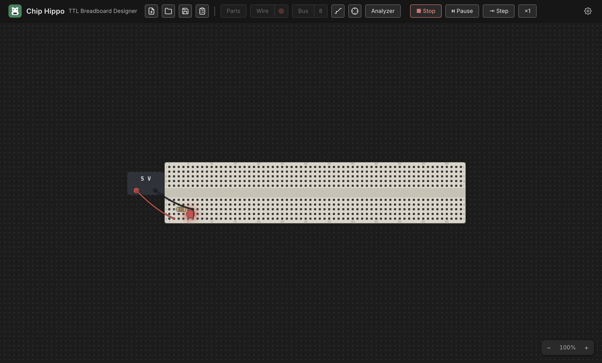

# Running a Simulation

Once a circuit is wired up, **Run** hands it to the simulation engine, which
traces power from every supply, resolves the electrical state of every net,
and settles the circuit — LEDs light, chips report their health, and the
probe and logic analyzer come alive. This page covers the transport (Run,
Pause, Step, speed), what the signal levels mean, what triggers a
re-settle, and what you can still interact with while the circuit runs.

## Run & Stop

Press **Run** in the header toolbar — or the shortcut `Space` / `Cmd+R`
(`Ctrl+R` on Windows/Linux) — to start the simulation. The button becomes
**Stop**, editing locks (you can't move parts, place new ones, or lay wires
while running), and the engine cold-starts: it settles the circuit once from
scratch and begins driving live views from the result.

Press **Stop** (same shortcut) to freeze the simulation and return to
editing. Stopping clears all run-volatile state — net levels, chip health
badges, and any sequential state (counter values, shift-register contents,
clock phase) reset. The only thing Stop doesn't discard is **12 V chip
damage**, which is written into the circuit itself and persists until you
replace the damaged chip.

`Space` is disabled while a placement, wire, or bus tool is armed (it might
want the key for its own gesture) or while a text field has focus — use
`Cmd/Ctrl+R` in that case, or just click **Run**.

## Signal levels: H, L, Z, X

Every point in the circuit — a hole, a pin, a wire — settles to one of four
levels. The probe tool and the logic analyzer both speak this same
vocabulary (see [Probing & Net Names](probing.md)):

- **`H`** — logic high, driven by a supply or a chip output.
- **`L`** — logic low, driven the same way.
- **`Z`** — floating: nothing is actively driving this point. Chip Hippo
  models real 74xx TTL behavior here — **a floating input reads as HIGH**,
  so an unconnected chip input doesn't just do nothing, it behaves as if
  tied high.
- **`X`** — a conflict: two drivers disagree on a net (two chip outputs
  fighting, or opposing supplies wired together), or the net never settled
  to a stable value at all (an oscillation — see below).

You don't need to know how the engine computes these to use the app, but
recognizing `X` on a probe reading is the fastest way to spot a wiring
mistake.

## What re-settles the circuit

The circuit isn't a one-shot calculation — anything that could change what a
net carries triggers a fresh settle while you're running:

- Clicking a **switch** or **button**.
- Turning a **PSU** on/off or changing its voltage.
- Changing a **clock**'s rate or manual/free-running mode.
- A manual clock click, or (for sequential circuits) a **Step** advance.

Each re-settle starts from the *previous* stable state rather than from
scratch — this warm start is what lets a cross-coupled latch or a counter
hold its value across small changes instead of resetting every time you
touch something.

## The transport — Pause, Step & speed

For circuits with a **clock source**, the toolbar grows a small transport
cluster next to **Run** the moment you start:

- **Pause** / **Resume** — freezes the free-running clock's edges without
  stopping the simulation; everything stays lit exactly as it was. Click
  again (the button relabels to **Resume**) to continue.
- **Step** — advances the circuit by exactly one clock half-period: every
  free-running clock flips once, and the circuit settles around it. Stepping
  implies Pause, so you can single-step a counter or shift register edge by
  edge and watch each bit change. A manually-toggled clock steps only on its
  own click, not on **Step**.
- **Speed** (`×¼` / `×1` / `×4`) — click to cycle the free-running clock rate
  up or down. It scales every clock brick on the desk together, so a design
  with more than one clock keeps their relative timing.

See [Power & Clock Sources](power-and-clocks.md) for placing and configuring
a clock brick, and [Logic Analyzer & Timing](logic-analyzer.md) for
capturing what these edges actually do to your signals over time.

## What lights up while running

Live views render entirely from the settled simulation state — nothing is
computed by the views themselves:

- **LEDs** light when their anode net is `H` and their cathode net is `L`.
  Chip Hippo's LEDs are idealized (no series resistor required), but an LED
  driven directly between a strong supply and strong ground with nothing
  current-limiting it shows a distinct **burnt** cue instead of lighting
  normally — the app's way of telling you that connection would fry a real
  LED.
- **Chips** show a small health badge the moment they're powered: normal
  chips show nothing extra, an **underpowered** chip (running at 3 V) gets
  an amber corner dot, and a chip killed by 12 V shows **damaged** — a red X
  with a smoke cue. Hover the badge for the exact reason (also unpowered or
  reversed VCC/GND). A damaged chip stays dead — including through Stop and
  a fresh Run — until you replace it from its right-click menu.
- **Probe highlights** tint whatever net you hover by its live level. Full
  detail on reading and naming nets lives in
  [Probing & Net Names](probing.md) — this page won't duplicate it.
- **Clock bricks** carry a small pulse lamp that tracks their own current
  output level in real time.

## Interacting live

Switches, push buttons, and clock bricks stay fully interactive while
running — click a **slide switch** to flip it, hold a **push button** to
press it, or click a **manual clock** to pulse it by hand. Each of these is
exactly the kind of input event described above: it doesn't just update its
own view, it triggers a fresh settle of the whole circuit, so downstream
LEDs and chips react immediately.

Everything that edits the circuit's *topology* — placing, moving, or
deleting a part, board, or wire — is locked out until you Stop. Part state
(a switch position, a button press, a clock's phase) is not topology, so it
stays live the whole time you're running.

## Oscillations & conflicts

"The circuit settles" just means: the engine keeps re-evaluating every net
and chip, feeding each result back in, until nothing changes anymore. Most
circuits reach that fixed point in a handful of passes, faster than you can
perceive.

Two things can go wrong:

- **A conflict or short** — two chip outputs disagreeing on the same net, or
  opposing supplies tied together — settles immediately, but to `X`, and the
  app raises a warning naming the net.
- **An oscillation** — a circuit that never stops changing (an unbuffered
  ring of inverters, for instance) can't reach a fixed point at all. Chip
  Hippo detects this — after a bounded number of attempts it gives up,
  marks the still-changing nets `X`, and flags the oscillation rather than
  hanging.

Either way, the affected nets read `X` on the probe and in the logic
analyzer, which is your cue to go find the wiring mistake causing it.

---

Next: [Power & Clock Sources](power-and-clocks.md) for supply voltages, the
12 V damage rule, and clock bricks in depth, or
[Probing & Net Names](probing.md) to read exactly what's happening on any
net.
