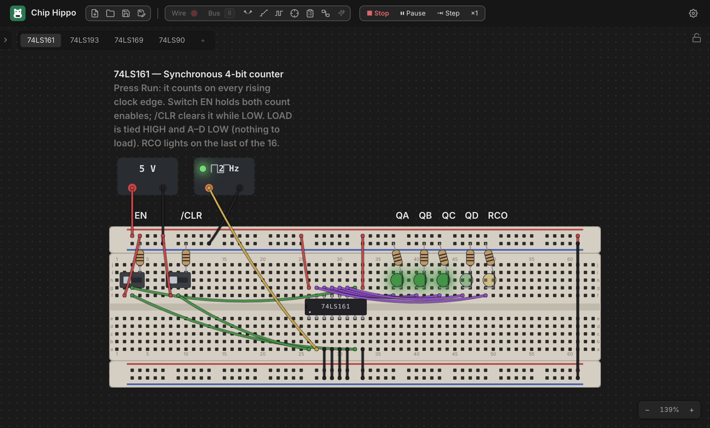

# Running a Simulation

Once a circuit is wired up, **Run** hands it to the simulation engine, which
traces power from every supply, resolves the electrical state of every net,
and settles the circuit — LEDs light, chips report their health, and the
probe and logic analyzer come alive. This page covers the transport (Run,
Pause, Step, speed), what the signal levels mean, what triggers a
re-settle, and what you can still interact with while the circuit runs.

## Run & Stop

Press **Run** in the header toolbar — or the shortcut `Space` / `Cmd+R`
(`Ctrl+R` on Windows/Linux) — to start the simulation. The button becomes
**Stop**, editing locks (you can't move parts, place new ones, or lay wires
while running), and the engine cold-starts: it settles the circuit once from
scratch and begins driving live views from the result.

Press **Stop** (same shortcut) to freeze the simulation and return to editing.
Stopping clears all run-volatile state — net levels, chip health badges, any
sequential state (counter values, shift-register contents, clock phase), and
**over-voltage chip damage**, so a chip you burnt out is whole again the moment
you stop. Nothing that happens during a run outlives it.

`Space` is disabled while a placement, wire, or bus tool is armed (it might
want the key for its own gesture) or while a text field has focus — use
`Cmd/Ctrl+R` in that case, or just click **Run**.

## Signal levels: H, L, Z, X

Every point in the circuit — a hole, a pin, a wire — settles to one of four
levels. The probe tool and the logic analyzer both speak this same
vocabulary (see [Probing & Net Names](probing.md)):

- **`H`** — logic high, driven by a supply or a chip output.
- **`L`** — logic low, driven the same way.
- **`Z`** — floating: nothing is actively driving this point. What a chip
  input makes of that depends on its **logic family**, exactly as on a real
  bench:
  - a **74LS (TTL)** input pulls itself up — **a floating input reads as
    HIGH**, so an unconnected input doesn't just do nothing, it behaves as if
    tied high;
  - a **CD4000 (CMOS)** input has nothing to pull it anywhere — **a floating
    input reads as unknown (`X`)**, so whatever it feeds is unknown too. A
    gate whose other input already decides it still answers (a NOR with one
    input HIGH is LOW whatever the floating one does), and a counter or
    flip-flop whose reset or clock floats loses track of its count until a
    clean reset. Tie every CMOS input — spare gates included.
- **`X`** — unknown: two drivers disagree on a net (two chip outputs
  fighting, or opposing supplies wired together), a floating CMOS input, or
  the net never settled to a stable value at all (an oscillation — see
  below).

You don't need to know how the engine computes these to use the app, but
recognizing `X` on a probe reading is the fastest way to spot a wiring
mistake.

## What re-settles the circuit

The circuit isn't a one-shot calculation — anything that could change what a
net carries triggers a fresh settle while you're running:

- Clicking a **switch** or **button**.
- Turning a **PSU** on/off or changing its voltage.
- Changing a **clock**'s rate or manual/free-running mode.
- A manual clock click, or (for sequential circuits) a **Step** advance.
- A **timer** reaching its next edge — a 555 or an RC-timed CD4000 part keeps
  its own time and re-settles the circuit at exactly the moment its output
  changes, with no clock brick involved (see
  [Timers](chip-library.md#timers)).

Each re-settle starts from the *previous* stable state rather than from
scratch — this warm start is what lets a cross-coupled latch or a counter
hold its value across small changes instead of resetting every time you
touch something.

## The transport — Pause, Step & speed

For circuits with a **clock source**, the toolbar grows a small transport
cluster next to **Run** the moment you start:

- **Pause** / **Resume** — freezes the free-running clock's edges without
  stopping the simulation; everything stays lit exactly as it was. Click
  again (the button relabels to **Resume**) to continue. To hold just ONE
  clock while the rest of the circuit keeps running, use the **⏸** button on
  that clock brick instead (see
  [Power & Clock Sources](power-and-clocks.md#clock-sources)).
- **Step** — advances the circuit by exactly one clock half-period: every
  free-running clock flips once, and the circuit settles around it. Stepping
  implies Pause, so you can single-step a counter or shift register edge by
  edge and watch each bit change. A manually-toggled clock steps only on its
  own click, not on **Step**.
- **Speed** (`×¼` / `×1` / `×4`) — click to cycle the free-running clock rate
  up or down. It scales every clock brick on the desk together, so a design
  with more than one clock keeps their relative timing. A clock never runs
  faster than 100 Hz, the top of its own rate list, so `×4` applied to a rate
  that is already a quarter of the way there has nothing further to give.

**Timers keep simulated time, and the transport owns it.** A 555 or a CD4000
timer is told how long the circuit has been running — real seconds since
**Run**, scaled by the speed. **Pause** stops that clock along with the clock
bricks, so a pulse in progress is frozen where it is; **Speed** scales it, so
a 1 Hz 555 blinks four times a second at `×4`; and **Step** moves it on with
the clocks — by the fastest clock's half-period, or, with no clock brick on
the desk, straight to the next moment a timer's output changes, so a circuit
built round a 555 can be single-stepped edge by edge too.

See [Power & Clock Sources](power-and-clocks.md) for placing and configuring
a clock brick, and [Logic Analyzer & Timing](logic-analyzer.md) for
capturing what these edges actually do to your signals over time.

## What lights up while running

Live views render entirely from the settled simulation state — nothing is
computed by the views themselves:

- **LEDs** light when their anode net is `H` and their cathode net is `L` —
  provided something is limiting the current. An LED driven directly between
  a strong supply and strong ground, with no series resistor anywhere in the
  loop, shows a distinct **burnt** cue instead of lighting: that connection
  would fry a real LED, so it fries this one. A net reached through a resistor
  is only weakly pulled rather than strongly driven, which is what makes the
  resistor count. This is a physical rule, not a logical one — the levels
  alone would happily light it. A **CD4000 output at 5 V or below** limits
  the current by itself, so an LED wired straight onto one lights rather than
  burns — see [Mixing logic families](#mixing-logic-families).
- **Chips** show a small health badge the moment they're powered: normal
  chips show nothing extra, an **underpowered** chip (a 74LS part at 3 V) gets
  an amber corner dot, and a chip killed by over-voltage shows **damaged** — a red X
  with a smoke cue. Hover the badge for the exact reason (also unpowered or
  reversed VCC/GND). A damaged chip stays dead for the rest of that run, and
  **Stop** restores it — see [Power & Clock Sources](power-and-clocks.md).
- **Probe highlights** tint whatever net you hover by its live level. Full
  detail on reading and naming nets lives in
  [Probing & Net Names](probing.md) — this page won't duplicate it.
- **Clock bricks** carry a small pulse lamp that tracks their own current
  output level in real time.
- **Timers** print their rate or pulse length under their part number — in
  amber when it is faster than the desk can draw — and show a warning triangle
  when they cannot make out their own wiring. Hover either for the full
  sentence; see [Timers](chip-library.md#timers).

## Interacting live

Switches, push buttons, and clock bricks stay fully interactive while
running — click a **slide switch** to flip it, hold a **push button** to
press it, click one position of a **DIP switch bank** to open or close it, or
click a **manual clock** to pulse it by hand. Each of these is
exactly the kind of input event described above: it doesn't just update its
own view, it triggers a fresh settle of the whole circuit, so downstream
LEDs and chips react immediately.

Everything that edits the circuit's *topology* — placing, moving, or
deleting a part, board, or wire — is locked out until you Stop. Part state
(a switch position, a button press, a clock's phase) is not topology, so it
stays live the whole time you're running.

## Oscillations & conflicts

"The circuit settles" just means: the engine keeps re-evaluating every net
and chip, feeding each result back in, until nothing changes anymore. Most
circuits reach that fixed point in a handful of passes, faster than you can
perceive.

Two things can go wrong:

- **A conflict or short** — two chip outputs disagreeing on the same net, or
  opposing supplies tied together — settles immediately, but to `X`, and the
  app raises a warning naming the net. An analog switch (CD4066B, CD405x) can
  make one too: a closed channel joins the nets on its two sides, a supply
  crossing it counts as an ordinary output, so a rail switched onto an output
  is a conflict, and a channel joining + to − is reported as a short.
- **An oscillation** — a circuit that never stops changing (an unbuffered
  ring of inverters, for instance) can't reach a fixed point at all. Chip
  Hippo detects this — after a bounded number of attempts it gives up,
  marks the still-changing nets `X`, and flags the oscillation rather than
  hanging.

Either way, the affected nets read `X` on the probe and in the logic
analyzer, which is your cue to go find the wiring mistake causing it.

## Mixing logic families

A 74LS (TTL) chip and a CD4000 (CMOS) chip can share a board, and at 5 V they
can share signals — but the two were not designed to the same voltages, and
Chip Hippo says so where it matters. None of these changes a level; each is a
warning naming the net, with the fix:

- **A floating CMOS input** — a CD4000 input nothing drives. Spare gates count:
  their datasheets say to tie every unused input.
- **A 74LS output into a CMOS input** — a 74LS HIGH is about 3.4 V, below the
  3.5 V a CD4000 input needs at 5 V. It usually works on a bench, which is why
  it is marginal rather than wrong; a pull-up resistor from the net to VCC is
  the textbook fix, and clears the warning.
- **Too many TTL loads** — a standard CD4000 output can hold only one 74LS
  input LOW. The CD4049UB and CD4050B buffers exist for exactly this: one of
  their outputs drives eight.
- **Two supplies on one net** — chips on different supply voltages joined by
  a signal, which needs a level shifter. The CD4049UB and CD4050B are one:
  their inputs may be driven from a higher supply than their own, so a signal
  coming DOWN into them is not reported. (Ground is shared by every supply,
  and is never a signal.)

One difference works the other way. A standard CD4000 output is too weak to
burn an LED: at 5 V it can push only about 4 mA through one, a fifth of what
an LED is rated for, so an LED wired straight onto a CD4000 output with no
resistor **lights** — on the desk as on a bench. The same goes for an LED fed
through a CD4066B or CD4051B/52B/53B switch at 5 V, whose on-resistance
(about 470 Ω) does the limiting. Above 5 V it stops being true: at 9 V the
output would pass about 15 mA and overheat the chip, and at 12–15 V the LED
too, so there the LED burns as it would off a 74LS output. Two parts are
built to drive hard and burn an LED at any supply: the CD4049UB/CD4050B
buffers when their output is LOW, and the CD4511B's segment outputs. A
resistor is still good practice.

## A more electrical simulation

Everything on this page is the **standard engine**: every net is a clean
logic level and every change arrives instantly. Settings ▸ Spice Lite
switches on a second engine with time, charging capacitors, current limits
on outputs and supplies, and the resistance of the wires. See
[Spice Lite](spice-lite.md).

---

Next: [Power & Clock Sources](power-and-clocks.md) for supply voltages, the
over-voltage damage rule, and clock bricks in depth, or
[Probing & Net Names](probing.md) to read exactly what's happening on any
net.
