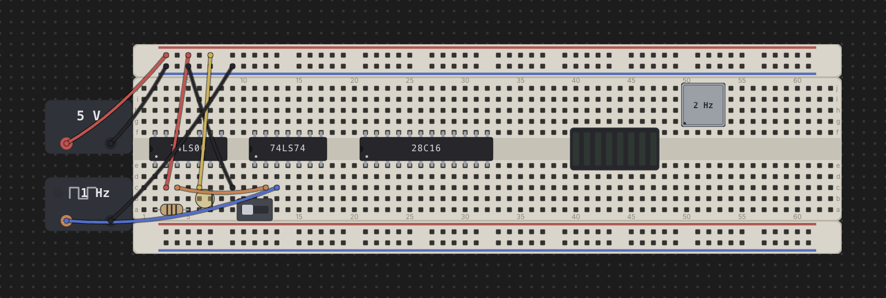

# The Desk & Breadboards

The desk is Chip Hippo's infinite, pannable, zoomable workspace — the place
every board, chip, wire, and power source lives. This page covers how to move
around the desk and how breadboards actually work under the hood: they are
not single parts but individual **strips** — a pin-board plus power rails —
that snap and mate together the way real boards do on a bench.

## Pan, zoom & fit to screen

The desk has no edges — pan and zoom to work at whatever scale suits the
circuit in front of you.

- **Pan**: click-drag an empty patch of desk, or two-finger scroll on a
  trackpad.
- **Zoom**: scroll/pinch to zoom, centered on the pointer, or use the
  **+** / **−** buttons in the zoom control. Keyboard: `Cmd/Ctrl+=` (zoom in),
  `Cmd/Ctrl+-` (zoom out), `Cmd/Ctrl+0` (reset to 100%).
- **Fit to screen**: `Cmd/Ctrl+F` frames everything currently on the desk in
  the viewport — the fastest way to find your circuit after panning away.
- **Zoom out full**: `Cmd/Ctrl+Shift+F` zooms all the way out, useful for
  locating a part on a very large or sprawling layout.

A faint **dot grid** marks the 0.1 in hole pitch under everything you place;
it coarsens at low zoom and disappears entirely once you're zoomed out too
far for individual holes to matter. Zoom and pan position are remembered
between sessions.

## Breadboards are strips

A real solderless breadboard is not one molded part — it's a centre
**pin-board** with one or two **power-rail** strips dovetailed onto its top
and bottom edges. Chip Hippo models this literally: each strip is its own
object on the desk, and what looks like "a breadboard" is a small **kit** of
strips placed together in one action.

The palette offers three assembled kits:

- **Full 830** — a full-length pin-board with a rail strip above and below.
- **Half 400** — the same layout at half length.
- **Tiny 170** — a bare pin-board only; the real 170-point part ships with no
  rails at all, so this kit is a single strip.

On a pin-board, rows run top to bottom as `j i h g f`, then the **trench**,
then `e d c b a`. The trench is the gap down the centre that isolates the top
half of each column from the bottom half electrically — a DIP chip **straddles
the trench**, with one row of pins in `f` and the other in `e`, exactly as it
would seat on a real board. A power-rail strip carries both a `+` and a `−`
line, each one continuous connection along its whole length, independent of
every other strip.

See [Chips & Components](components.md) for how chips and discretes seat into
the grid, and [Power & Clock Sources](power-and-clocks.md) for feeding a rail
from a PSU.

## Kits vs. loose strips

Below the assembled kits, the palette also offers the individual strips on
their own — a bare **Full pin-board**, a bare **Half pin-board**, a spare
**Full power rail**, and a spare **Half power rail**. Reach for these when a
board shipped without enough rails, when you want a rail somewhere a kit
wouldn't put one, or when you're building up a custom layout strip by strip.
Placing, ghosting, and overlap checking all work identically whether you're
dropping a whole kit or a single loose strip.

## Snapping & mating

Drop a strip within a couple of tenths of an inch of another strip it can
dovetail with — matching width when stacked, matching height side by side,
meeting flush with no gap — and it snaps into place automatically. This is
the same **magnetic pull** whether you're dragging a placed strip or holding
a fresh one from the palette; a whole kit snaps as one piece, and the pull
only ever engages when the snapped position is still legal (it will never
pull a strip into an illegal overlap).

Two strips that end up flush **mate**: they join a shared **group** and from
then on drag together as one rigid unit, just like a real breadboard's rails
stay attached to its pin-board when you nudge it on the bench. A kit arrives
pre-grouped; anything you drop flush against an existing board joins its
group (or merges two groups into one, if it bridges a gap). When several
strips are mated, clicking any one of them highlights the whole set — the
outline traces the union of the group's strips, so flush neighbours read as
one board rather than showing a seam between them.

## Groups & breaking a snap

Grabbing a mated strip normally drags the **whole group** together. To pull
just part of a group apart, hold a modifier while you start the drag:

- **Option-drag** — moves the **reachable run forward** from the strip you
  grabbed: itself plus every strip mated to it through a below/right edge.
- **Option+Shift-drag** — moves the run **backward** instead, following
  above/left edges.

Either way, only strips still reachable through the group come along; a strip
that merely happens to sit flush elsewhere in the layout is left behind. When
you drop a torn-off run, both the piece you moved and what's left of the
original group are re-evaluated — each is split into fresh groups based on
what's still actually mated within it, so the two halves never end up
sharing a group id after the break.

## Rotating a rail

**Power rails can rotate; pin-boards cannot.** A pin-board's trench (and
every DIP seated across it) only makes sense in one orientation, so it's
locked at 0°. A rail strip is just two parallel lines of holes, so it reads
the same standing on end — turned 90° it becomes a vertical **signal bus**
you can run alongside a board and tap into at any point along its length.

Press `R` while a rail is in hand (mid-placement, before you click it down)
to cycle its rotation through 0°/90°/180°/270°. Once a strip is placed its
angle is fixed; to change it, pick it up again. Rotating doesn't change
anything electrically — a rail is one continuous node however it's turned —
it only changes which way the strip's footprint runs on the desk.

---

Next: [Chips & Components](components.md) for populating a board, or
[Wiring, Nets & Buses](wiring.md) for connecting everything up.
