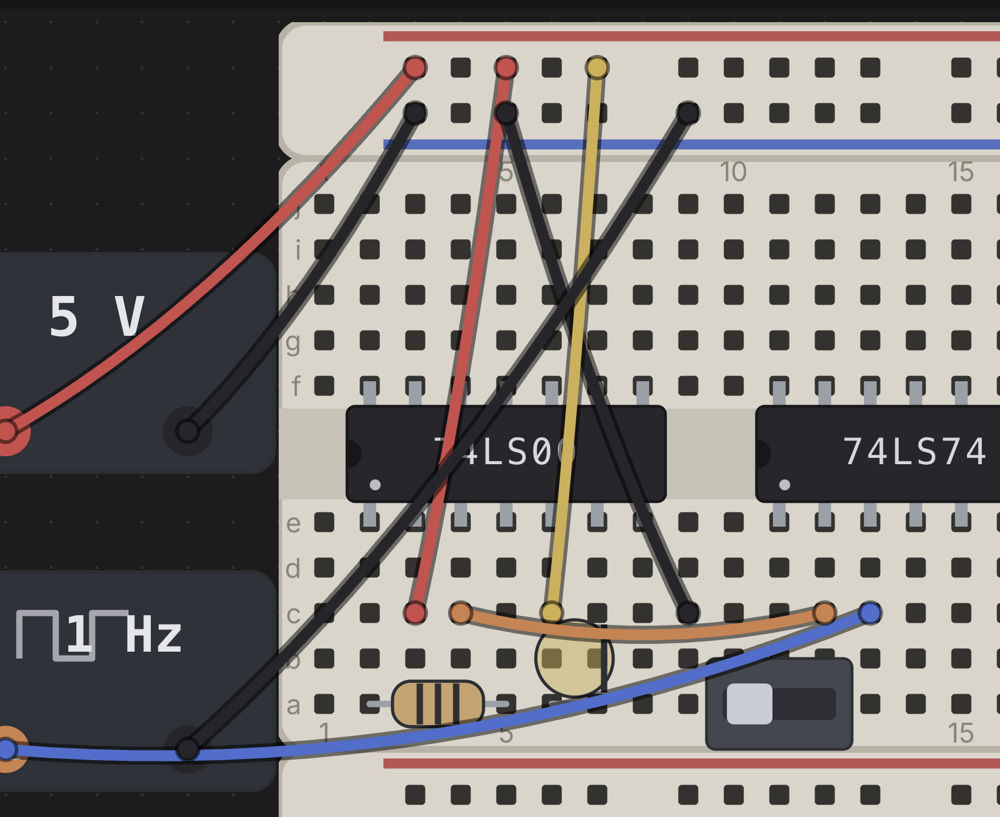

# Wiring, Nets & Buses

Wires are how you connect the holes, rails, and terminals you've already
populated with boards and parts into a working circuit. Chip Hippo's wire
tool is click-click (no drag-to-draw), every wire remembers the two
*addresses* it connects rather than raw screen positions, and a bus lets you
lay a whole marching group of wires — a data or address bus — as one
gesture. This page covers the wire tool, colors, cross-board wiring,
re-routing and deleting a wire, addresses, and buses.

## The wire tool

Press `W` (or click **Wire** in the toolbar) to arm the wire tool. With the
tool armed:

1. Click a free hole or terminal to anchor the first end — a rubber-band
   preview then tracks your cursor.
2. Click a second free point to drop the wire between them.

The tool stays armed after a wire is committed, so you can lay a whole chain
of wires without re-arming — each new wire starts fresh, so it does **not**
automatically continue from the last endpoint; just click a new starting
hole. A hover ring shows the point under your cursor and turns red the
moment it's over an illegal target (already occupied, or the same point you
started from) — the rubber band tints red too, so a bad landing is obvious
before you click.

Press `Esc` to cancel a pending (anchored-but-not-yet-dropped) wire without
leaving the tool, or `Esc`/click **Wire** again to disarm it entirely. `M`
also disarms whichever of the wire, bus, or probe tools is currently
armed — one key to "put the tools away." The wire tool (like the bus and
placement tools) is unavailable while a simulation is running; editing is
locked until you press **Stop**.

## Wire colors

Chip Hippo ships eight wire colors: **red, black, blue, green, yellow,
orange, white,** and **purple**. The active color is shown as a swatch dot on
the toolbar's **Wire** button — click it to open the color palette, or, while
the wire tool is armed, press a digit `1`–`8` to jump straight to that color
(1 = red, 2 = black, and so on through the list above). The color you pick
**stays pinned** between wires — laying a chain of jumpers keeps whatever
color you last chose, so pick red for a supply run and black for ground and
they'll stay that way until you deliberately switch.

You can also recolor a wire after the fact: right-click it and choose a new
color from the context menu (which also offers **Remove wire**).

## Cross-board wires

A wire's endpoints don't care which board or brick they land on — you can
run a wire from one breadboard to another, from a board to a PSU terminal, or
between two separate strips, exactly as freely as within one board. When you
drag a board that a wire is attached to, the wire's other end stays put and
the whole wire stretches and re-sags live, riding the move; nothing needs to
be re-laid. Deleting a board cascades: any wire with an end seated on that
board is removed along with it.

## Re-routing & deleting a wire

Grab a wire two different ways:

- **Its end cap** — drag just one endpoint to a new hole or terminal,
  re-routing that end while the other stays put. A hover ring and red/legal
  tint on the dragged end work exactly like placing a fresh wire; release
  over an illegal point and the end snaps back to where it started.
- **Its body** — drag anywhere along the wire itself to translate the whole
  wire rigidly, keeping its length and orientation and just sliding both ends
  together onto a new pair of holes. If either landing point isn't free, the
  wire snaps back on release.

To delete a wire, click it to select it, then press `Delete` or `Backspace`
(the same shortcut removes whatever's currently selected — a part, a board,
or a wire).

## Addresses

Wires never store pixel positions — they store **addresses**, the one
cross-module currency for anything wireable. An address is
`<ownerId>.<point>`:

- `bb1.a12` — a grid hole (board id `bb1`, hole `a12`).
- `bb2.+7` — hole 7 on a rail strip's `+` rail.
- `psu1.+` — the `+` terminal of a PSU brick.

A wire's `from`/`to` are just two of these addresses, plus a `color`. One
hole or terminal holds at most one lead — one pin or one wire end — so the
occupancy check that keeps the wire tool's hover ring legal/illegal is the
same one that governs seating a chip or a discrete. Because everything
resolves through addresses rather than coordinates, a wire keeps working
correctly no matter how the boards around it get rearranged.

## Buses

For a wide, tidy bundle — a data or address bus — press `B` (or click
**Bus** in the toolbar) to arm the bus tool instead of laying eight wires by
hand. It's click-click like the wire tool: anchor a start hole, then click a
second point to lay the whole run in one go, rendered as a single fat band
rather than a fan of individual wires.

Before you click the second point, set what you're laying:

- **Name** — type a bus name like `D[7:0]` or `A[0:15]` in the toolbar; the
  tool parses the bit range from it. Laying a run onto a **chip pin group**
  (a catalog-defined bus of pins, like a chip's data lines) instead fans the
  bus directly onto those pins in bit order.
- **Width** — while the bus tool is armed, press `1` for an 8-bit bus
  (`D[7:0]`) or `2` for a 16-bit bus (`D[15:0]`), the same two presets the
  toolbar's width menu offers.

A bus is metadata layered over the individual wires it lays — right-click a
placed bus to **Rename**, **Recolor** (which recolors every member wire
too), **Un-bundle** (keep the wires, drop the bus grouping), or **Delete bus
+ wires**. Drag a bus by its band to move every member wire together.

## See also

- [Chips & Components](components.md) — placing the parts a wire connects.
- [Power & Clock Sources](power-and-clocks.md) — PSU and clock brick
  terminals, which wires reach exactly like board holes.
- [Probing & Net Names](probing.md) — inspecting the nets your wires and
  buses form, and naming them.
